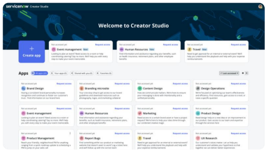

## Visão Geral

O **Creator Studio** é uma ferramenta intuitiva da plataforma ServiceNow projetada para qualquer pessoa — mesmo sem conhecimento técnico — que deseja criar aplicações simples baseadas em requisições. Com uma interface amigável de arrastar e soltar, componentes pré-configurados e automações guiadas, o Creator Studio torna a criação de aplicações rápida, fácil e segura.

A proposta do Creator Studio é eliminar as barreiras tradicionais do desenvolvimento, permitindo que especialistas de negócio transformem seu conhecimento em aplicações e automações, sem depender de times técnicos. Além disso, ele oferece integração com a estrutura da plataforma para garantir governança, colaboração com desenvolvedores experientes e controle de publicação.

É ideal para usuários de áreas de negócio que desejam digitalizar processos do dia a dia, como solicitações internas, aprovações e atendimentos simples.

  

## Objetivo

Entender como o Creator Studio funciona e ser capaz de criar sua primeira aplicação com base em um processo simples. A aplicação usará um **playbook** para guiar o usuário na execução de uma **task**, passo a passo.

## Contexto

Você está apoiando Jake, diretor de marketing da sua organização. O time de Jake está superando suas metas, e ele quer recompensá-los.

A empresa possui um processo de premiação onde um gerente pode solicitar uma das recompensas previamente aprovadas para sua equipe. No entanto, o processo atualmente é manual e demorado. Jake pediu que você recrie esse processo na ServiceNow usando o **Creator Studio**.
