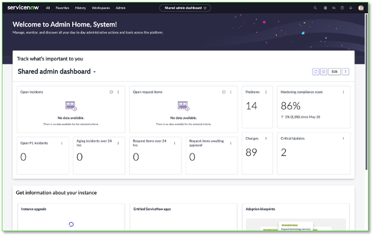
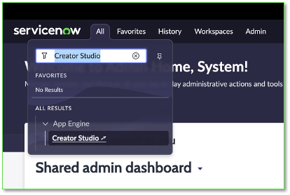
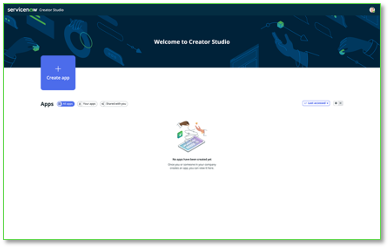
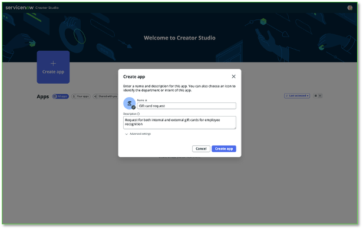
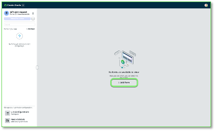
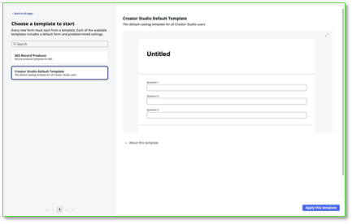
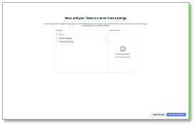
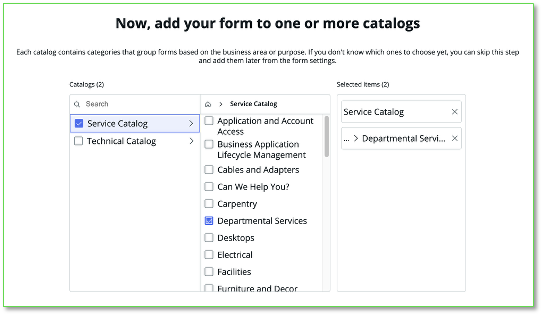
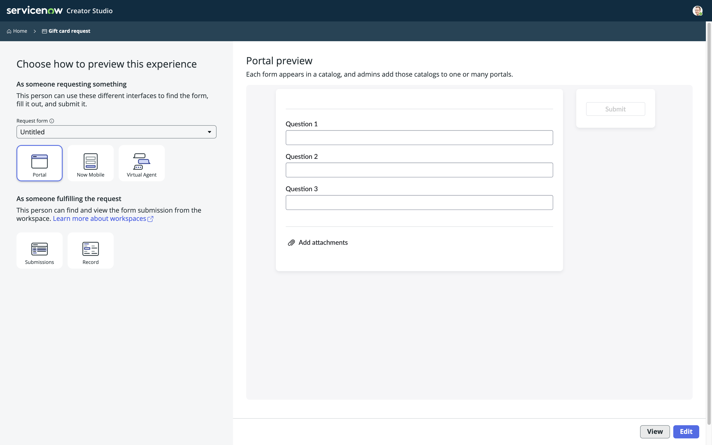

## Acesso à Instância do ServiceNow

Faça login na sua instância usando os dados fornecidos a você.

O nome de usuário é **admin** e você atuará como administrador da plataforma neste exercício. Os demais detalhes de login estão disponíveis em seu local.

  

Como a instância que você está usando é nova, aparecerão vários pop-ups de “Welcome” e “Get Started” – você pode fechá-los ou navegar por eles.

  

## Acessar o Creator Studio

1. No canto superior esquerdo, clique no menu **All**

2. Digite **Creator Studio**

3. Clique em **Creator Studio** abaixo, em App Engine
  

4. O Creator Studio abrirá em uma nova aba no seu navegador. Mantenha ambas abertas.
  

  

## Crie sua primeira aplicação no Creator Studio

Vamos começar a construir uma aplicação!

4. Clique em **Create app** e insira as seguintes informações:

5. Nome: **Gift card request**

6. Descrição: **Request for both internal and external gift cards for employee recognition**

7. Clique em **Create app**
    

> Nota: Isso criará um “scope” no ServiceNow que abrigará todos os artefatos da sua aplicação. Isso também permite fácil implantação do Desenvolvimento para Teste e depois para Produção quando for o momento.

Você pode inserir o que desejar nos campos Nome e Descrição, isso não afetará o funcionamento do Lab.

## Criar um form

Cada app no Creator Studio pode ter múltiplos forms.

1. Clique em **Add Form**
  

2. O Creator Studio atualmente oferece um template. “Creator Studio Default Template.”

3. No lado esquerdo, você vê os templates disponíveis.

4. No lado direito, verá uma prévia do template escolhido.

  

1. Clique e selecione **Creator Studio Default Template**

10. Clique em **Apply template and continue**

## Construa por conta própria

Vamos começar dando um Nome e uma Descrição para o form. Essas informações serão usadas para corresponder ao que o usuário busca no Service Portal.

11. Clique em **Form name** e altere para **Gift card request**

12. Altere o Short description para **Request gift cards for employee recognition**

13. Agora clique na descrição à direita do espaço reservado da imagem, você verá um editor de texto rico. Altere o conteúdo para:  
**Looking for a great way to recognize your colleagues? Use this form to request a gift card to our internal company store or to a third-party store of your choice! Internal gift cards under $50 will be automatically approved, all others will go through finance approval.**

Você precisará nomear seu form e pode querer dar uma Short e Long description.

14. Clique e

15. Clique em **Apply template and continue**

## Adicione sua aplicação de request a um Service Catalog

Você pode adicionar a aplicação, ou melhor, os Catalog Items do seu processo de request, a um ou mais Service Catalogs e Categorias.

1. Por enquanto, usaremos “Service Catalog” e a categoria “Departmental services”
  

16. Clique na seta ao lado de **Service Catalog** para revelar suas categorias

17. Marque **Departmental Services**

18. Clique em **Save and continue**

  

## Visualize em várias experiências

O ServiceNow oferece diversas formas de consumir suas experiências. Nesta visualização, você poderá ver como seu request ficará em diferentes interfaces de usuário.

1. Você poderá retornar a essa visualização a qualquer momento para ver suas alterações.
  
> Sinta-se à vontade para explorar essas visualizações – você pode voltar aqui depois.

2. Clique em **Edit** para continuar

## Seção Completa

Parabéns, você criou uma aplicação no ServiceNow e está pronto para editar a aplicação.

Seu próximo passo será projetar o Request Form que o usuário usará para enviar sua solicitação no seu processo.

  
