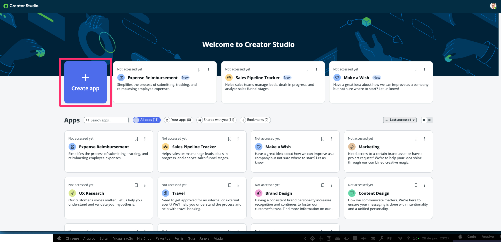
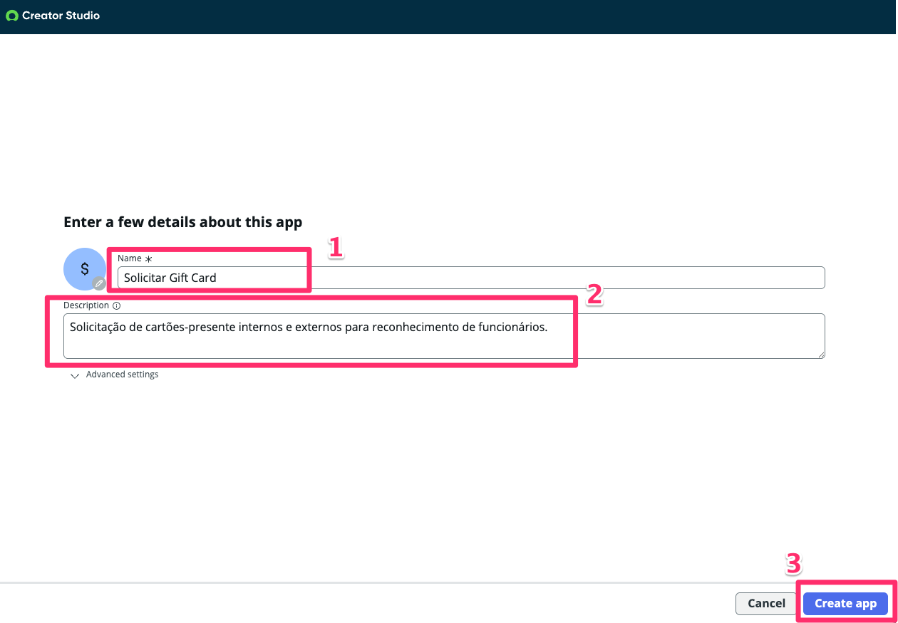
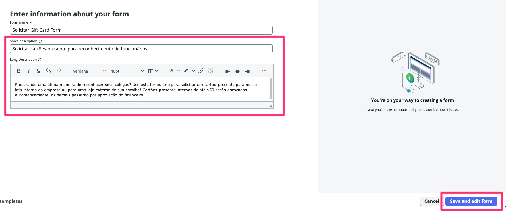

## Acesso à Instância do ServiceNow

Faça login na sua instância usando os dados fornecidos a você.

O nome de usuário é **admin** e você atuará como administrador da plataforma neste exercício. Os demais detalhes de login estão disponíveis em seu local.

  

Como a instância que você está usando é nova, aparecerão vários pop-ups de “Welcome” e “Get Started” – você pode fechá-los ou navegar por eles.

  

## Acessar o Creator Studio

1. No canto superior esquerdo, clique no menu **All**

2. Digite **Creator Studio**

3. Clique em **Creator Studio** abaixo, em App Engine
  

4. O Creator Studio abrirá em uma nova aba no seu navegador. Mantenha ambas abertas.
  

  

## Crie sua primeira aplicação no Creator Studio

Vamos começar a construir uma aplicação!

4. Clique em **Create app**

5. Insira as seguintes informações:
   1. Nome: **Solicitar de Gift Card**
   2. Descrição: **Solicitação de cartões-presente internos e externos para reconhecimento de funcionários.**
   3. Clique em **Create app**
    

> Nota: Isso criará um “scope” no ServiceNow que abrigará todos os artefatos da sua aplicação. Isso também permite fácil implantação do Desenvolvimento para Teste e depois para Produção quando for o momento.

Você pode inserir o que desejar nos campos Nome e Descrição, isso não afetará o funcionamento do Lab.

## Criar um form

Cada app no Creator Studio pode ter múltiplos forms.

1. Clique em **Add Form**
  

2. O Creator Studio atualmente oferece um template. “Creator Studio Default Template.”

3. No lado esquerdo, você vê os templates disponíveis.

4. No lado direito, verá uma prévia do template escolhido.

  

1. Clique e selecione **Creator Studio Default Template**

10. Clique em **Apply template and continue**

## Construa por conta própria

Vamos começar dando um Nome e uma Descrição para o form. Essas informações serão usadas para corresponder ao que o usuário busca no Service Portal.

1.  Clique em **Form name** e altere para **Solicitação de Gift card**

2.  Altere o Short description para **Solicitar cartões-presente para reconhecimento de funcionários**

3.  Agora clique na descrição à direita do espaço reservado da imagem, você verá um editor de texto rico. Altere o conteúdo para:  
**Procurando uma ótima maneira de reconhecer seus colegas? Use este formulário para solicitar um cartão-presente para nossa loja interna da empresa ou para uma loja externa de sua escolha! Cartões-presente internos de até $50 serão aprovados automaticamente, os demais passarão por aprovação do financeiro.**

## Seção Completa

Parabéns, você criou uma aplicação no ServiceNow e está pronto para editar a aplicação.

Seu próximo passo será projetar o Request Form que o usuário usará para enviar sua solicitação no seu processo.

  
