Nesta seção, você irá criar o formulário de requisição.

## Creator Studio – Tela de Edição

Esta é a tela de edição do Creator Studio. Na tela, você verá:
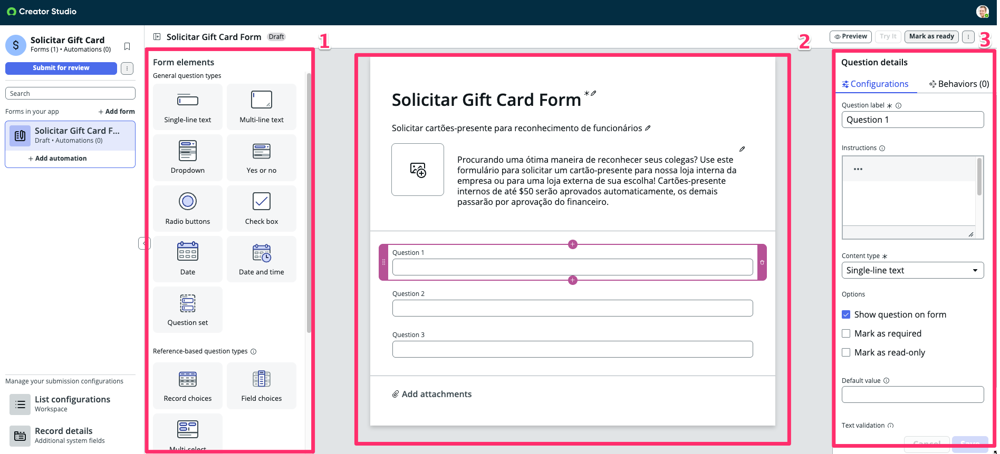

1. **Form Elements**
     - Estes são os elementos que você pode arrastar e soltar na Área de Edição. Cada elemento possui diferentes funcionalidades.

2. **Editing Area**
     - Você arrasta e solta os Form Elements nesta área para configurar os elementos que usará para capturar informações do usuário.
     - Você também nomeia o formulário (“Untitled” abaixo), dá uma descrição e, potencialmente, uma imagem.

3. **Element Configuration**
     - Cada elemento possui diferentes opções de configuração, é aqui que você define o Label, Instruções, Tipo, etc., dos elementos.

## Edite seu formulário de requisição

Vamos começar dando um Nome e uma Descrição para o formulário. Essas informações serão usadas para corresponder ao que o usuário pesquisar no Service Portal.

**Opcional:** Você pode clicar no espaço reservado para a imagem e fazer upload de uma imagem, se tiver uma.  
  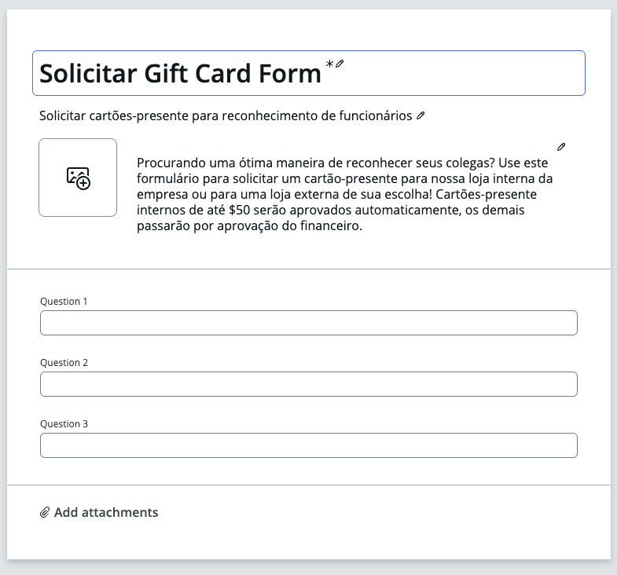

## Edite o formulário

1. Clique para editar **Question 1** e, no lado direito, altere os seguintes detalhes:  
Question label: **Gift card da loja da corporativa?**  
Content type: **Yes or no**  
Clique em **Save and close**
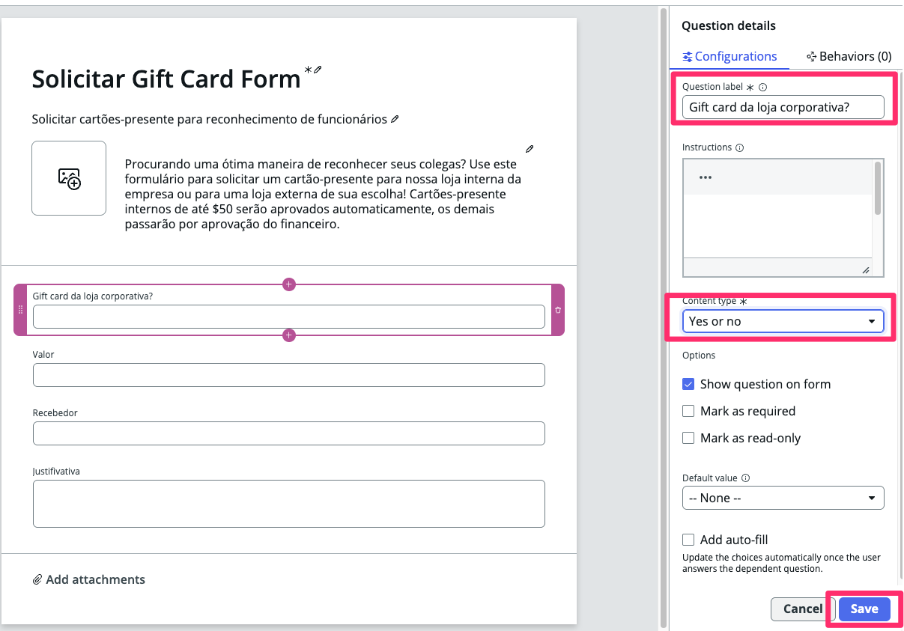

1. Clique para editar **Question 2** e, assim como acima, altere os seguintes detalhes:  
Question label: **Valor**  
Text validation: **Number**
Clique em **Save and close**
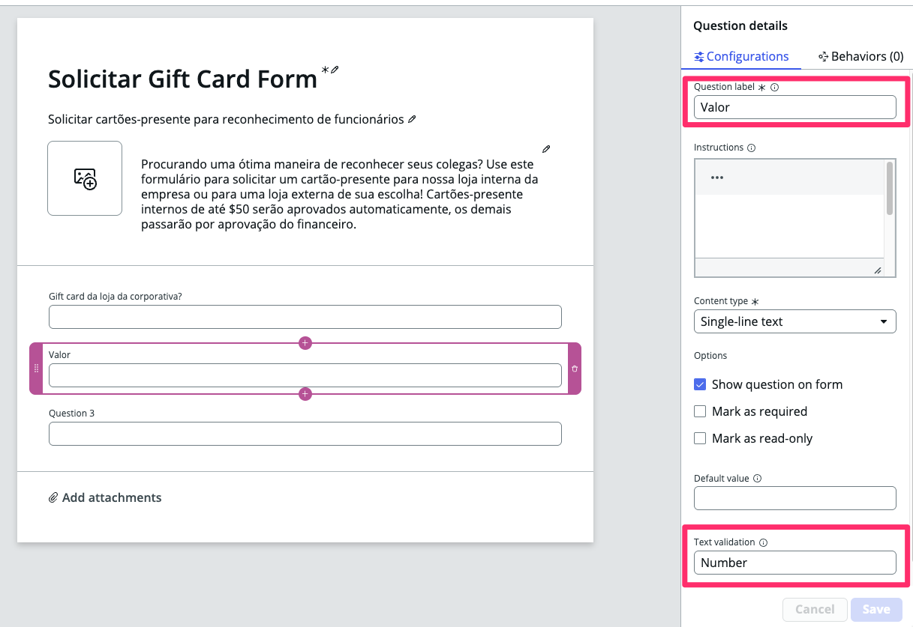

1. Clique para editar **Question 3**  
Question label: **Recebedor**  
Content type: **Record Choices**  
Source table: **User** \[sys_user\]  
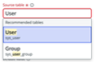
Clique em **Save and close**
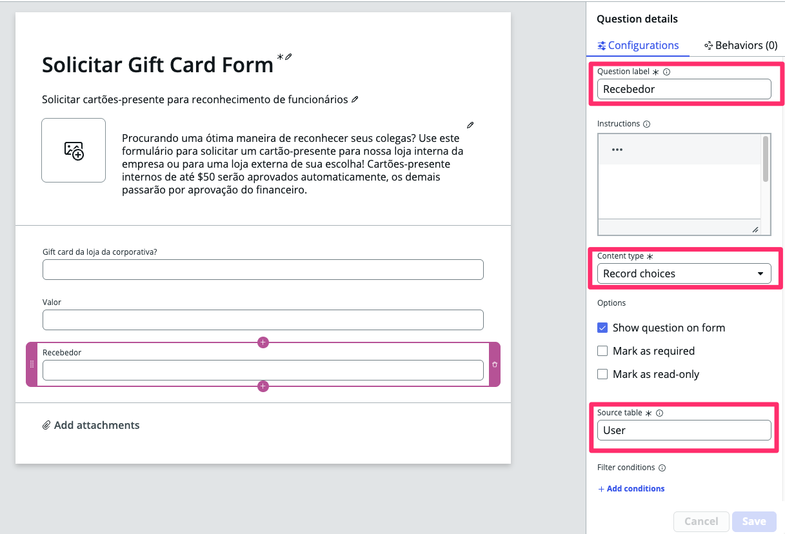

  **Nota:** para esta questão, escolhemos referenciar uma tabela do ServiceNow.

  Isso nos dá a opção de popular dinamicamente um popup com dados disponíveis  
  na plataforma.

4.  Adicione outro form element para capturar a **Justificativa**.  
  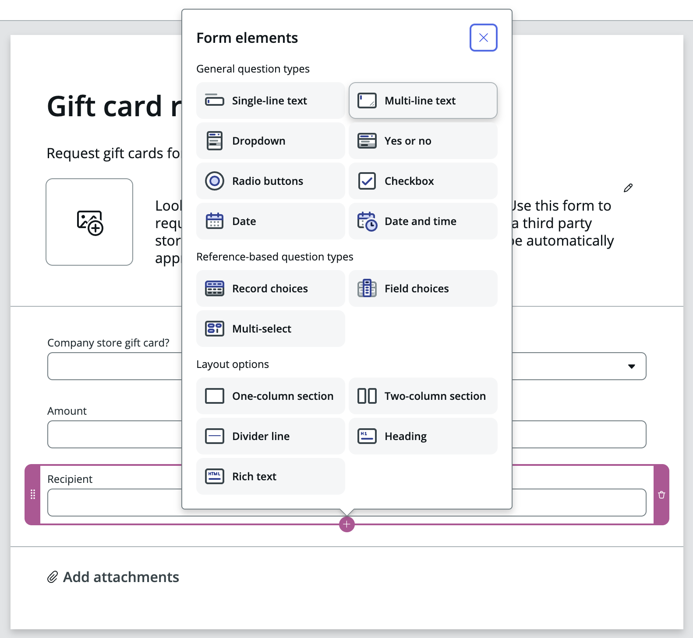
    - Com o form element inferior _Recipient_ selecionado – clique no **Plus +** que aparece abaixo do form element e escolha adicionar um  
    **Multi-line text** element.  
    - Clique na **Question 4** e edite o campo Question label para **Justificativa**.
  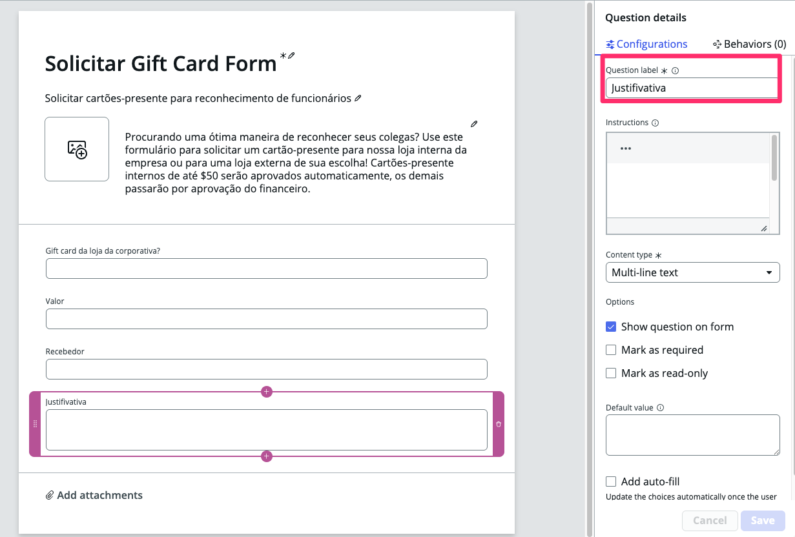
  Clique em **Save and close**  

5. Clique em **Mark as ready**
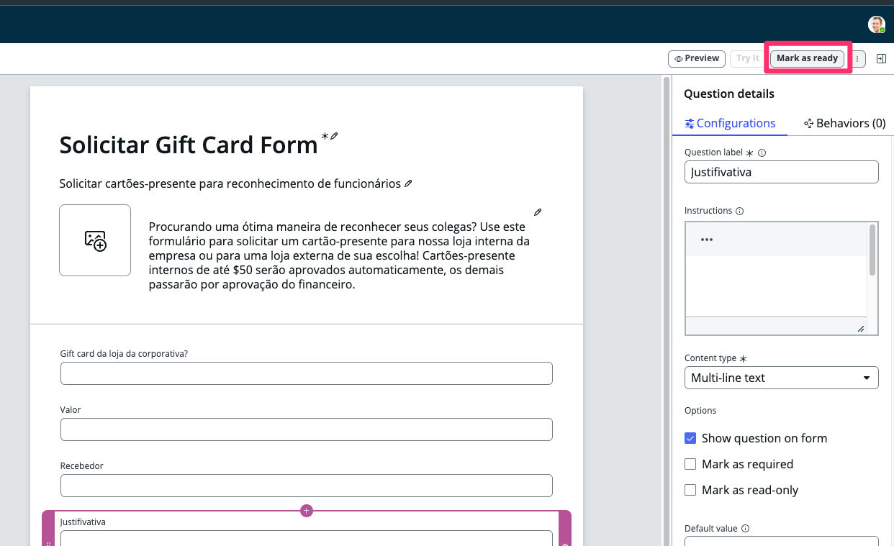

6. Vamos definir o local em que o nosso formulário estará acessível em nosso portal. Clique em **Edit location setting**
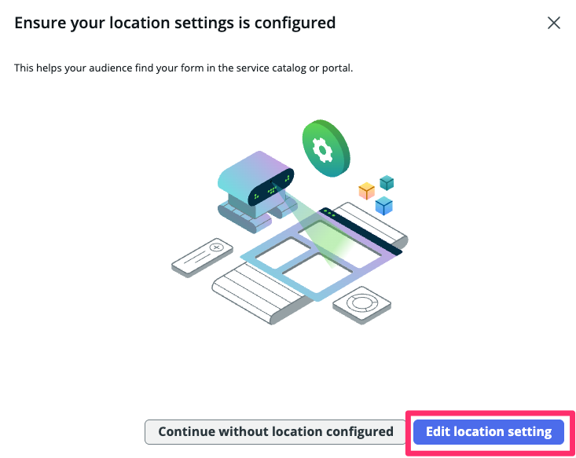

## Adicione sua aplicação de request a um Service Catalog

Você pode adicionar a aplicação, ou melhor, os Catalog Items do seu processo de request, a um ou mais Service Catalogs e Categorias.

1. Clique em **edit** para selecione o catálogo.
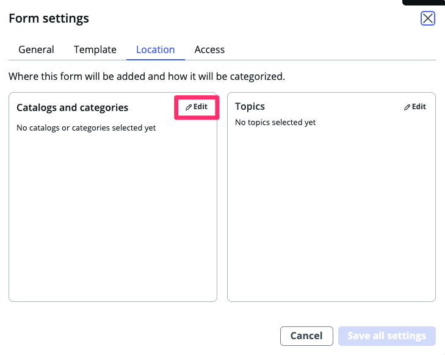

2. Por enquanto, usaremos “Service Catalog” e a categoria “Can We Help You?”
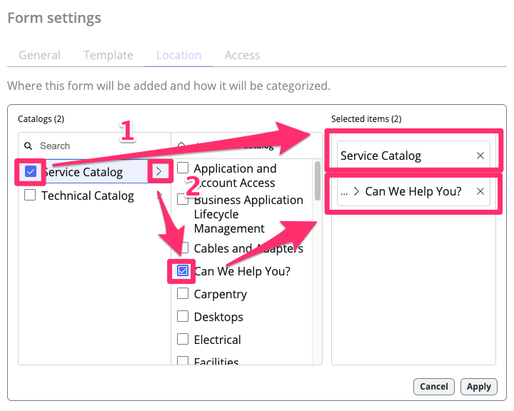

3.  Clique em **Save all settings**
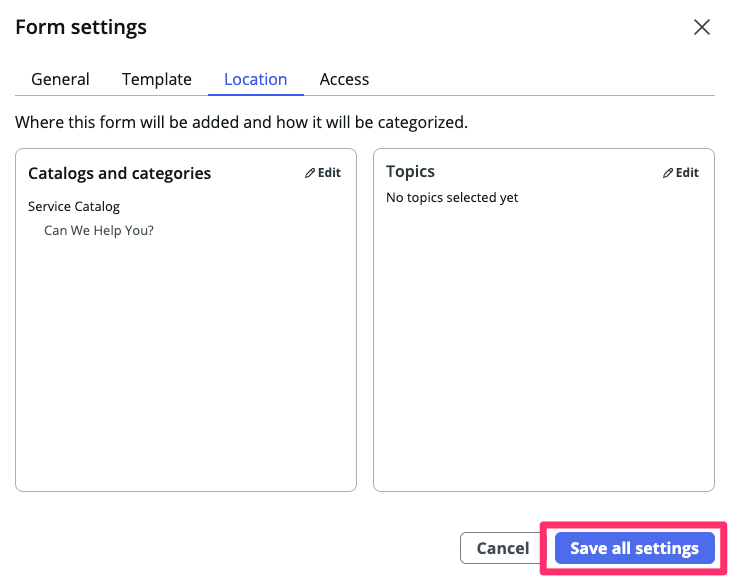

4. Clique novamente em **Mark as ready** e uma mensagem de sucesso deve ser exibida no topo da página.
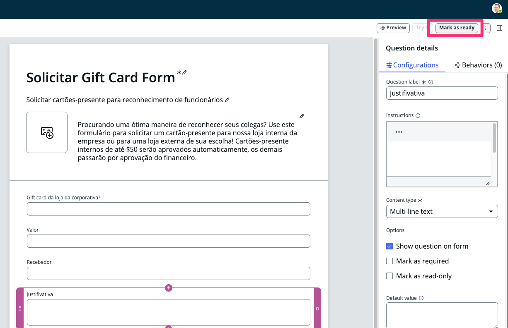
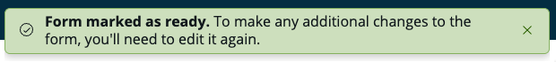

## Visualize em várias experiências

O ServiceNow oferece diversas formas de consumir suas experiências. Nesta visualização, você poderá ver como seu request ficará em diferentes interfaces de usuário.

1. Você poderá retornar a essa visualização a qualquer momento para ver suas alterações.
2. Clique em **Preview**
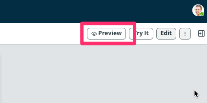
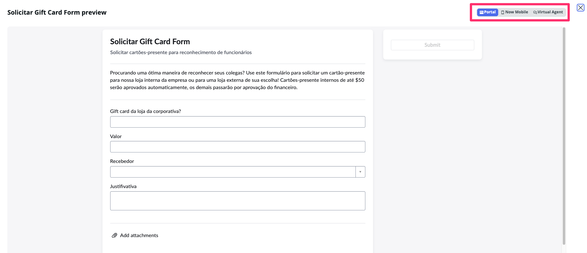

  > Sinta-se à vontade para explorar essas visualizações – você pode voltar aqui depois.

3. Clique em **Fechar** para continuar
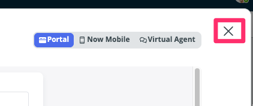

## Seção Concluída

Parabéns, você criou o formulário para sua aplicação.

O próximo passo será projetar os processos que cuidam da aprovação pelo gerente do solicitante e pelo grupo de aprovação apropriado.
