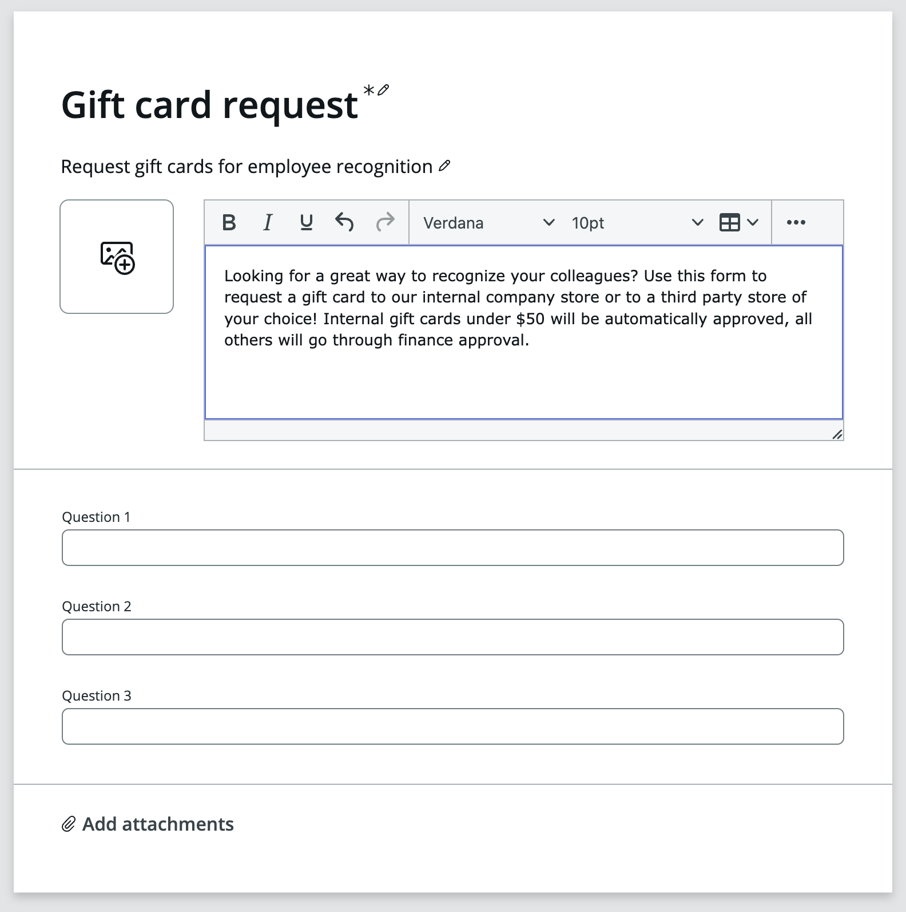
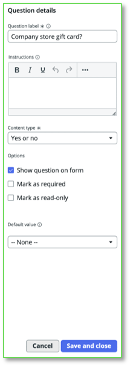

Nesta seção, você irá criar o formulário de requisição.

## Creator Studio – Tela de Edição

Esta é a tela de edição do Creator Studio.

- **Forms, Automations and Submissions**  
Você pode configurar três áreas principais no Creator Studio:

1. **Forms** – Estes serão seus itens de catálogo, seus record producers. É o que o usuário final usará para iniciar o processo, para enviar a requisição.

2. **Automations** – Aqui você pode criar um Playbook para guiar o usuário do processo, o fulfiller, sobre como atender à requisição do usuário.

3. **Form submissions** – Aqui você pode editar e configurar a visualização que o usuário do processo terá ao trabalhar em uma requisição no “Request App Workspace.”

Na tela, você também verá:

- **Form Elements**

  - Estes são os elementos que você pode arrastar e soltar na Área de Edição. Cada elemento possui diferentes funcionalidades.

- **Editing Area**

  - Você arrasta e solta os Form Elements nesta área para configurar os elementos que usará para capturar informações do usuário.

  - Você também nomeia o formulário (“Untitled” abaixo), dá uma descrição e, potencialmente, uma imagem.

- **Element Configuration**

  - Cada elemento possui diferentes opções de configuração, é aqui que você define o Label, Instruções, Tipo, etc., dos elementos.

## Edite seu formulário de requisição

Vamos começar dando um Nome e uma Descrição para o formulário. Essas informações serão usadas para corresponder ao que o usuário pesquisar no Service Portal.

1. Clique em **Untitled** e altere para **Gift card request**

2. Clique na linha abaixo e altere para **Request gift cards for employee recognition**.

3. Agora clique na descrição à direita do espaço reservado para a imagem, note que você terá um editor de texto enriquecido aqui. Altere o conteúdo para:  
**Looking for a great way to recognize your colleagues? Use this form to request a gift card to our internal company store or to a third-party store of your choice! Internal gift cards under $50 will be automatically approved, all others will go through finance approval.**

4. **Opcional:** Você pode clicar no espaço reservado para a imagem e fazer upload de uma imagem, se tiver uma.  
  

5. O próximo passo será definir as opções para o usuário e substituir as perguntas de placeholder na metade inferior.
  

### Edite o formulário

24. Clique para editar **Question 1** e, no lado direito, altere os seguintes detalhes:  
Question label: **Company store gift card?**  
Content type: **Yes or no**  
Clique em **Save and close**

25. Clique para editar **Question 2** e, assim como acima, altere os seguintes detalhes:  
Question label: **Amount**  
Clique em **Save and close**

26.   Clique para editar **Question 3**  
Question label: **Recipient**  
Content type: **Record Choices**  
Source table: **User** \[sys_user\]  
Clique em **Save and close**

**Nota:** para esta _(__20__)_ questão, escolhemos referenciar uma tabela do ServiceNow.

Isso nos dá a opção de popular dinamicamente um popup com dados disponíveis  
na plataforma.

27. Adicione outro form element para capturar a **Justification**.  
  
Com o form element inferior _Recipient_ selecionado – clique no **Plus +** que aparece abaixo do form element e escolha adicionar um  
**Multi-line text** element.  
  
Alternativamente, arraste e solte um elemento **Multi-line text** da seção Form elements à esquerda para a Editing Area.  
  
Dê ao elemento o label: **Justification**.  
Clique em **Save and close**  

## Seção Concluída

Parabéns, você criou o formulário para sua aplicação.

O próximo passo será projetar os processos que cuidam da aprovação pelo gerente do solicitante e pelo grupo de aprovação apropriado.
