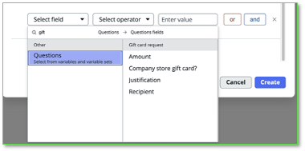
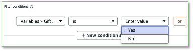
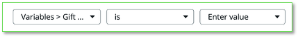
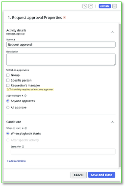

Nesta seção, vamos criar um playbook para automação e desenhar o processo de aprovação.

Vamos criar um playbook que será executado quando o usuário solicitar um gift card de uma loja externa (quando o usuário selecionar NÃO para a pergunta “Company store gift card?” que você criou anteriormente).  
  

1.  Clique em **Automations** na seção da aba superior.

2.  Clique em **Create** **a new playbook** e nomeie como **Approve internal gift cards**

**30.**  No popup Create playbook, role para baixo até **Filter conditions** e clique em **\+ Add conditions**.  
No popup **Select field** para as condições de filtro, clique e role até o final em **Questions**.  
**Você pode digitar, ao lado da lupa, o que está procurando (Dica: gift card) ou rolar até encontrar no lado direito.**  
    
Selecione **Company store gift card**

31. Em seguida, selecione **is** como seletor no popup do meio e **Yes** no último _(Enter value)_.  
    
Nota: Devido a um problema de UI nas instâncias do Lab, você não verá que selecionou “Yes” no último popup – ele mostrará “Enter value” independentemente da sua escolha. Não se preocupe, sua seleção foi feita.  
    
  

32. Clique em **Create**!

Você criou um Playbook que será acionado quando necessário. O próximo passo é definir as ações que queremos. Os **Fulfillment steps**.

Agora vamos criar passos para solicitar aprovação do gerente do solicitante.

A caixa do meio, **Fulfillment steps**, conterá sua lógica.

Como o Creator Studio preza pela simplicidade, o usuário está limitado a um passo de fulfillment. Playbooks mais avançados podem ser construídos usando o **Workflow Studio**, mas isso fica para outro lab.

**Nota:** Quando você abrir um popup nesta visualização para adicionar ou configurar passos, seu trabalho será salvo assim que clicar em **Save and close** nos popups exibidos.

  

33.     Clique no **+ azul** para adicionar um novo passo.  
Você verá duas opções.  
O símbolo **Diamond** no topo cria uma **Decision activity** (if/then)  
O símbolo **square** embaixo adiciona uma atividade. Clique no **Square** embaixo para adicionar uma atividade.  
  

34. No popup exibido, escolha adicionar uma atividade **Request approval**.  
  

  

35.   Nas propriedades da atividade **Request approval**, atualize o Nome para **Request manager approval** e selecione a checkbox para **Requestor’s manager**.  
Clique em **Save and close.  
  
**

36. No canto superior direito da tela, clique em **Activate** para tornar o novo Playbook ativo para todas as novas solicitações.  
  

## Section Complete

Parabéns, você criou a automação do playbook para sua solicitação.

A seguir, vamos revisar o workspace usado para cumprir as solicitações.

  
