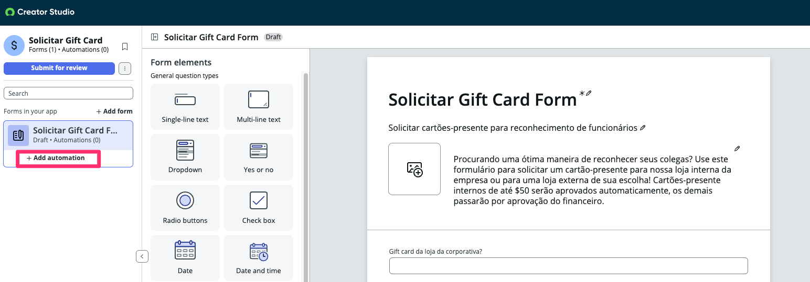
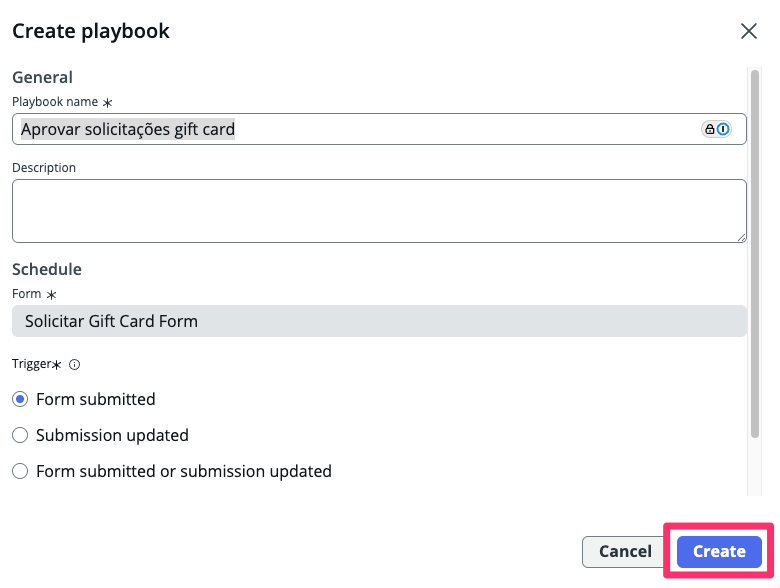
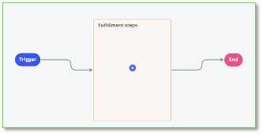
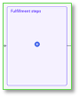
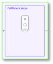
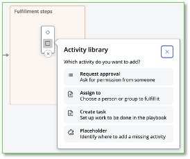
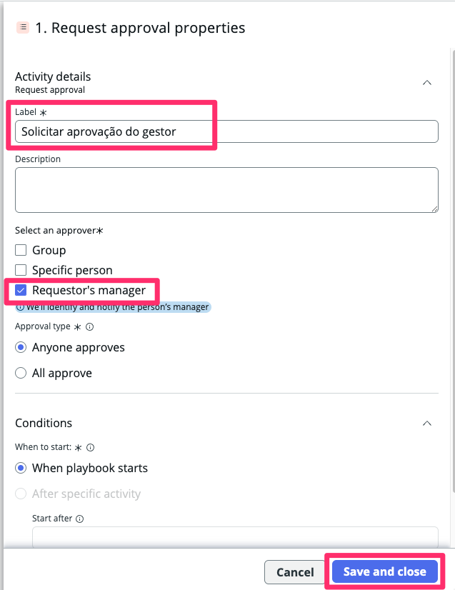
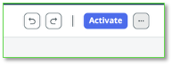

Nesta seção, vamos criar um playbook para automação e desenhar o processo de aprovação.

Vamos criar um playbook que será executado quando o usuário solicitar um gift card de uma loja externa (quando o usuário selecionar NÃO para a pergunta “Company store gift card?” que você criou anteriormente).  
  

1.  Clique em **+ Add Automations** abaixo do seu form.

2.  Nomeie como **Aprovar solicitações gift card** e clique em **Create**
 

1.  Clique em **Create**!

Você criou um Playbook que será acionado quando necessário. O próximo passo é definir as ações que queremos. Os **Fulfillment steps**.

Agora vamos criar passos para solicitar aprovação do gerente do solicitante.

A caixa do meio, **Fulfillment steps**, conterá sua lógica.

Como o Creator Studio preza pela simplicidade, o usuário está limitado a um passo de fulfillment. Playbooks mais avançados podem ser construídos usando o **Workflow Studio**, mas isso fica para outro lab.

**Nota:** Quando você abrir um popup nesta visualização para adicionar ou configurar passos, seu trabalho será salvo assim que clicar em **Save and close** nos popups exibidos.

  

8.  Clique no **+ azul** para adicionar um novo passo.  
Você verá duas opções.  
O símbolo **Diamante** no topo cria uma **Decisão** (if/then)  
O símbolo **Quadrado** embaixo adiciona uma atividade. Clique no **Quadrado** embaixo para adicionar uma atividade.  
    

9.  No popup exibido, escolha adicionar uma atividade **Request approval**.  
  

10. Nas propriedades da atividade **Request approval**, atualize o Nome para **Solicitar aprovação do gestor** e selecione a checkbox para **Requestor’s manager**.  
Clique em **Save and close**. 

  
11.  No canto superior direito da tela, clique em **Activate** para tornar o novo Playbook ativo para todas as novas solicitações.  
  

## Section Complete

Parabéns, você criou a automação do playbook para sua solicitação.

A seguir, vamos revisar o workspace usado para cumprir as solicitações.

  
