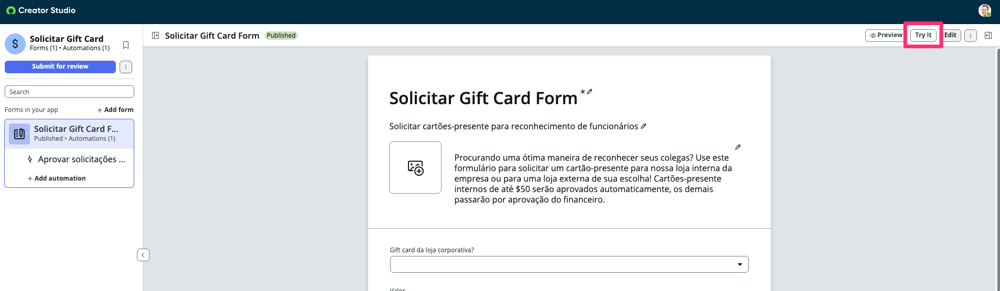
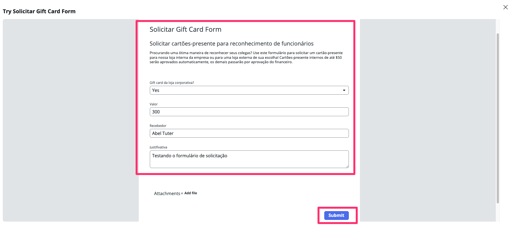
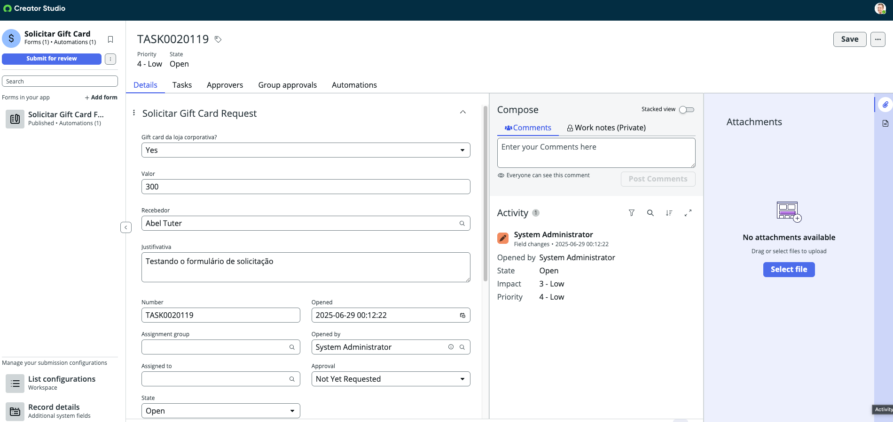

Vamos revisar a sua solução enviando uma solicitação de teste dentro do **Creator Studio**

1. Clique em **Try it**

2. Preencha informações para testarmos o nosso formulário.

3. Você será redirecionado para a visão de recebimento das solicitações.
 
   

## Seção Completa

Parabéns, você revisou o Workspace para seu processo.
