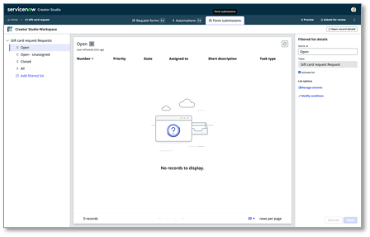

Revise a seção “Form submissions”

Para aplicações criadas no Creator Studio, existe um workspace comum chamado “Request app workspace.” Usuários do processo, fulfilledores, utilizam este workspace para trabalhar nas tarefas criadas nas diversas aplicações feitas no Creator Studio. O acesso a um determinado processo é fornecido por roles criadas pelo Creator Studio.

A última parte a revisar e configurar é a seção do seu processo no workspace comum Request app workspace.  
  

1.  Clique em **Form submissions** no topo central do Creator Studio.  
  

Esta visualização permite configurar a visão que seus usuários do processo usarão para trabalhar em registros individuais.

A coluna à esquerda fornece alguns filtros de lista pré-configurados para os registros e a tabela criada para seu processo. Clicando em “Add filtered list” você pode adicionar mais opções para seus usuários.

O centro exibe uma prévia da lista e, no lado direito, você configura tanto a lista selecionada da coluna esquerda quanto as colunas da tabela mostradas na prévia do centro.

  

Não faremos nenhuma alteração nesta visualização neste laboratório.

## Seção Completa

Parabéns, você revisou o Workspace para seu processo.
