Agora, vamos fazer um teste rápido.

## Teste sua aplicação

1. Agora, vamos **impersonate** outro usuário; lembre-se que construímos isso usando uma persona admin.
2. Volte para a home da plataforma servicenow.
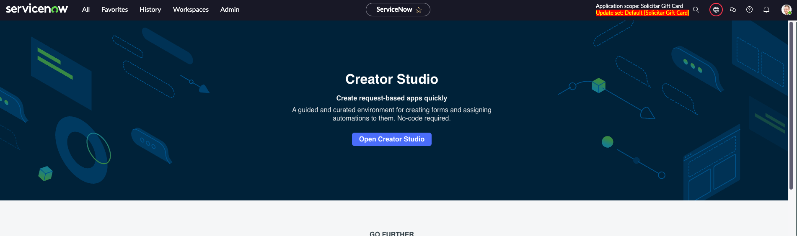

3. Clique na foto do seu usuário no canto superior direito e escolha **Impersonate user**.
  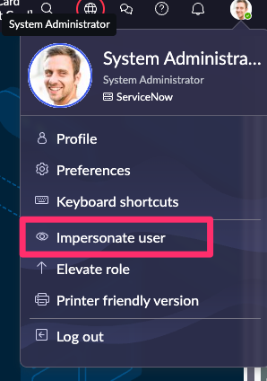

1. Na caixa **Impersonate user**, digite e escolha o usuário  
**Billie Cowley** – quando selecionado, clique no botão **Impersonate user**.  
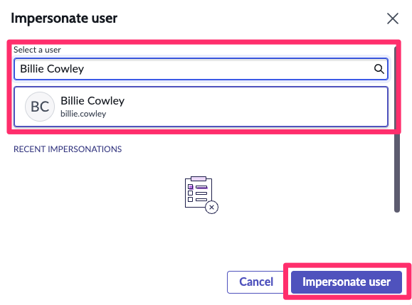

  > **Nota:** Tudo o que você fizer a partir de agora será “como” Billie Cowley.

5. Agora, como Billie Cowley – no menu **All**, digite e clique para abrir o **Service Catalog** (a maneira mais rápida para encontrarmos nosso catalog item e testá-lo “ao vivo”).
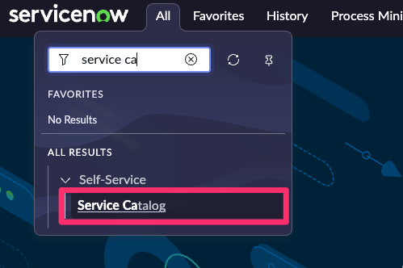

6. Uma vez no Service Catalog, pesquise por **Gift card request** no canto superior direito da visualização do catálogo. Pressione **Enter** para buscar.  
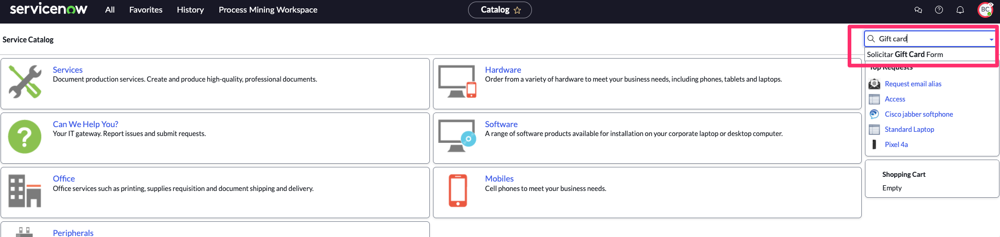

7. Clique em **Gift card request** no resultado da busca.  
Isso permitirá que você envie uma solicitação de teste, como Billie Cowley.
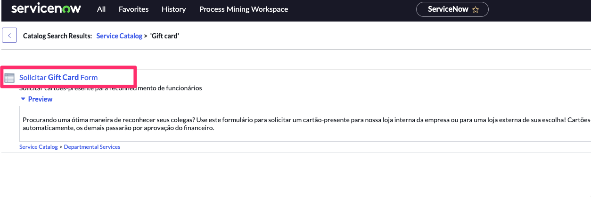

8. Preencha o formulário:  
   - Gift card da loja corporativa?: **Yes**  
   - Valor: **100**  
   - Recebedor: **Joe Employee**  
   - Justificativa: **Ótimo trabalho!**  

  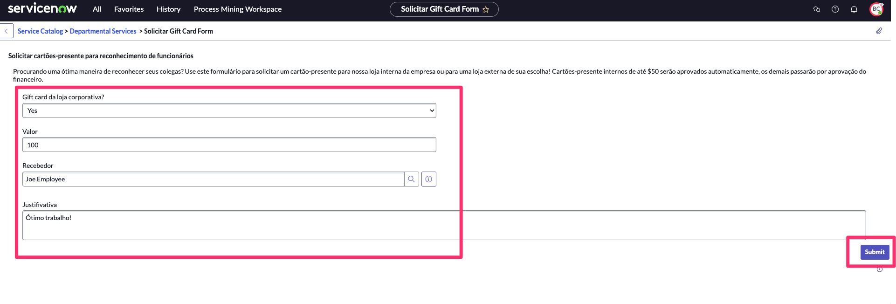
  Clique em **Submit**

9. No menu do usuário no canto superior direito, clique em **BC** (para Billie Cowley) e escolha **End impersonation** para voltar à sua persona admin.  
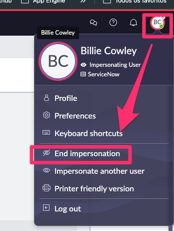

  > **Nota:** Você agora enviou uma solicitação como **Billie Cowley**. Billie tem uma gerente, Crystal. De volta à persona desenvolvedor/admin, vamos testar o workspace para solicitações do Creator Studio.

## Testar o “Request app workspace”

Agora de volta como admin

10. No menu **All**, digite e clique em **Request app workspace**
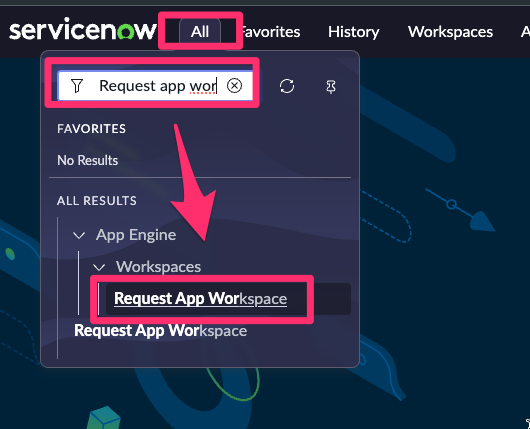

11. O workspace será aberto. Este workspace é comum para todas as aplicações construídas usando o **Creator Studio**. O acesso aos processos individuais é governado pelos papéis definidos quando a aplicação e os fluxos de trabalho são criados no **Creator Studio**.

12. Role até encontrar a lista com o nome **Solicitar Gift Card** e selecione **Open**
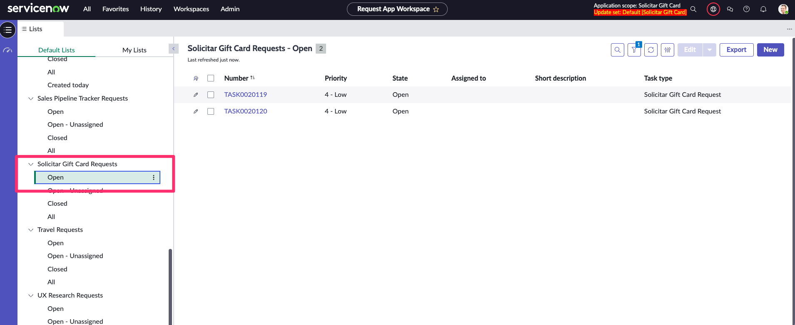

13.  Clique para visualizar a tarefa que Billie Cowley acabou de enviar, no meu caso é a **TASK0020120** (seu número será diferente – mas verifique o timestamp e verá que é o correto para você).
  

14. Aqui, podemos ver que Billie criou a solicitação (opened by), e podemos visualizar os diversos dados que ela inseriu antes de enviar.
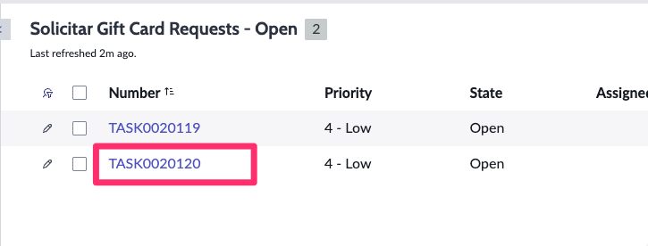

15. Também podemos ver que o estado de aprovação da solicitação está como **Requested**.
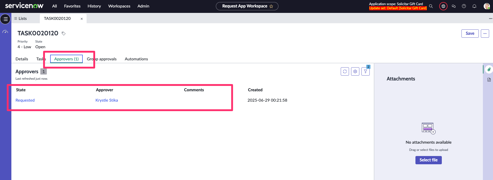

16.  Clique na lista relacionada **Automations**.  
  

Observe que **Krystle Stika** foi designada para aprovar esta solicitação. Ela é a gerente de Billie.

A lista relacionada **Automations** mostra qualquer passo de automação que você construiu no Playbook. Os passos aqui também podem ser para o usuário do processo – o playbook guia o usuário sobre o que fazer.
