Agora, vamos fazer um teste rápido.

## Teste sua aplicação

### Publicar o Catalog Item

Para testar a aplicação e o processo, precisamos visualizar o Catalog Item que criamos e testar o Workspace.

  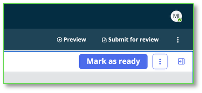

1. Volte para a visualização **Request forms** e clique no botão **Mark as ready** no canto superior direito.  

> **Nota:** Esta ação irá “publicar” seu Catalog Item na instância de desenvolvimento em que você está trabalhando. Isso permitirá que façamos o teste!

Agora, vamos **impersonate** outro usuário; lembre-se que construímos isso usando uma persona admin.

  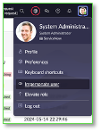

2. Clique no perfil do usuário no canto superior direito da tela e escolha **Impersonate user**.

3. Na caixa **Impersonate user**, digite e escolha o usuário  
**Billie Cowley** – quando selecionado, clique no botão **Impersonate user**.  

  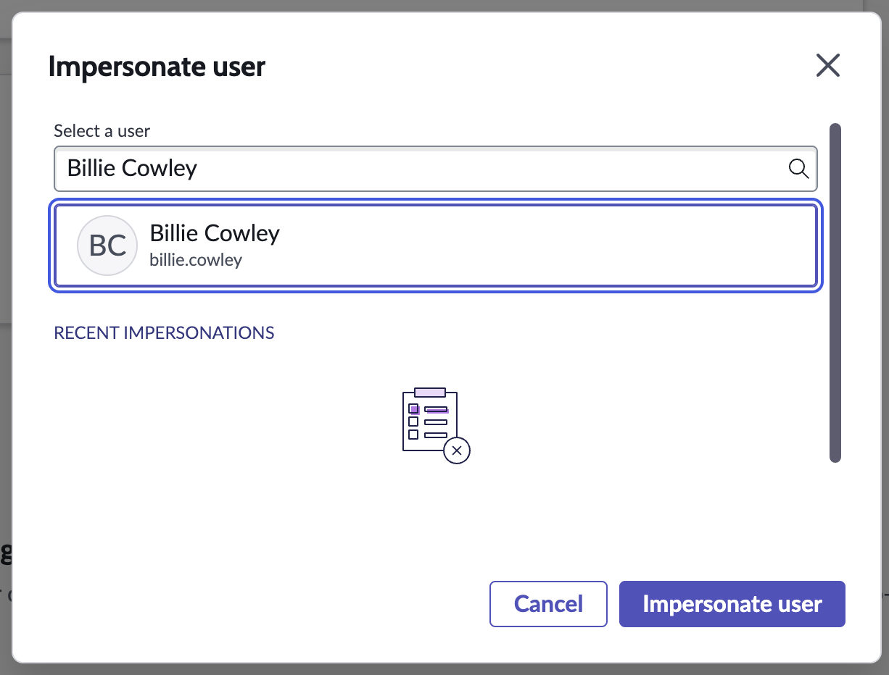

> **Nota:** Tudo o que você fizer a partir de agora será “como” Billie Cowley.

  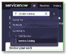

4. Agora, como Billie Cowley – no menu **All**, digite e clique para abrir o **Service Catalog** (a maneira mais rápida para encontrarmos nosso catalog item e testá-lo “ao vivo”).

5. Uma vez no Service Catalog, pesquise por **Gift card request** no canto superior direito da visualização do catálogo. Pressione **Enter** para buscar.  

  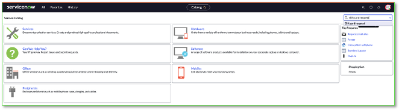

6. Clique em **Gift card request** no resultado da busca.  
Isso permitirá que você envie uma solicitação de teste, como Billie Cowley.

7. Preencha o formulário:  
   - Company store gift card: **Yes**  
   - Amount: **100**  
   - Recipient: **Joe Employee**  
   - Justification: **Well done job!**  

  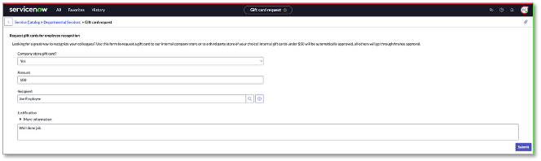

8. Clique em **Submit**

9. No menu do usuário no canto superior direito, clique em **BC** (para Billie Cowley) e escolha **End impersonation** para voltar à sua persona admin.  

> **Nota:** Você agora enviou uma solicitação como **Billie Cowley**. Billie tem uma gerente, Crystal. De volta à persona desenvolvedor/admin, vamos testar o workspace para solicitações do Creator Studio.

## Testar o “Request app workspace”

  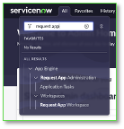Agora de volta como admin

10. No menu **All**, digite e clique em **Request app workspace**

O workspace será aberto.

Este workspace é comum para todas as aplicações construídas usando o **Creator Studio**. O acesso aos processos individuais é governado pelos papéis definidos quando a aplicação e os fluxos de trabalho são criados no **Creator Studio**.

  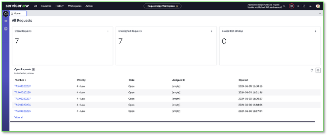

Como você pode ver, meu workspace tem algumas tarefas, o seu provavelmente terá apenas uma.

11. Clique para visualizar a tarefa que Billie Cowley acabou de enviar, no meu caso é a **TASK0020239** (seu número será diferente – mas verifique o timestamp e verá que é o correto para você).

  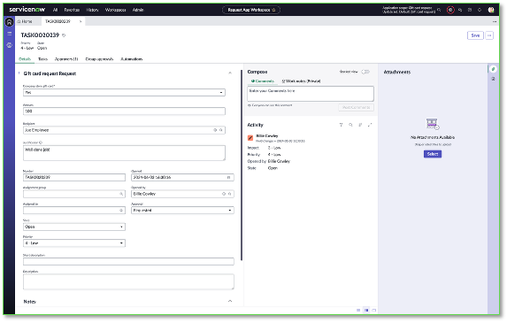

Aqui, podemos ver que Billie criou a solicitação (opened by), e podemos visualizar os diversos dados que ela inseriu antes de enviar.

Também podemos ver que o estado de aprovação da solicitação está como **Requested**.

12. Clique na lista relacionada **Approvers** perto do topo do registro e depois na lista relacionada **Automations**.

  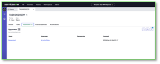   
  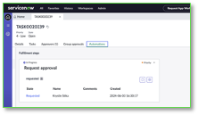

Observe que **Krystle Stika** foi designada para aprovar esta solicitação. Ela é a gerente de Billie.

A lista relacionada **Automations** mostra qualquer passo de automação que você construiu no Playbook. Os passos aqui também podem ser para o usuário do processo – o playbook guia o usuário sobre o que fazer.
