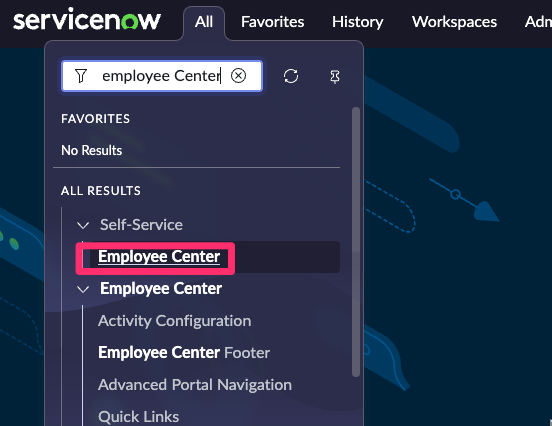
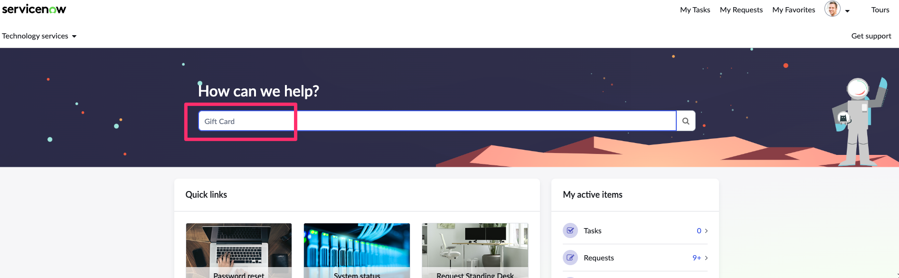

A ServiceNow oferece diversos tipos de portais para facilitar o acesso e o uso de suas aplicações, mesmo para usuários iniciantes. Esses portais são diferentes maneiras de acessar formulários, serviços e informações na plataforma, cada um com uma experiência adaptada para necessidades específicas.

Você também pode acessar sua aplicação a partir de um dos portais da ServiceNow.

1. No menu **All**, digite e clique em **Employee Center**

2. Uma vez no Employee Center, pesquise por **Gift card request** no canto superior direito da visualização do catálogo. Pressione **Enter** para buscar.  

3. Veja que o seu formulário é acessível de difentes experincias disponíveis na plataforma

## DESAFIO

Explore outro portal da Servicenow chamado **Service Portal**.

:::tip
**DICA:** Você também pode acessá-lo colocando no fim da sua URL **/sp**

`https://xxxxxxxxxx.com/sp`
:::