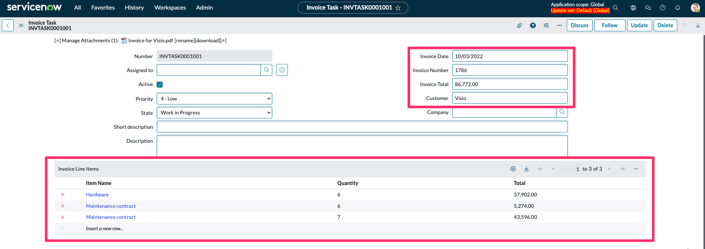

Com o caso de uso aberto na página de administração do **Document Intelligence**:

1. Crie o Flow para criar uma nova tarefa de Documento a partir de uma tarefa de Fatura:
   - Na aba **Integrations**, selecione **Set up your first integration**.

    

   - Preencha o formulário para criar a integração de Process Task:

    | Campo                       | Valor                         |
    |-----------------------------|-------------------------------|
    | **Name your Integration:**  | Process Invoice Task          |
    | **What type of integrations you want to set?** | Process Task |
    | **Condition:**              | Leave blank                   |
    | **Create Flow:**            | Checked (True)                |

    
   - Clique em **Save**.
   - Abra no **Flow Designer** (clicando no valor na coluna **Flow**).

      

    :::info
    **Verificação de Conhecimento:** Revise o gatilho do Flow e as Ações: Uma tarefa de Documento será criada quando uma tarefa de Fatura for criada? Como elas estão relacionadas?
    :::
   - Ative o Flow. Em seguida, feche a aba do navegador.

    

2. Crie o Flow que preenche os campos da tarefa de Fatura uma vez que a tarefa de Documento é concluída:
   - Clique em **New integration**.
    
   - Preencha o formulário para criar a integração de **Extract Values**:

    | Campo                       | Valor                         |
    |-----------------------------|-------------------------------|
    | **Name your Integration:**  | Extract Invoice Task          |
    | **What type of integrations you want to set?** | Extract Values |
    | **Create Flow:**            | Checked (True)                |

    
   - Clique em **Save**.
   - Abra no **Flow Designer** (selecionando o valor na coluna **Flow**).
    
    :::info
    **Verificação de Conhecimento:** Revise o gatilho do Flow e as Ações: Nosso registro de Fatura será atualizado quando uma tarefa de Documento for concluída?
    :::
   - Ative o Flow. Em seguida, feche a aba do navegador.
    

## Verificação do Lab

Usando a outra aba do navegador (no início do Lab 2, abrimos uma nova aba do navegador para configurar o **Document Intelligence**), no menu de navegação, abra o menu **Invoice Tasks**. 

Crie uma nova tarefa de Fatura (clique em **New**). Anexe um dos PDFs que você baixou no início deste laboratório. Clique em **Submit**.

- Observe o Número, neste exemplo `INVTASK0001001`. 
:::note 
Você pode ter um número diferente em sua instância.
:::
- Retorne à aba do navegador com a administração do **Document Intelligence** e atualize a página.
- **Verifique as Ações:** Verifique se foi criada uma nova tarefa de Documento. No campo **Source Record**, você deve ver o número da tarefa de Fatura.

Abra a tarefa de documento e selecione **Open in Document Intelligence**.

## Verifique as Ações

:::info
1 - Caso o document intelligence apresente a mensagem: `We recommend you wait until the task is ready and DocIntel suggestions are available.` Quer dizer que o documento ainda está sendo processado.

2 - Clique em `No, I can wait` e aguarde o processamento finalizar. 

3 - Clique em `Refresh` para atualizar o processamento até que o processo seja concluído:

:::

Agora iremos verificar os campos. 

1. Comece a digitar o valor a ser extraído e observe as sugestões com um nível de confiança (0%). 
2. Clique em uma sugestão para selecioná-la como o valor a ser extraído.

    

3. Comece a digitar o valor a ser extraído e observe as sugestões com um nível de confiança (0%). Clique em uma sugestão para selecioná-la como o valor a ser extraído.

    

4. Para mapear os campos da tabela. clique no ícone ao lado de **Line Item** para expandir.
   

5. Digite os valores conforme a ordem exibida.
   

6. Ao finalizar todos os campos, clique em **Submit**
    :::info
    Perceba que os campos ao serem concluídos são marcados com ícone verde, indicando que foram completados.
    :::
    

    - Feche a aba do navegador.

7. Retorne para a workspace do DocIntel e clique em **Save**
   

8. Verifique o status foi alterado para **Done**
   

9. Retorne para a Invoice Task `INVTASK0001001` criada anteriormente. Veja que os campos foram preenchidos com os valores extraídos.
    

:::info
As sugestões são geradas de forma assíncrona, e pode levar alguns minutos para que o processamento ocorra.
:::

:::info
Caso o processamento não seja concluído, usaremos uma solução alternativa no Lab 3.
:::
