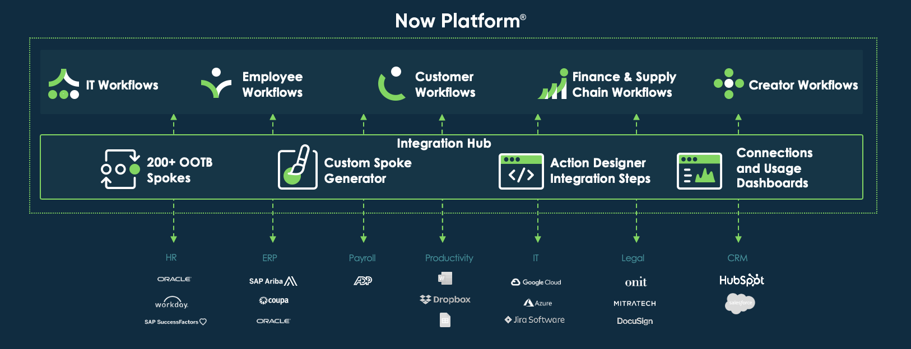
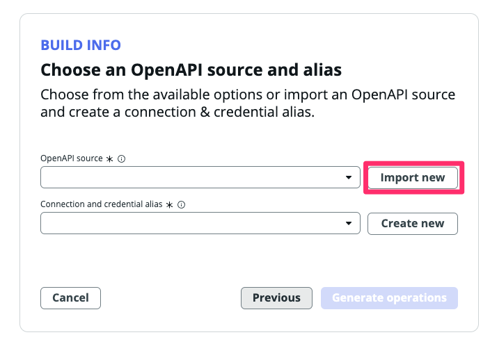
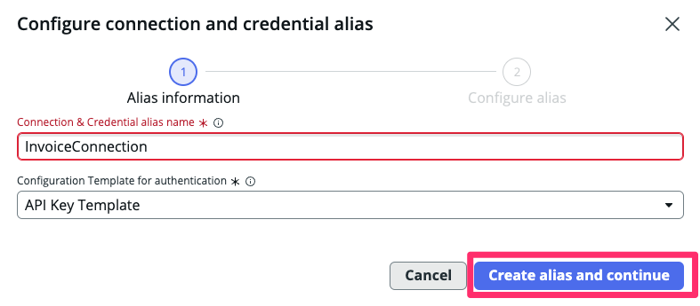
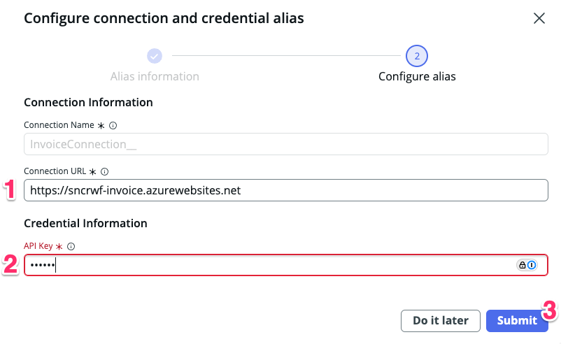
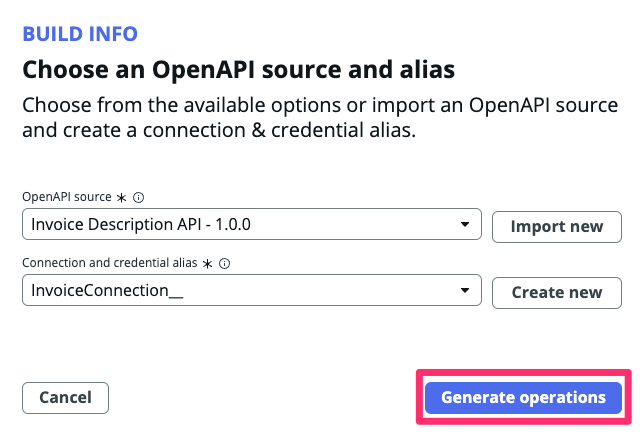
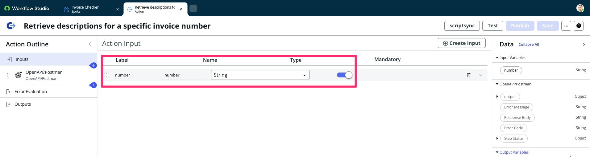
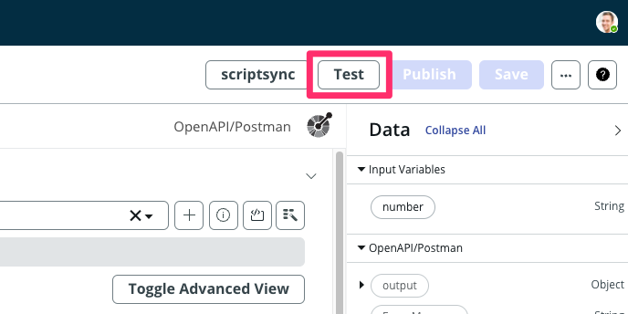
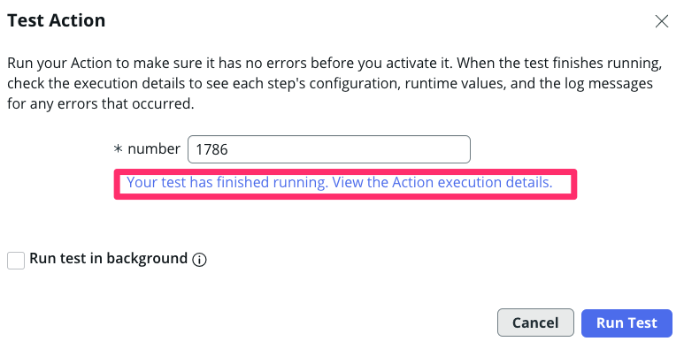
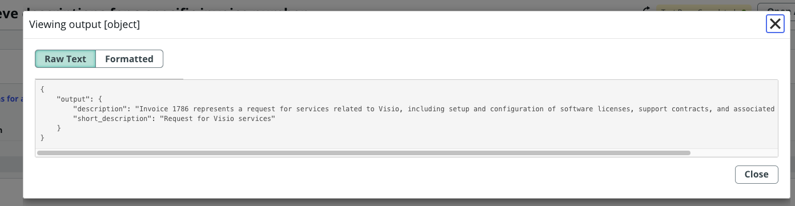

## Caso de Uso

Nosso sistema precisa integrar-se a um sistema externo responsável pelo gerenciamento de faturas, que contém os detalhes de cada invoice processada. O objetivo desta integração é enriquecer os dados da nossa aplicação com as informações fornecidas por esse sistema.

A API desse sistema externo está documentada em OpenAPI (Swagger) e pode ser acessada pelo seguinte link:

**🔗 [Documentação da API](https://sncrwf-invoice.azurewebsites.net/api-docs)**

A API possui uma dinâmica simples: ao fornecer o número da invoice, ela retorna os seguintes detalhes:

- **Short Description**: Uma descrição curta da fatura.
- **Description**: Uma descrição mais detalhada.

Sinta-se à vontade para explorar a documentação e entender melhor seu funcionamento!

## Integration Hub

O IntegrationHub é o local central na plataforma para consumir, criar e gerenciar integrações na sua instância do ServiceNow. No caso de você estar buscando conectar um fluxo de trabalho a um sistema externo, mas o ServiceNow ou os parceiros tecnológicos do ServiceNow não oferecem uma integração pronta (Spoke) para isso, você pode facilmente criar a sua própria. O IntegrationHub fornece numerosos Passos de Ação para conectar seu fluxo de trabalho a sistemas externos que utilizam protocolos como REST, PowerShell, SSH, etc. Neste laboratório, focaremos na integração REST.



## Objetivo

Neste laboratório, vamos mostrar a capacidade de "Gerador de Spokes". Esse recurso permite gerar novos spokes e ações de spoke para APIs de terceiros que seguem a especificação OpenAPI. Você usará um arquivo JSON fornecido.

:::note
Um arquivo JSON para especificações OpenAPI é um arquivo de configuração amigável ao usuário que define a estrutura, endpoints e detalhes de uma API RESTful. Facilita para os desenvolvedores documentarem e comunicarem o design da API. O gerador de spoke pode utilizar automaticamente este arquivo JSON para criar ações de spoke.
:::

Este recurso inovador, o "Gerador de Spokes", reduz significativamente o tempo necessário para criar uma nova integração.


## Instruções

1. Volta para a aba da plataforma (se tiver fechado basta acessar o link raiz da instância novamente), na página principal, clique em **All** (1). Em seguida, digite **flow** (2) e clique em **Flow Designer** (3) para abrir a interface do Flow Designer.
   

2. Uma vez na interface do **Flow Designer**, para acessar o Spoke Generator, selecione **Create New** (1) (localizado no lado direito da tela) e depois clique em **Spoke**.
   

3. O Spoke Generator solicitará as seguintes informações: uma imagem em miniatura (1) (você pode fazer upload de uma imagem em miniatura para servir como logo do seu Spoke; sinta-se à vontade para encontrar uma imagem gratuita no Google Imagens e fazer o upload aqui), um Nome do Spoke (2) e uma Descrição (4).

   | Campo         | Valor                                                        |
   |---------------|--------------------------------------------------------------|
   | 1. Choose how you want to build your spoke | Create a spoke in existing scope   |
   | 2. Application name | Invoice Checker                                              |
   | 3. Description     | This spoke will be used to verify invoice details. |
   | 4. Logo | Upload o do arquivo `spoke-icon.png`    |

    

   - Depois de definir o valor, clique em **Continue**

4. Na tela seguinte, você será solicitado a selecionar o método que deseja usar para criar seu novo spoke. Pretendemos utilizar o método OpenAPI Specification, já que temos o arquivo JSON que descreve a API e segue a Especificação OPENAPI.
   * Selecione **OpenAPI Specification** (1) e clique em **Continue** (2)

    

5. Na próxima tela, **Invoice Checker: Add operations**, você pode fornecer o arquivo JSON. Clique em **Import New** (1), e depois forneça a URL do arquivo JSON, copie a URL do link aqui: 

    
   
   - Copie a URL abaixo:

   ```
   https://sncrwf-invoice.azurewebsites.net/swagger.json
   ```

6. Cole a URL copiada na etapa anterior no campo **OpenAPI URL** (1), e depois clique em **Import** (2)
   


7.  Em seguida, clique em **Create New** ao lado do campo **Connection Alias** (1)

    

   :::note
   No ServiceNow, um Connection Alias é uma configuração usada para estabelecer e gerenciar conexões com sistemas externos. Funciona como uma camada de abstração para conectar a sistemas externos e simplifica o processo de integração dentro dos fluxos de trabalho e outros componentes do ServiceNow. Normalmente, ao conectar o ServiceNow a um sistema externo, você deve configurar a URL do endpoint (o sistema de terceiros) e especificar como autenticar com ele. Isso é feito através das configurações de Conexão e Credenciais no ServiceNow. Na prática, é essencial discutir com o administrador do sistema remoto e coordenar com a equipe de segurança antes de iniciar essa configuração.
   :::

8.  No campo **Connection alias name** (1) digite **InvoiceConnection** e mantenha o **Authentication Configuration Template** com o valor padrão **Api Key Template** (2), depois clique em **Create alias and continue** (3)

    

11. Preencha as informações a seguir e clique em **Submit**

   | Campo         | Valor                                                        |
   |---------------|--------------------------------------------------------------|
   | (1) Connection URL | `https://sncrwf-invoice.azurewebsites.net`   |
   | (2) API Key | `appkey`                                    |
   | (3)     | <span className="button-purple">Submit</span> |

    

12. Clique em **Generate Operations**.

    

13. O sistema solicitará que você selecione qual Spoke Action deseja criar.

    :::note
    Para este laboratório, estamos utilizando uma API muito básica projetada especificamente para fins de laboratório e educativos. Esta API consiste em apenas um método, por isso apenas uma ação está visível. Em cenários do mundo real, a maioria das aplicações comerciais que você tenta integrar terá dezenas ou até centenas de métodos em sua API. Você terá a opção de escolher os métodos que deseja utilizar do ServiceNow e criar Spoke Actions para eles.
    :::

14. Selecione a Ação **Retrieve descriptions for a specific invoice number** (1) e depois clique em **Publish** (2)

    


15. Clique em **Done: Go to Spoke**.

    

16. Clique na Spoke Action recém-criada, isso abrirá o editor de Ação no Flow Designer para que possamos inspecioná-la

    

17. Aguarde o carregamento e observe a seção de Entrada da Ação, as Entradas para essa Spoke Action foram criadas automaticamente
    
    

18. Clique no OpenAPI Step (1). Observe os inputs da etapa, eles estão usando as Entradas da Ação, então os valores das Entradas da Ação serão passados como parâmetros quando a chamada API for feita ao sistema externo.

    

19. Vamos testar a API agora. Clique em **Test**

    

20. Preencha o campo **number** com o Número de Invoice e clique em <span className="button-purple">Run Test</span>

   | Campo         | Valor                                                        |
   |---------------|--------------------------------------------------------------|
   | Número de Invoice | **`1786`**   |

    

21. Após concluir o teste. Clique no link abaixo.

    

22. Verifique o status da requisição e o output. Em seguida, clique no output para ver com mais detalhes.

    
    

## Conclusão

** 🎉🎉 Parabéns! Você acaba de criar um Spoke para ser utilizado como conector para integração em fluxos posteriores. **

No próximo passo nós iremos criar um flow para deixar o processo de recebimento de invoices mais inteligente!
