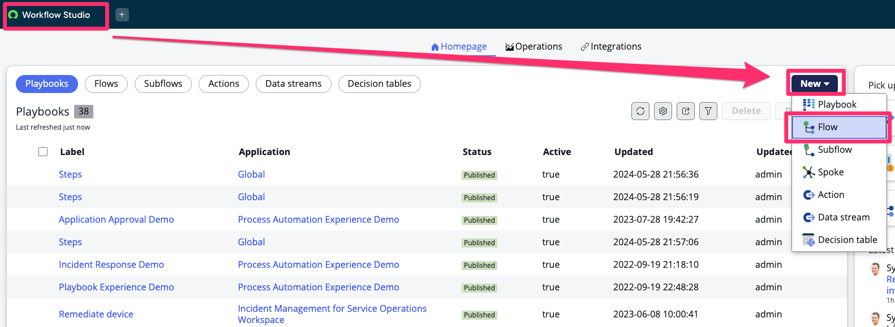
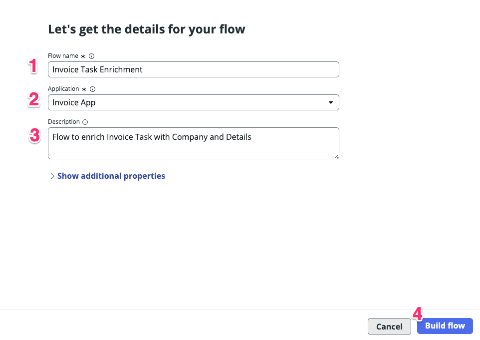
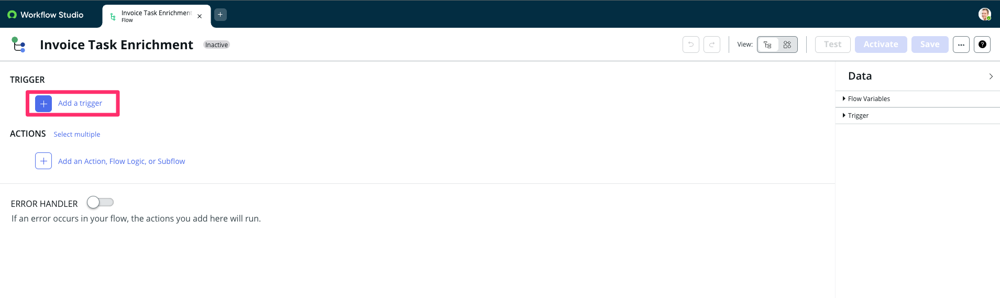
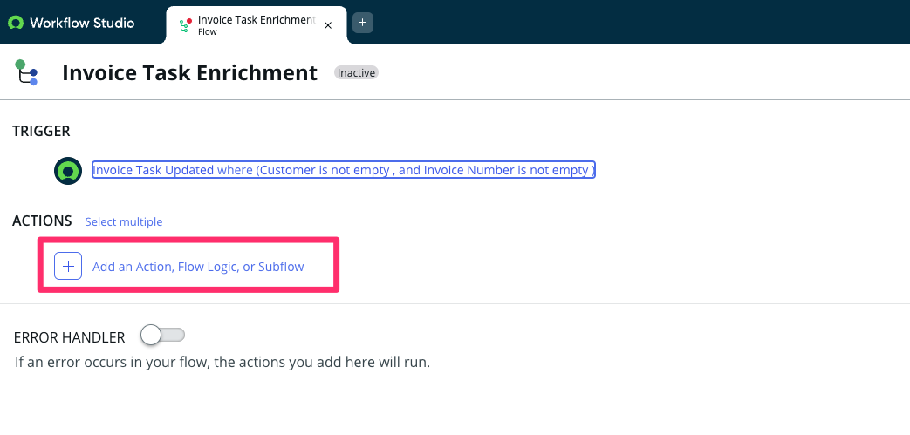
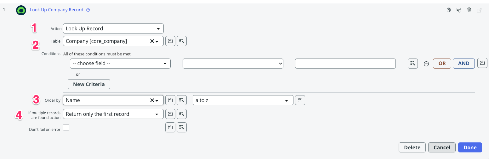
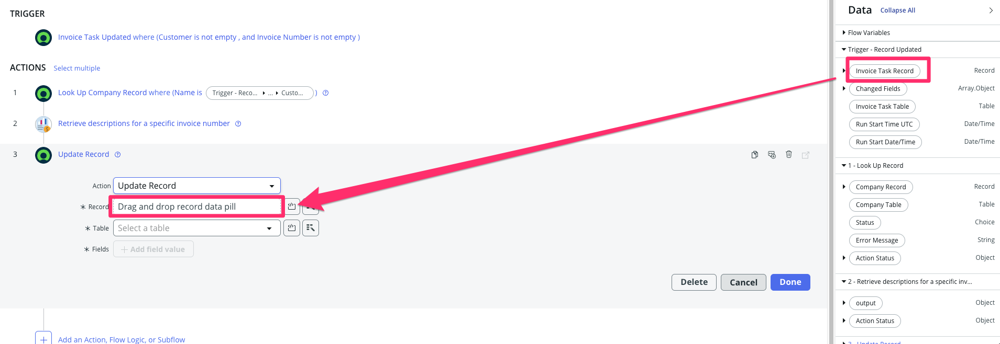
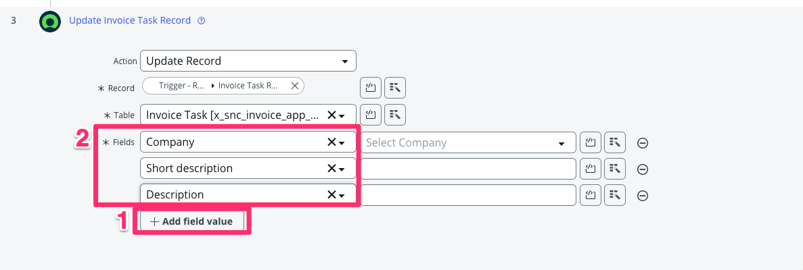
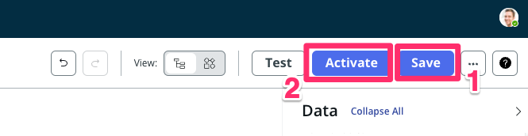
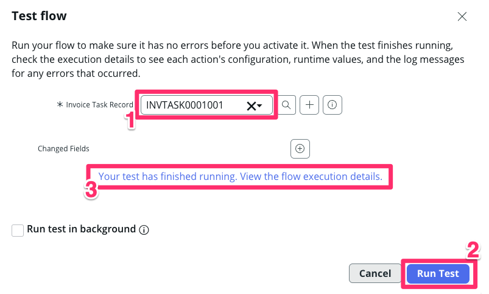
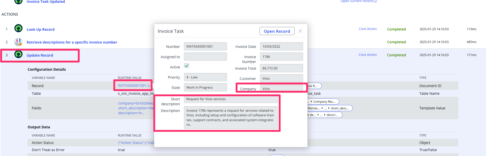

## Caso de Uso

Nosso sistema precisa integrar-se a um sistema externo responsável pelo gerenciamento de faturas, que contém os detalhes de cada invoice processada. O objetivo desta integração é enriquecer os dados da nossa aplicação com as informações fornecidas por esse sistema.

## Visão Geral - Flow

Um fluxo (Flow) representa uma sequência de etapas que são automatizadas para alcançar um resultado de negócios específico. Cada fluxo pode incluir os seguintes componentes:
- **Gatilho**: O evento ou condição que, quando atendido, inicia automaticamente um fluxo.
- **Condições**: Permite fornecer condições sob as quais o fluxo será executado. Por exemplo, execute o fluxo apenas se um campo estiver acima de um determinado valor.
- **Ações**: As tarefas realizadas pelo Fluxo, como atualizar dados, solicitar aprovações ou enviar notificações.

## Visão Geral do Fluxo - Invoice Task Enrichment

   | Etapa         | Detalhes                                                        |
   |---------------|--------------------------------------------------------------|
   | 1 | Crie um Flow que seja acionado ao atualizar a tarefa de Fatura quando o campo **Customer** e **Invoice Number** forem alterados.   |
   | 2  | O Flow busca o registro de cliente na tabela **Company** com o valor do campo **Customer** e recupera o primeiro registro. 
   | 3  | Utilizando o nosso Spoke **Invoice Checker**, iremos consultar as informações de **Short description e Short description** para enriquecermos a nossa tarefa com os detalhes do serviço. |
   | 4  | Ao final, iremos atualizar os campos **Company**, **Short description e Short description** com as informações retornadas                                            |

Com o **Document Intelligence** configurado, podemos processar o fluxo de ponta a ponta.

## Instruções

1. Retorne para homepage do Workflow Studio, selecione **New** e em seguida **Flow**.
   
   :::info
   Caso tenha fechado a janela, volte para a aba da plataforma (se tiver fechado basta acessar o link raiz da instância novamente), na página principal, clique em **All** (1). Em seguida, digite **flow** (2) e clique em **Flow Designer** (3) para abrir a interface do Flow Designer.
   :::

   

2. Preencha as informações do Flow.
   
   | Campo          | Valor                                                 |
   |----------------|-------------------------------------------------------|
   | 1. Flow name   | Invoice Task Enrichment                               |
   | 2. Application | Invoice App                                           |
   | 3. Description | Flow to enrich Invoice Task with Company and Details  |
:::danger
Utilize a application **Invoice App** e não **Invoice Checker**, para que esse fluxo seja criado no escopo da aplicação e não do spoke.
:::

3. Com o flow criado, iremos começar adicionar uma trigger. Clique em **+ Add a trigger**

    

4. Selecione a opção **Record > Updated**
   
   

5. Agora precisamos adicionar a tabela e as condições para o fluxo ser executado. Preencha da seguinte forma:

   | Campo          | Valor                                                 |
   |----------------|-------------------------------------------------------|
   | 1. Trigger     | Updated                                                 |
   | 2. Table       | Invoice Task [x_snc_invoice_app_invoice_task]           |
   | 3. Condition   | ( `Customer` ***is not empty*** ) **AND** ( `Invoice Number` ***is not empty*** )  |
   | 4. Run Trigger | Once           |

   - Clique em Done

    

6. Clique agora em **+ Add an Action, Flow Logic, or Subflow**.

    

7. Clique em Action e selecione a opção **Look Up Record**.

    

5. Agora iremos buscar a base de empresas cadastradas na tabela **Company** e que correspoda ao valor do campo **Customer**. Preencha da seguinte forma:

   | Campo          | Valor                                                 |
   |----------------|-------------------------------------------------------|
   | 1. Action      | Look Up Record                                        |
   | 2. Table       | Company [core_company]                                |
   | 3. Order by    | Name = a to z                                         |
   | 4. If multiple records are found action | Return only the first record |

    

6. Para adicionar a condição utilizaremos os **Data Pills** que funcionam como variáveis dentro do fluxo. Iremos criar a condição de busca pelo Name (Tabela Company) = Customer (Tabela Invoice Task).

    1. No campo **(-- choose filed --)** busque pelo valor **Name**
    2. Mantenha a condição **"is"**
    3. Na barra lateral (Data), expanda o data pill `Invoice Task Record` e busque o campo `Customer`, arraste-o para o campo vazio de condição.

    

    - Clique em Done

7. Nosso próximo passo é buscar os detalhes da invoice na aplicação externa, para isso utilizaremos o Spoke **Invoice Checker** para retornar essas informações.

   1. Abaixo da action anterior, selecion **+ Add an Action, Flow Logic, or Subflow**. Clique em **Action**
   2. Busque pelo Spoke **Invoice Checker**
   3. Selecione o Spoke
   4. Selecione a action disponível
  
    

8. Perceba que ele trás o input necessário para realizar a consulta. Iremos passar essa informação utilizando o Data Pill **Invoice Number**. Arraste o data pills para o campo number.

    

    - Clique em Done

9. Por último, precisamos atualizar os valores na tabela com as informações buscadas. Adicione uma nova **Action** **ServiceNow Core > Update Record**.

    

10. Iremos utilizar o registro que foi disparado na Trigger. Arraste para o campo **Record** o data pill **Invoice Task Record**.
    
    

11. Perceba que ele preencheu a Tabela automaticamente. Agora adicione os campos do registro que devem ser alterados clicando em: 
    - (1) `+ Add field value` (Clique 3 vezes)
    - (2) Adicione os campos **Company, Short Description e Description**

    

12. Agora iremos adicionar os valores por meio dos data pills.

    | Campo          | Valor (Data Pill)                                    |
   |----------------|-------------------------------------------------------|
   | 1. Company      | `1 - Look Up Record` > `Company Record`                    |
   | 2. Short Description       | `2 - Retrieve descriptions for a specific inv...` > `output` > `short_description`                                 |
   | 3. Description    | `2 - Retrieve descriptions for a specific inv...` > `output` > `description`                                         |

    

    - Clique em Done

13. Clique em Save e em seguida Activate

    

14. Vamos testar o nosso fluxo. Clique em **Test**

    

15. Selecione o registro `INVTASK0001001` e clique em Run Test e após a execução, clique no link abaixo.

    

16. Verifique o resultado da exeução.

    

17. Abra o step **3. Update Record** e clique no link `INVTASK0001001` e verifique que os campos **Company, Short Description e Description** foram devidamente alterados.

    

## Conclusão

** 🎉🎉 Parabéns! Você acaba de criar um fluxo ponta-a-ponta de integração de faturas utilizando DocIntel para processar documentos por meio de OCR e ML e IntegrationHub para integrar com uma API Rest externa. **

:::danger
**DESAFIO: TESTE SEUS CONHECIMENTOS**

Após finalizar o laboratório te desafio a incrementar o fluxo para que ele fique mais inteligente!

- Cenário: Criar fluxo de exceção
- Detalhes: Se não houver nenhum registro correspondente ao nome do cliente, o Flow deve cria uma aprovação. Se aprovado, o Flow cria o registro na tabela **Company**.
:::