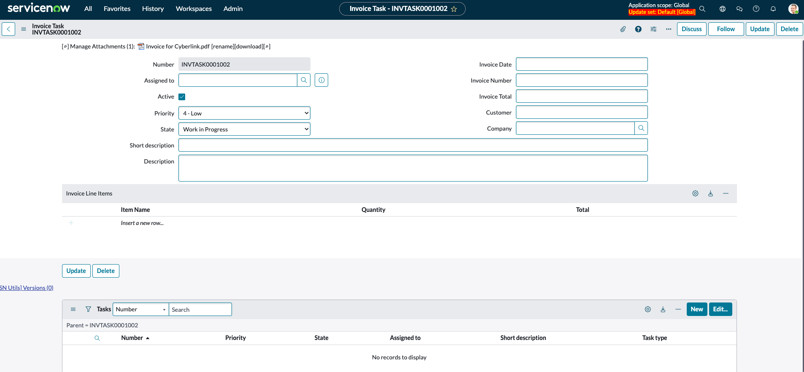
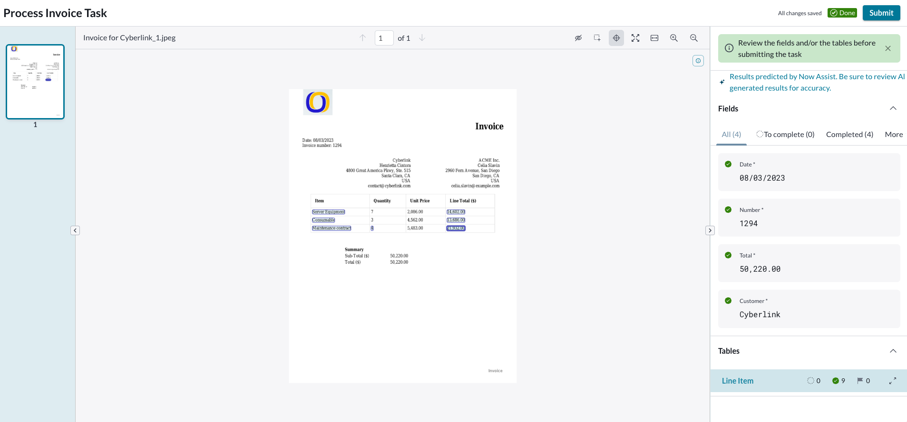

1. Envie uma solicitação para o processamento de fatura:
   - Navegue para **Invoice Lab > Submit an invoice** para acessar o Record Producer.
    
   - Anexe um arquivo e envie. 
    
   - Após ser redirecionado para o registro, observe que os campos da fatura estão vazios e não há itens de linha de fatura.
    

2. Atenda à solicitação:
   - Mantenha a guia anterior aberta e abra outra aba da plataforma (URL raiz da sua instância).
   - Navegue para **Document Intelligence > Document Tasks** e abra o registro com **Source Record** = `INVTASK0001002`.
   - Selecione **Show In DocIntel**.
   - Prossiga com a extração, preencha e revise os campos.
   - Observe o nível de confiança. Envie. Feche a aba do navegador.
  
   

   -  Retorne para aba com com o formulário `INVTASK0001002`  e recarregue a página. 

## Verificação do Lab 

Verifique que todos os campos foram preenchidos.

