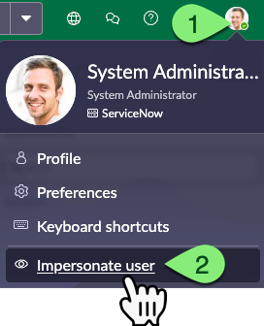
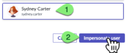
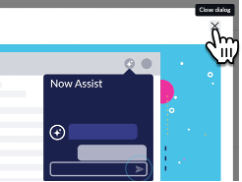
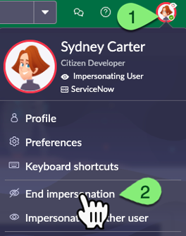

# Exercício 0 – Impersonação (10 min)

Haverá vários exercícios que exigem que você **impersone** outro usuário. Você pode pular para o **Exercício 1** se já estiver familiarizado com essa funcionalidade no **ServiceNow**.

Neste laboratório, você fará login na sua própria instância do **ServiceNow** usando a conta padrão de **System Administrator**. Essa conta normalmente é utilizada apenas na configuração inicial da instância ou em treinamentos como este.

O **ServiceNow** possui vários **roles** que concedem diferentes permissões aos usuários. Um usuário pode ter múltiplos roles. O **System Administrator** tem um papel especial chamado **admin**, que concede privilégios para quase todas as ações dentro de uma instância. **Tenha muito cuidado** ao operar como um usuário com o role **admin**.

Uma das habilidades concedidas pelo role **admin** é a capacidade de **impersonar** outros usuários. Isso é extremamente útil para desenvolvedores testarem funcionalidades de aplicativos como diferentes perfis de usuário.

## 🛠️ Tempo de Produção!  

⚠️ Os próximos passos devem ser realizados apenas na instância de Produção (Prod) ⚠️

1. Faça login na instância de **Produção (Prod)**.  
2. No canto superior direito do **ServiceNow**, clique no avatar do **System Administrator**, depois clique em **Impersonate user**. 
   
3. Selecione **Sydney Carter** e clique em **Impersonate User**. 
   
4. A página será recarregada enquanto você impersona **Sydney**. Feche a caixa de diálogo se ela aparecer. 
   
5. Clique no avatar no canto superior direito. Observe que agora há opções como: **End impersonation** e **Impersonate another user**.  
   
6. Clique em **End impersonation** para encerrar a sessão de impersonação.  

## 🎯 Recapitulação  

**Parabéns!** 🎉  

Agora você sabe como **impersonar** outros usuários em uma instância do **ServiceNow**!  

Neste laboratório, a maioria das atividades será realizada como **System Administrator**. No mundo real, o desenvolvimento de aplicativos geralmente é feito sem o role **admin**, mas os desenvolvedores ainda podem obter a permissão de **Impersonation** para testar diferentes perfis de usuário.  

## 📌 Cenário de Uso  

**Sydney Carter**, uma profissional experiente da área de TI, deseja participar do programa de **Citizen Developer** da empresa.  

Esta seção descreve as etapas da jornada de **Sydney** para se tornar uma **Citizen Developer**.  