# Exercício 1 – Solicitação de Desenvolvedor (15 min)

O processo de **Solicitação de Desenvolvedor (Intake Request)** é uma etapa essencial para aqueles que desejam participar do **Programa de Citizen Developer**. O preenchimento correto do formulário garante uma comunicação eficiente e uma aprovação rápida.

## 📌 Cenário de Uso  

**Sydney Carter**, uma profissional experiente da área de TI, deseja participar do **Programa de Citizen Developer** da empresa.  

Esta seção descreve as etapas da jornada de **Sydney** para se tornar uma **Citizen Developer**.

## 🛠️ Tempo de Produção!  

⚠️ **Os próximos passos devem ser realizados apenas na instância de Produção (Prod).**  

1. Impersone **Sydney Carter**.  
2. Clique em **Favorites**, depois clique em **Employee Center**. Isso abrirá uma nova aba no navegador. 
   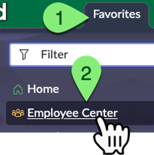 
3. No canto superior esquerdo, clique em **Technology Services**.  
   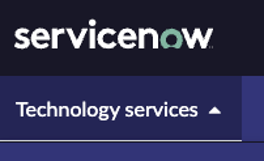
4. Clique em **IT for IT**.  
   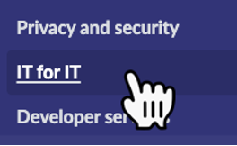
5. Clique em **Apply for Citizen Development**.  
   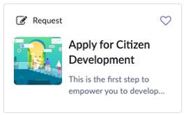
6. Complete o formulário com os seguintes valores:  

   | Campo | Valor |
   |-------|-------|
   | **Application Name** | Request Time Off |
   | **Describe your idea…** | Permitir que usuários de TI solicitem folgas com aprovações. |
   | **Is your process repeatable?** | Sim |
   | **Do you have an email or excel-based process?** | Sim |
   | **How many users are involved in this?** | >20 |
   | **Does this involve any sensitive/PII data?** | Não |
   | **Do you need data from other departments?** | Não |
   | **Who are the users that will have access to the data in this application?** | Qualquer pessoa no departamento de TI. |

7. Clique em **Submit**.  
8. Após o envio da solicitação, feche a aba do **Employee Center** e retorne à aba original da instância **Prod**.  

Após a submissão, **Sydney** receberá um e-mail informando o status da solicitação.

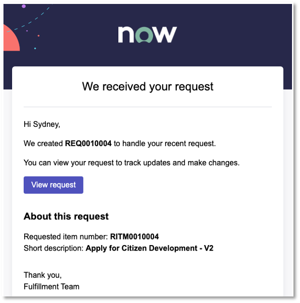

## 🎯 Recapitulação  

**Sydney** deu o primeiro passo para criar aplicativos na plataforma **ServiceNow** dentro de sua organização.  

A **Solicitação de Desenvolvedor (Intake Request)** é uma etapa essencial para aqueles que desejam participar do **Programa de Citizen Developer**.  

O preenchimento correto do formulário garante uma comunicação eficiente e uma aprovação rápida.  

Agora, **Jayne** (a Administradora do App Engine) irá aprovar a solicitação de **Sydney**.  

## 🛠️ Tempo de Produção!  

⚠️ **Os próximos passos devem ser realizados apenas na instância de Produção (Prod).**  

1. Impersone **Jayne Nigel**.  
2. Clique no número **1** acima da palavra **Intake**. 
   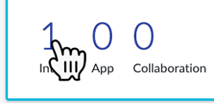

   > Se o número for **0**, aguarde cerca de 30 segundos e atualize a página. A automação pode ainda estar processando a solicitação.  

3. Clique no número do ticket para abrir a solicitação de **Sydney**.  
   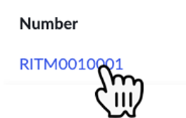
4. Role até o final do formulário e clique no campo **Group(s)**.  
   
5. Selecione o grupo **ServiceNow Studio Users**.  
   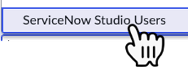

   > Outros grupos concederiam menos permissões. Para este laboratório, estamos concedendo a **Sydney** acesso a todas as ferramentas de desenvolvimento.  

6. Role de volta até o topo do formulário e clique em **Save** no canto superior direito.  
   
7. Clique em **Catalog Tasks**.  
   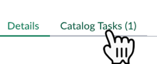
8. Clique no número do ticket da **Catalog Task** para abri-lo.
   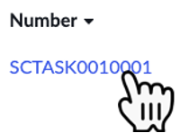  

   > O propósito dessa tarefa é instruir **Jayne** a selecionar o grupo de permissões para **Sydney**.  

9.  Clique em **Close Task** no canto superior direito.  
    
10. Clique no ícone **ⓘ** no campo **Request item**. Isso retornará ao ticket original.  
    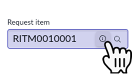
11. Clique em **Approve** no canto superior direito.  
    

## 🎯 Recapitulação  

O **App Engine Management Center** configurará automaticamente o acesso de **Sydney** no ambiente **Dev**. Após isso, ela receberá um e-mail com instruções sobre como acessar o ambiente de desenvolvimento.  

No mundo real, pode haver mais de uma pessoa responsável pela aprovação, e o processo pode levar mais tempo para revisar as respostas.  

Além disso, pode ser necessário exigir que o desenvolvedor, como **Sydney**, passe por treinamentos adicionais antes de receber permissão para criar aplicativos.  

## 📌 Esclarecimento de Funções  

O processo destacou o papel fundamental de **Jayne**, a **Administradora do App Engine**, dentro do sistema. Suas responsabilidades vão além do título formal e do fato de não possuir o role **admin**. Suas aprovações iniciam uma série de processos automatizados que são cruciais para o funcionamento eficiente do sistema.  

Isso nos lembra que **todas as funções, independentemente do título, têm responsabilidades e impactos significativos**.  

## 🔄 Processo de Aprovação  

O impacto do processo de aprovação em ações subsequentes (como o envio automático de um e-mail para **Sydney**) foi um aprendizado essencial.  

Isso demonstra o poder dos **workflows automatizados**, que economizam tempo e reduzem erros manuais.  

## 🔒 Segregação de Funções  

A conclusão bem-sucedida deste processo sem que **Jayne** precisasse de um role **admin** demonstra o princípio da **Segregação de Funções**.  

Isso mostra que **altos níveis de acesso nem sempre são necessários para realizar tarefas importantes**, reduzindo riscos de segurança e promovendo a integridade do sistema.  