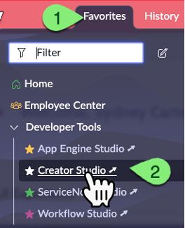
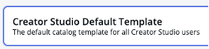

# Exercício 2 – Creator Studio (15 min)

O **ServiceNow** oferece diferentes **Studios de desenvolvimento de aplicativos**, adaptados ao nível de habilidade do usuário. Cada um deles está integrado ao **App Engine Management Center** para governança automatizada e implantação de aplicativos.  

A opção mais simples para começar é o **Creator Studio**.  

## 🛠️ Tempo de Desenvolvimento!  

⚠️ **Os próximos passos devem ser realizados apenas na instância de Desenvolvimento (Dev).**  

1. Acesse a instância de **Desenvolvimento (Dev)**.  
2. Impersone **Sydney**.  
3. Clique em **Favorites**, depois clique em **Creator Studio**.
     
4. Clique no botão **Create App**.  
   
5. Nomeie o aplicativo como **Request Time Off – Creator Studio**.  
6. Clique em **Create app**.  
7. Clique em **Creator Studio Default Template**.  
   
8. Clique em **Apply this template**.  
9.  Clique em **Edit** no painel **Topics**.  
    
10. Marque a opção **Technology Services**.  
    
11. Clique em **Apply**.  
12. Clique em **Save and continue**.  
13. Clique em **View** no canto inferior direito.  
14. Clique em **Mark as ready** no canto superior direito.  
15. Clique em **Submit for review** no canto superior direito.  
    
16. Clique em **Continue**.  
17. Clique em **Continue** novamente.  
18. Clique em **Continue** mais uma vez.  
19. Clique em **Submit for review**.  
20. Feche a aba do navegador com o **Creator Studio**.  

## 🎯 Recapitulação  

**Sydney** criou seu primeiro aplicativo e o enviou ao **App Engine Management Center** para aprovação e implantação.  

No mundo real, ela teria trabalhado mais na configuração do formulário dentro do **Creator Studio**, mas este laboratório foca principalmente no **processo de implantação do aplicativo**.  