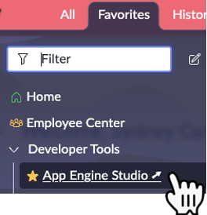

# Exercício 3 – App Engine Studio (10 min)

Neste exercício, **Sydney** criará um aplicativo no **App Engine Studio** e o enviará para implantação.  

O **App Engine Studio** é um pouco mais avançado que o **Creator Studio**, mas ainda permite que a maioria dos usuários desenvolva aplicativos com pouca necessidade de treinamento no **ServiceNow**.  

## 🛠️ Tempo de Desenvolvimento!  

⚠️ **Os próximos passos devem ser realizados apenas na instância de Desenvolvimento (Dev).**  

1. Clique em **Favorites**, depois clique em **App Engine Studio**.  
   
2. Clique em **Create App** no canto superior direito.  
3. Nomeie o aplicativo como **Request Time Off – App Engine Studio**.  
4. Clique em **Continue**.  
5. Clique em **Continue** novamente.  
6. Clique em **Go to app dashboard**.  
7. Clique em **Submit**.  
8. Clique em **Submit** novamente.  
9.  No campo **Release notes**, digite: `Initial version of app`.  
10. Clique em **Continue**.  
11. Clique em **Close**.  
12. Feche a aba do navegador com o **App Engine Studio**.  

## 🎯 Recapitulação  

Assim como no exercício anterior, **Sydney** conseguiu rapidamente criar seu aplicativo e enviá-lo ao **App Engine Management Center** para implantação.  

Mais tempo normalmente seria gasto na construção do aplicativo, mas o foco deste laboratório é demonstrar **como implantar aplicativos a partir do AES**.  
