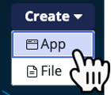
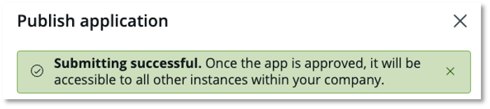

# Exercício 4 – ServiceNow Studio (10 min)

Neste exercício, **Sydney** criará um aplicativo no **ServiceNow Studio** e o enviará para implantação.  

O **ServiceNow Studio** oferece uma experiência unificada e eficiente para desenvolvedores de nível intermediário a avançado, permitindo a criação, modificação e extensão de aplicativos. Ele é um ambiente centralizado para desenvolvimento, ajudando as empresas a gerar valor de forma mais rápida.  

## 🛠️ Tempo de Desenvolvimento!  

⚠️ **Os próximos passos devem ser realizados apenas na instância de Desenvolvimento (Dev).**  

1. Clique em **Favorites**, depois clique em **ServiceNow Studio**.  
2. No canto superior direito, clique em **Create**, depois selecione **App**. 
    
3. Nomeie o aplicativo como **Request Time Off – ServiceNow Studio**.  
4. Clique em **Continue**.  
   
5. Clique em **Continue** novamente. 
    
6. Clique em **Go to app dashboard**.  
   
7. No canto superior direito, clique em **Publish**.  
   
8. Clique em **Publish** novamente.  
   
9.  Verifique a mensagem verde indicando que a solicitação de publicação foi bem-sucedida.  
    
10. Clique em **Done**.
    
11. **NÃO FECHE O NAVEGADOR AINDA!**  

## 🎯 Recapitulação  

Assim como nos exercícios anteriores, **Sydney** conseguiu criar rapidamente seu aplicativo e enviá-lo ao **App Engine Management Center** para implantação.  

Mais tempo normalmente seria investido na construção do aplicativo, mas o foco deste laboratório é demonstrar **como implantar aplicativos a partir do ServiceNow Studio**.  