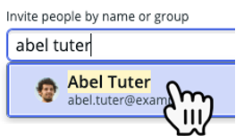
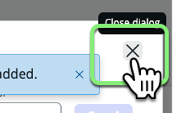
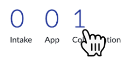
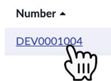
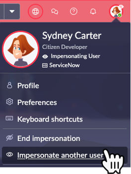
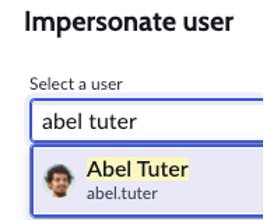
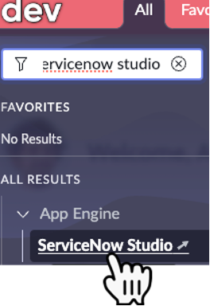
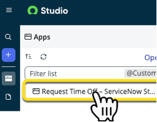
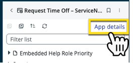
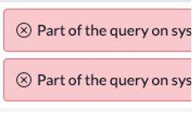

# Exercício 5 – Gerenciar Colaboradores (10 min)

Em algum momento, **Sydney** pode querer que outras pessoas da organização colaborem em seu aplicativo.  

O **ServiceNow Studio** foi projetado para permitir o envio de **solicitações de colaboração** diretamente para o **App Engine Management Center**.  

Neste exercício, **Sydney** enviará uma **solicitação de colaboração** ao **AEMC**. **Jayne** aprovará a solicitação e, em seguida, o **AEMC** configurará automaticamente o acesso ao aplicativo para o novo colaborador.  

## 🛠️ Tempo de Desenvolvimento!  

⚠️ **Os próximos passos devem ser realizados apenas na instância de Desenvolvimento (Dev).**  

1. Certifique-se de que você ainda está no **ServiceNow Studio** como **Sydney**.  
2. No canto superior direito, clique no botão **Manage collaborators**.  
   
3. Pesquise por **Abel Tuter** e clique no nome dele na lista suspensa.  
   
4. Clique em **Send**.  
   
5. Verifique a mensagem azul confirmando o sucesso da solicitação.  
6. Clique no **X** para fechar a janela **Collaborate with others**.  
   
7. Feche a aba do navegador com o **ServiceNow Studio**.  

## 🎯 Recapitulação até agora  

**Sydney** adicionou **Abel** como colaborador em seu aplicativo.  

Nos próximos passos, **Jayne** (a **Administradora do App Engine**) aprovará a solicitação.  

## 🛠️ Tempo de Produção!  

⚠️ **Os próximos passos devem ser realizados apenas na instância de Produção (Prod).**  

8. Alterne para a instância de **Produção (Prod)**.  
9. Impersone **Jayne Nigel**.  
10. Clique no número **1** acima da palavra **Collaboration**.  
    
   > Se o número **1** não aparecer, atualize a página.  

11. Clique no número do **ticket** para abrir a solicitação de colaboração de **Sydney**.  
    
12. Clique em **Approve** no canto superior direito.  
    
13. Verifique a mensagem azul confirmando a aprovação bem-sucedida.  
14. No canto superior esquerdo, clique em **Overview** para voltar à página principal do **AEMC**.  
    

## 🛠️ Tempo de Desenvolvimento!  

⚠️ **Os próximos passos devem ser realizados apenas na instância de Desenvolvimento (Dev).**  

15. Alterne para a instância de **Desenvolvimento (Dev)**.  
16. No canto superior direito, clique no avatar e depois em **Impersonate another user**.
      
17. Pesquise por **Abel Tuter**, selecione o nome e clique em **Impersonate User**. 
     
18. Clique em **All**, pesquise por **ServiceNow Studio** e clique no nome no menu. 
     
19. Na coluna esquerda, clique no aplicativo **Request Time Off…**.  
    
20. Clique no link **App details**.  
    

   > Se mensagens de erro em vermelho aparecerem, elas podem ser ignoradas neste laboratório.  

21. Observe que **Abel pode fazer alterações no aplicativo, mas não pode enviá-lo para implantação**. Isso acontece porque ele tem permissão de **Editor**, mas apenas **Sydney**, como proprietária do app, pode enviá-lo para implantação.  
    
22. Feche a aba do navegador com o **ServiceNow Studio**.  
    

## 🎯 Recapitulação  

**Sydney** conseguiu adicionar um colaborador ao seu aplicativo com facilidade.  

**Jayne** pôde revisar e aprovar a solicitação rapidamente.  

Essa ação simples iniciou um **workflow automatizado** que **configurou o acesso de Abel ao aplicativo** e **o notificou por e-mail**.  

Como **Sydney** é a proprietária do aplicativo, **apenas ela pode enviá-lo para implantação**.  

O **App Engine** também permite adicionar **novos perfis além de Owner e Editor**, proporcionando um controle mais refinado sobre as permissões dos colaboradores.  

---

## ⏳ **Aguarde!**  

⚠️ **Neste laboratório, estamos limitados a apenas duas instâncias (Dev e Prod).**  

No mundo real, é recomendado que cada **Pipeline** tenha pelo menos **três instâncias: Dev, Test e Prod**.  

Enquanto aguardamos a implantação do aplicativo, o instrutor do laboratório explicará como funciona o **processo de Teste**.  

:::danger
🚫 **Pare aqui!** Não continue para o próximo exercício até que o instrutor informe que é seguro prosseguir.  
:::