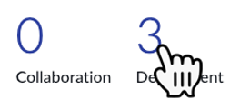
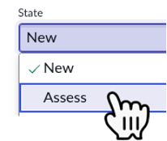
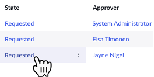
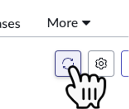
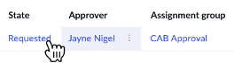
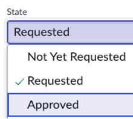
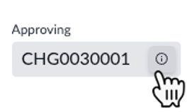
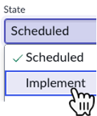
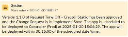

# Exercício 6 – Implantação (15 min)

**Jayne** está pronta para aprovar e implantar o novo aplicativo de **Sydney**.  

Ela precisará seguir o **Processo de Mudança do ITSM**, pois estará realizando uma alteração no ambiente de **Produção** ao implantar o aplicativo.  

Além disso, sua organização deseja rastrear o aplicativo no **CMDB**.  

Felizmente, o **App Engine Management Center** já está **integrado com o Change e o CMDB**, facilitando todo o processo.  

## 🛠️ Tempo de Produção!  

⚠️ **Os próximos passos devem ser realizados apenas na instância de Produção (Prod).**  

1. Alterne para a instância de **Produção (Prod)**.  
2. Impersone **Jayne Nigel**.  
3. Clique no número **3** acima da palavra **Deployment**. 
    
4. Clique no primeiro número do **ticket** para abrir a solicitação de implantação do aplicativo **Request Time Off – Creator Studio**.  
   
5. No canto superior direito, clique em **Approve & Create Change Request**.  
6. Clique em **Change Requests** para abrir a lista de solicitações de mudança.  
   
7. Clique no número do **ticket** para abrir a solicitação de mudança.  
   
8. Altere o campo **State** para **Assess**.  
   
9.  Clique em **Save** no canto superior direito.  
10. Clique em **Approvers** para abrir a lista de aprovadores.  
    
11. Ao lado do nome de **Jayne**, clique em **Requested** para abrir a solicitação de aprovação.  
    
12. Altere o **State** para **Approved** e clique em **Save** no canto superior direito.  
    
13. Clique no ícone **ⓘ** ao lado do número do **Change ticket** para retornar à solicitação de mudança.  
    
14. Clique novamente em **Approvers** para abrir a lista de aprovadores.  
15. Clique no **ícone de atualização** para atualizar a lista de aprovadores. 
     
16. Ao lado de **Jayne Nigel’s CAB Approval**, clique em **Requested**.  
    
17. Altere o **State** para **Approved** e clique em **Save** no canto superior direito.  
    
18. Clique no ícone **ⓘ** ao lado do número do **Change ticket** para retornar à solicitação de mudança. 
     
19. Atualize a página do navegador.  
20. Altere o **State** para **Implement** e clique em **Save**.  
    
21. Revise a mensagem amarela no **Activity log**.  
    
   > A mensagem explicará que a implantação do aplicativo foi aprovada e indicará **quando ele será implantado automaticamente no ambiente de Produção (Prod)**.  

## 🎯 Recapitulação  

**Jayne** conseguiu aprovar e implantar o aplicativo de **Sydney** no ambiente de **Produção** com facilidade.  

O **App Engine Management Center** simplificou o processo ao permitir a criação rápida de uma **Change Request** e, automaticamente, criar um **Configuration Item** no **CMDB** vinculado à solicitação de mudança.  
