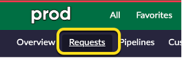
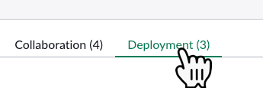
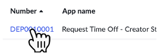
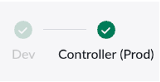
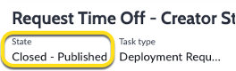
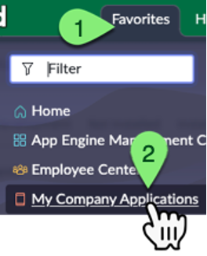
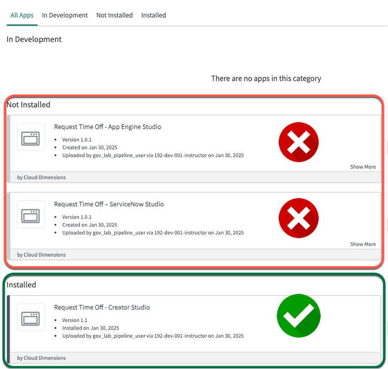
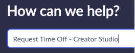
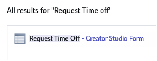

# Exercício 7 – Revisão Final (10 min)

O **App Engine Management Center** concluiu a **implantação do aplicativo** no ambiente de **Produção (Prod)**.  

A **Change Request** foi automaticamente fechada.  

Nos próximos passos, revisaremos os resultados finais desse processo.  

## 🛠️ Tempo de Produção!  

⚠️ Os próximos passos devem ser realizados apenas na instância de Produção (Prod) ⚠️
 

1. Faça login na instância de **Produção (Prod)**.  
2. Impersone **Jayne**.  
3. Clique em **Requests**.  
   
4. Clique em **Deployment**.  
   
5. Clique no número do **ticket** para a solicitação de implantação do **Request Time Off – Creator Studio**.  
   
6. Observe que o **pipeline stage formatter** agora indica que o aplicativo foi **implantado em Produção (Prod)**. 
    
   > Isso confirma que a nova versão do aplicativo foi instalada com sucesso no ambiente de Produção.  

7. Verifique se a **Deployment Request** está no estado **Closed – Published**.  
    
   > Isso significa que a implantação foi concluída com sucesso.  

8. Clique em **Favorites**, depois clique em **My Company Applications**. 
    
9.  Na página **My Company Applications**, visualize os aplicativos personalizados disponíveis para instalação a partir do ambiente **Dev** ou veja os aplicativos já instalados.  
    
   > **Jayne** poderá ver que a versão **1.1** do aplicativo **Request Time Off – Creator Studio** foi instalada com sucesso.  

10. Clique em **Favorites**, depois clique em **Employee Center**.  
11. Isso abrirá o **Employee Center** em uma nova aba do navegador.  

    > O **Employee Center** é o portal principal onde os funcionários podem pesquisar e enviar solicitações.  

12. No campo de pesquisa, digite **Request Time Off** e pressione **Enter** ou clique na **lupa**.  
    
13. Nos resultados da pesquisa, encontre o formulário **Request Time Off – Creator Studio**, criado por **Sydney** no ambiente **Dev**. 
     
14. Clique no **link do formulário** para acessá-lo.  

## 🎯 Recapitulação  

**Jayne** conseguiu **confirmar facilmente** que o aplicativo de **Sydney** foi implantado no ambiente de **Produção (Prod)**.  

Ela também conseguiu **pesquisar e encontrar o formulário de solicitação no Employee Center**, garantindo que o aplicativo esteja disponível para os usuários.  
