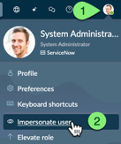
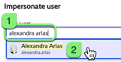
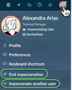

🕒 Duração Estimada: 10 min

## 🔍 Visão Geral  

Haverá vários exercícios neste laboratório que exigem que você **impersone** outro usuário.  

Se você já está familiarizado com a funcionalidade de **Impersonation no ServiceNow**, pode pular para o **Exercício 1**.  

Neste laboratório, você fará login na sua **instância do ServiceNow** usando a conta padrão de **System Administrator**.  

Essa conta normalmente é utilizada apenas na **configuração inicial da instância** ou em **exercícios de treinamento**, como este laboratório.  

O **ServiceNow** possui vários **roles** que concedem permissões específicas aos usuários. Um usuário pode ter múltiplos roles.  

O **System Administrator** possui um **role especial chamado admin**, que concede privilégios para quase todas as ações dentro de uma instância. **Tenha muito cuidado** ao operar como um usuário com o role **admin**.  

Uma das habilidades concedidas pelo role **admin** é a capacidade de **impersonar outros usuários**. Isso é extremamente útil para **testar funcionalidades de aplicativos** como diferentes tipos de usuários.  

## 🛠️ Passos  

1. No canto superior direito do **ServiceNow**, clique no **avatar do usuário** (System Administrator).  
2. Clique em **Impersonate user**.  
   
3. Na barra de pesquisa, digite **Alexandra Arias** e selecione o nome dela na lista suspensa.  
   
4. Clique em **Impersonate user**.  
   
5. A página será recarregada enquanto você impersona **Alexandra**. Feche a caixa de diálogo se ela aparecer.  
   
6. Clique no **avatar do usuário** no canto superior direito.  
   
   > Agora, você verá as opções **End impersonation** e **Impersonate another user**. 
    
7. Clique em **End impersonation** para encerrar a sessão de impersonação.  

## 🎯 Recapitulação  

**Parabéns!** 🎉  

Agora você sabe como **impersonar usuários no ServiceNow**!  

Para este laboratório, a maioria das atividades será realizada como **System Administrator**.  

No mundo real, o desenvolvimento de aplicativos geralmente é feito **sem o role admin**, mas os desenvolvedores podem obter a permissão de **Impersonation** para testar diferentes perfis de usuário.  

🚀 **Agora, vamos para o próximo passo: Geração do Aplicativo!**  
