<div class="button-homepage-vancouver">
🕒 Duração Estimada: 20 min
</div>

:::info
Você não precisa salvar seu trabalho em nenhum momento durante este exercício.
:::


O **Now Assist for Creator** permite que **Alexandra** expresse suas ideias em linguagem natural. O Now Assist interpreta essas descrições e as converte em componentes fundamentais de uma aplicação.

Isso capacita desenvolvedores cidadãos a começarem a criar aplicações sem precisar de conhecimento aprofundado em programação, ao mesmo tempo que oferece um ponto de partida poderoso para desenvolvedores pro-code.

**Alexandra** pode simplesmente descrever o que deseja que a aplicação faça, e a funcionalidade de **App Generation** traduz isso em um app funcional com todos os componentes criados. Isso significa um desenvolvimento mais rápido, com menos erros — permitindo que até usuários com pouca experiência em codificação contribuam.

:::info
Durante o exercício, as perguntas feitas pelo Now Assist podem não corresponder exatamente às capturas de tela no guia do lab. **Tudo bem!**  
Por favor, copie e cole os prompts exatamente como fornecidos, na ordem apresentada.
:::

---

### 📌 Passos

1. Acesse o **ServiceNow Studio**  
   a. Clique no menu com o emoji de foguete  
   b. Clique em **ServiceNow Studio + AES**  
   _Nota: As funcionalidades do AES foram integradas ao ServiceNow Studio._

   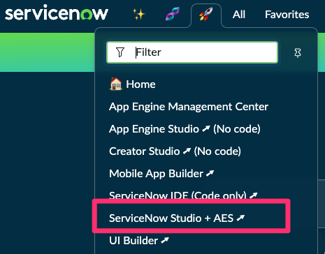

2. Abra o **Now Assist Panel** clicando no ícone **Now Assist** no canto superior direito.  
   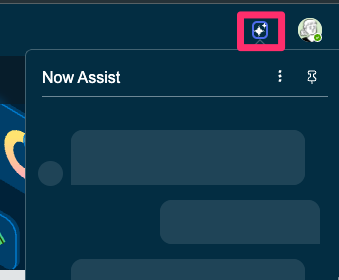

3. Clique no ícone de **alfinete** para fixar o painel à direita.  
   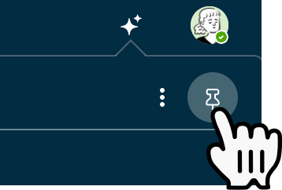

4. Clique em **Create an App**.  
   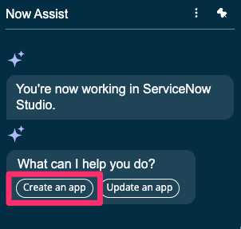

5. Copie e cole ou digite o seguinte texto no campo de entrada e pressione **Enter**:  
   ```txt title="App Generation - Prompt 1"
   I want to create an App for Cross-training in my organization. The app name should be 
   // highlight-next-line
   [YOUR APP NAME]
   ```  
   :::danger
   Substitua a tag **[YOUR APP NAME]** acima pela suas iniciais e 4 dígitos do seu aniversário MMDD, exemplo: RY0824
   :::

   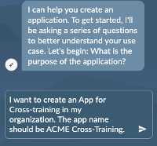

7. Copie e cole o prompt abaixo no campo de entrada:  
   ```txt title="App Generation - Prompt 2"
   The app will have a general table listing various training topics, managed by Training Coordinators. The data in this table can be modified only by training coordinators.  
   ```
   

8. Copie e cole o prompt abaixo no campo de entrada:  
   ```txt title="App Generation - Prompt 3"
   This table would have Topic Name and Date/time on which training session for the associated topic can be held. Training coordinators manage the data in this table. There should be another integer field named Attendees limit.  
   ```
   

9.  Copie e cole o prompt abaixo no campo de entrada:  
   ```txt title="App Generation - Prompt 4"
   The app will have two forms - one is for trainers to volunteer for a topic and this submitted data should be stored in one table. Another form is for attendees to register for a training session, and this submitted data should be stored in another table. Once the forms are submitted, all the data should be read-only and no one can modify the data.  
   ```
   

10. Copie e cole o prompt abaixo no campo de entrada:  
   ```txt title="App Generation - Prompt 5"
   Trainers should select a topic from the list of available topics. On selection of topic, date/time should be auto-populated. Along with that, trainers should choose whether the session would be Virtual or In-person. I hope you got it, so that I will then proceed with attendees form."** 
   ```
    

11. Copie e cole o prompt abaixo no campo de entrada:  
   ```txt title="App Generation - Prompt 6"
   Attendees would just see the list of topics available, and a date/time field which should be auto-populated based on the selected topic. I would want another form where attendees can provide feedback after the conclusion of each training session. The submitted feedback should be stored in another table.  
   ```
   

12. Copie e cole o prompt abaixo no campo de entrada:  
   ```txt title="App Generation - Prompt 7"
   Attendees should select a concluded training topic from the data list and provide their feedback using below fields: Training session rating (on a scale of 1-5) and Suggestions for improvement.  
   ```
   


12. Clique em **Save files and open app**.  
   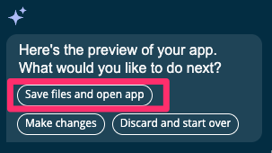

13. Aguarde alguns momentos para que a aplicação seja gerada.  
   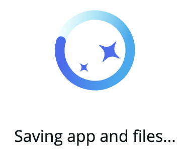

14. Clique no ícone de alfinete novamente para desafixar o **Now Assist Panel**.  
   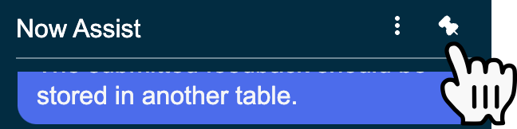

15. Clique no ícone de brilho para ocultar o **Now Assist Panel**.  
   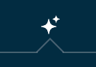

16. No menu lateral esquerdo, clique no ícone de **atualizar** para atualizar a lista de Apps.  
   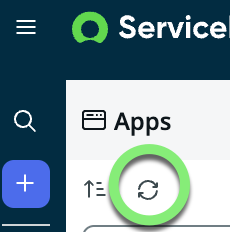

17. Localize o nome da sua aplicação na navegação lateral e clique nele para abrir.  
   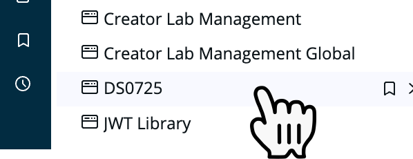

18. Expanda a seção **Tables** e clique em qualquer tabela para abri-la no **Table Builder**.  
   _O Table Builder é uma interface amigável para explorar campos, formulários e fluxos associados a uma tabela._  
   _Note que o **App Generation** criou todas as tabelas automaticamente._  
   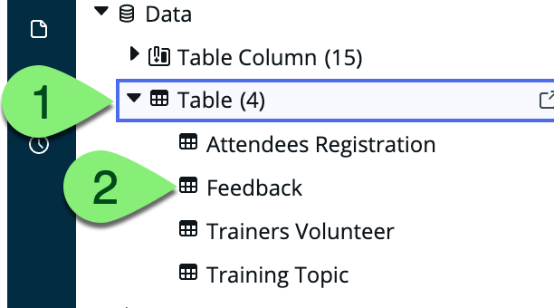

19. **💡 Dica:** Clique no ícone de menu (hambúrguer) no canto superior esquerdo para alternar a exibição do menu lateral.  
   _Isso pode ajudar em telas com resolução menor._  
   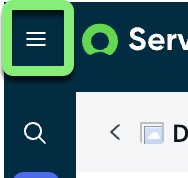

:::info
Ao conversar com o Now Assist para criar o app, ele fará a maior parte do trabalho de desenvolvimento.  
Entretanto, pode ser necessário ajustar ou corrigir alguns pontos.  
Como se trata de uma IA generativa, os apps podem variar de uma execução para outra.  
**Continue com o lab mesmo que sua aplicação gerada não esteja idêntica às capturas de tela.**
:::

20. Clique em **Forms** para visualizar e editar os formulários da tabela.  
   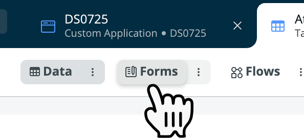

21. Clique no **X** para fechar a aba da tabela no Studio.  
   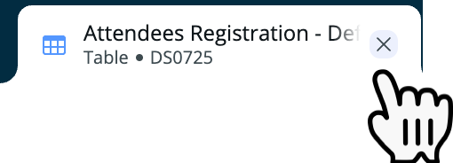

---

### ✅ Recapitulando

**Parabéns!**  
Você criou o app de **Cross Training Management** usando a funcionalidade de **App Generation**!

Esse app funciona como um contêiner para todas as configurações necessárias: tabelas, formulários, fluxos e mais.