<div class="button-homepage-vancouver">
🕒 Duração Estimada: 15 min
</div>

Agora que vimos a estrutura inicial da aplicação, vamos explorar como o **Now Assist for Creator** simplifica a criação e manutenção de itens de catálogo e record producers.

**Alexandra** quer criar **um novo formulário de treinamento**, com 10 perguntas que gerarão uma nova solicitação de feedback.

A funcionalidade de **Catalog Generation** permite que **Alexandra** descreva suas ideias em linguagem natural, e o **Now Assist for Creator** irá gerar um formulário de autosserviço com base nessas instruções.

---

### 📌 Passos

1. Para garantir que não teremos problema, vamos alterar o escopo na plataforma para a aplicação que criamos. 
2. Retorne para aba aberta da plataforma e selecione o icone de globo.
   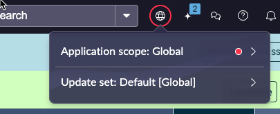
3. Clique no aplication scope e selecione e busque pela aplicação que criamos.
   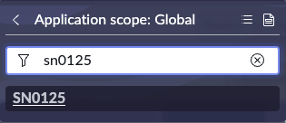
   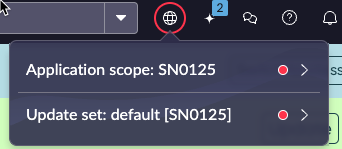

4. Agora, vamos retonar a aba do ServiceNow Studio.
   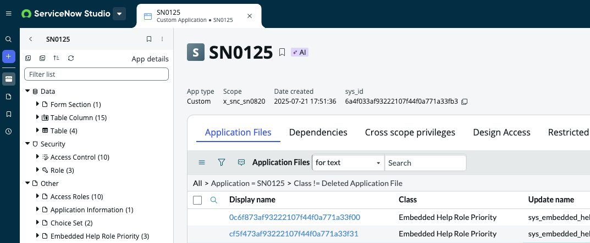

5. Selecione o botão <span className="button-purple-square">Create</span>.
   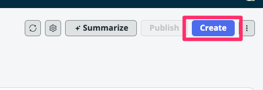

6. Selecione a opção [More] > User Interface > Catalog Item e <span className="button-purple-square">Continue</span>.
   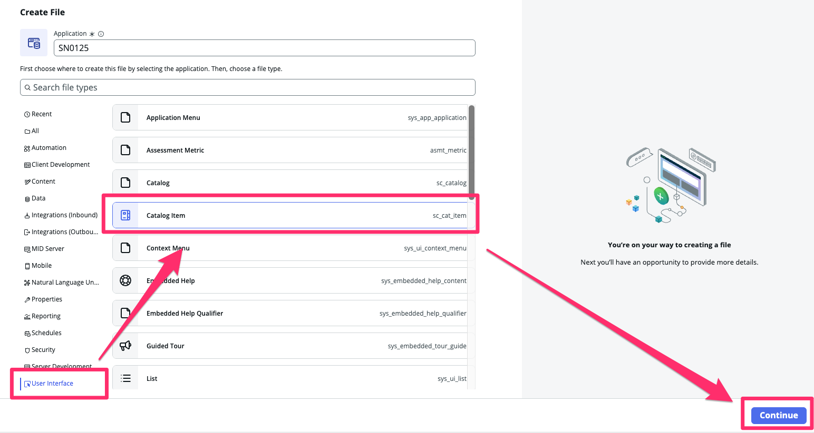

7. Selecione **AES Standard items in Service Catalog**.
   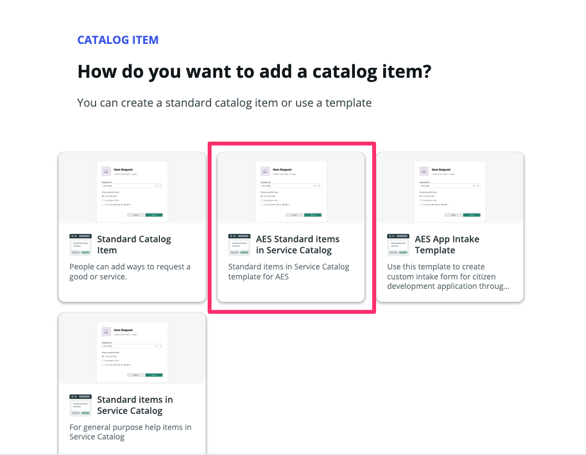

8.  A página do Catalog Builder será aberta com as informações pré-preenchidas do template. Você será recebido na primeira aba **Now Assist**  
   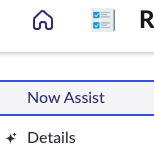

9.  No campo **Now Assist directions**, copie e cole o seguinte texto:

   ```text
   Create a new Self Service form to allow employees to request the addition of a new training program to the company’s training portfolio
   ```

   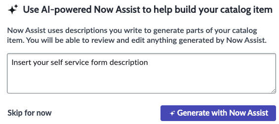

10. Clique em **Generate with Now Assist**  
   

11. Clique no botão **Preview** no canto superior direito da tela  
    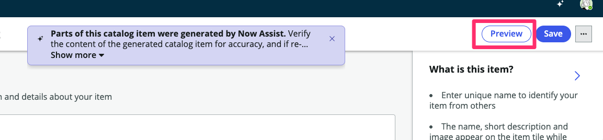

12. O sistema exibirá a recomendação de IA com o conteúdo e perguntas sugeridas para o formulário  
    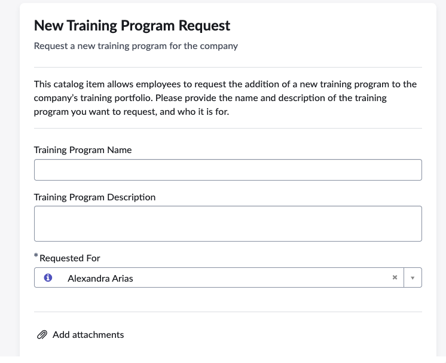

13. Clique no **X** no canto superior direito para fechar a pré-visualização  
    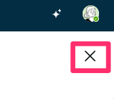

14. Volte para a aba **Now Assist**  
    

15. Como agora queremos fornecer uma entrada mais detalhada, substitua o conteúdo do campo **Now Assist directions** pelo seguinte texto:

   ```text
   Form Name: "New Training Request Form"

   Short Description: "This form allows employees to request the addition of a new training program to the company’s training portfolio. Please provide the necessary details to help us evaluate and implement your suggestion."

   Instructions: "Fill out the form below with all relevant details about the proposed training. Ensure that the training aligns with company goals and addresses specific skill gaps or development areas. Once submitted, the request will be reviewed by the training and development team."

   Questions:

   Training Title
   Training Category: Technical, Leadership, Compliance, Soft Skills
   Training Description
   Target Audience
   Skills or Knowledge Gaps Addressed
   Training Format: Online, In-Person, Hybrid
   Estimated Duration
   Proposed Trainer or Training Provider
   Expected Benefits
   Estimated Costs (Optional)
   Additional Comments
   ```

   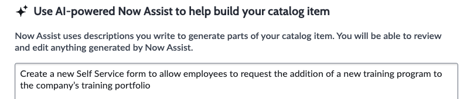

16. Clique em **Generate with Now Assist**  
    

17. Para confirmar a regeneração do conteúdo, clique em **Confirm**  
    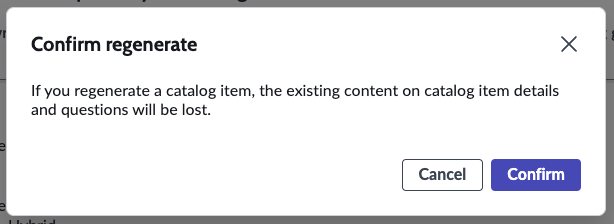

18. Clique em **Preview**  
    _Perceba que o formulário ficou muito mais completo com um prompt mais específico._  
    

19. Mude para o modo de pré-visualização **Now Mobile**  
    _Você poderá ver como o formulário será exibido no app mobile do ServiceNow._  
    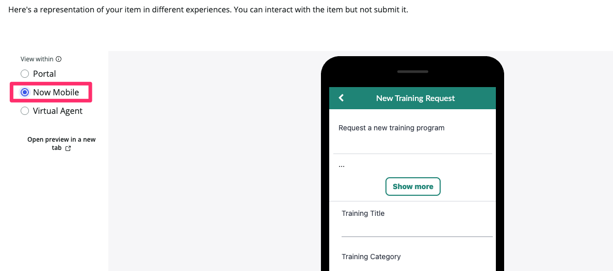

20. Mude para a pré-visualização do **Virtual Agent**  
    _Você poderá visualizar como será a conversa com o agente virtual para esse tipo de solicitação._
    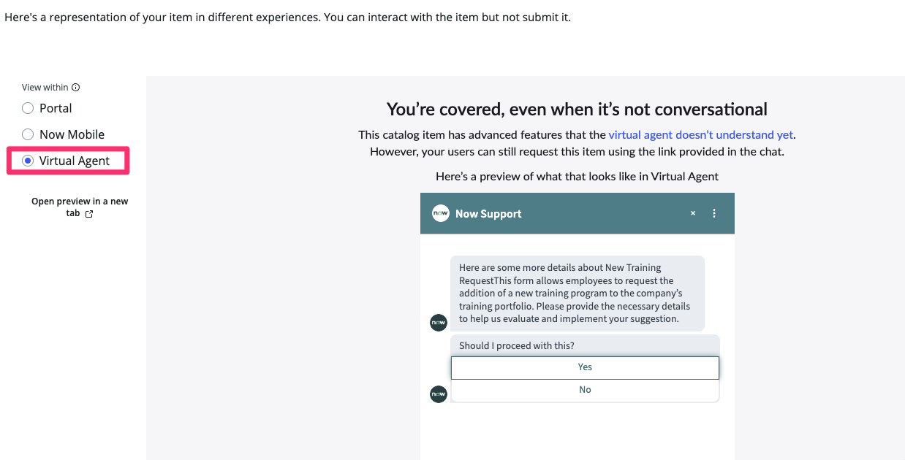

21. Clique em **Close** no canto superior direito  
    

22. Acesse a seção **Questions**.  
    Cada pergunta gerada por IA é marcada com o ícone.
      
    Você ainda pode editar as perguntas ou adicionar outras manualmente.  
    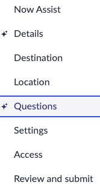

:::info
Você não precisa salvar seu trabalho em nenhum momento durante este exercício.
:::

---

### ✅ Recapitulando

**Parabéns!**  
Você criou um formulário robusto para que os usuários possam enviar novas solicitações de treinamentos com facilidade!

Nas próximas versões (como a Xanadu e futuras), espere ver melhorias na funcionalidade de Catalog Generation, incluindo suporte à edição dos formulários gerados.