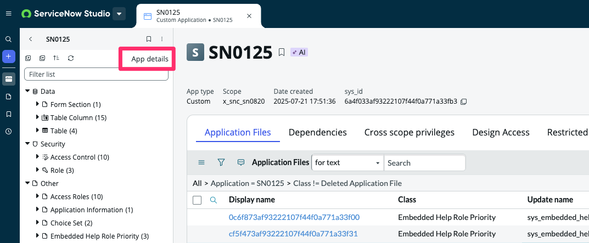

<div class="button-homepage-vancouver">
🕒 Duração Estimada: 15 min
</div>

Agora que vimos a estrutura inicial da aplicação, vamos explorar como o **Now Assist for Creator** simplifica a criação e manutenção de itens de catálogo e record producers.

**Alexandra** quer criar **um novo formulário de treinamento**, com 10 perguntas que gerarão uma nova solicitação de feedback.

A funcionalidade de **Catalog Generation** permite que **Você** descreva suas ideias em linguagem natural, e o **Now Assist for Creator** irá gerar um formulário de autosserviço com base nessas instruções.

---

### 📌 Passos

1. Agora, vamos retornar à aba da nossa aplicação no ServiceNow Studio. Caso ela não esteja aberta, clique em **App details**.
   

2. Selecione o botão <span className="button-purple-square">Create</span>.
   

3. Selecione a opção [More] > User Interface > Catalog Item e <span className="button-purple-square">Continue</span>.
   

4. Selecione **AES Standard items in Service Catalog**.
   

5.  A página do Catalog Builder será aberta com as informações pré-preenchidas do template. Você será recebido na primeira aba **Now Assist**  
   

6.  No campo **Now Assist directions**, copie e cole o seguinte texto:

   ```text
    Crie um novo formulário de Autoatendimento para permitir que os funcionários solicitem a adição de um novo programa de treinamento ao portfólio de treinamentos da empresa.
   ```

   

7.  Clique em **Generate with Now Assist**  
   

8.  Clique no botão **Preview** no canto superior direito da tela  
    

9.  O sistema exibirá a recomendação de IA com o conteúdo e perguntas sugeridas para o formulário  
    

10. Clique no **X** no canto superior direito para fechar a pré-visualização  
    

11. Volte para a aba **Now Assist**  
    

12. Como agora queremos fornecer uma entrada mais detalhada, substitua o conteúdo do campo **Now Assist directions** pelo seguinte texto:

   ```text
    Nome do Formulário: "Formulário de Solicitação de Novo Treinamento"

    Descrição Curta: "Este formulário permite que os funcionários solicitem a adição de um novo programa de treinamento ao portfólio de treinamentos da empresa. Forneça os detalhes necessários para nos ajudar a avaliar e implementar sua sugestão."

    Instruções: "Preencha o formulário abaixo com todos os detalhes relevantes sobre o treinamento proposto. Certifique-se de que o treinamento esteja alinhado aos objetivos da empresa e aborde lacunas específicas de habilidades ou áreas de desenvolvimento. Após o envio, a solicitação será revisada pela equipe de treinamento e desenvolvimento."

    Perguntas:

    Título do Treinamento  
    Categoria do Treinamento: Técnico, Liderança, Conformidade, Habilidades Interpessoais  
    Descrição do Treinamento  
    Público-Alvo  
    Habilidades ou Lacunas de Conhecimento Abordadas  
    Formato do Treinamento: Online, Presencial, Híbrido  
    Duração Estimada  
    Instrutor ou Fornecedor de Treinamento Proposto  
    Benefícios Esperados  
    Custos Estimados (Opcional)  
    Comentários Adicionais
   ```

   

13. Clique em **Generate with Now Assist**  
    

14. Para confirmar a regeneração do conteúdo, clique em **Confirm**  
    

15. Clique em **Preview**  
    _Perceba que o formulário ficou muito mais completo com um prompt mais específico._  
    

16. Mude para o modo de pré-visualização **Now Mobile**  
    _Você poderá ver como o formulário será exibido no app mobile do ServiceNow._  
    

17. Mude para a pré-visualização do **Virtual Agent**  
    _Você poderá visualizar como será a conversa com o agente virtual para esse tipo de solicitação._
    

18. Clique em **Close** no canto superior direito  
    

19. Acesse a seção **Questions**.  
    Cada pergunta gerada por IA é marcada com o ícone.
      
    Você ainda pode editar as perguntas ou adicionar outras manualmente.  
    

:::info
Você não precisa salvar seu trabalho em nenhum momento durante este exercício.
:::

---

### ✅ Recapitulando

**Parabéns!**  
Você criou um formulário robusto para que os usuários possam enviar novas solicitações de treinamentos com facilidade!

Nas próximas versões (como a Xanadu e futuras), espere ver melhorias na funcionalidade de Catalog Generation, incluindo suporte à edição dos formulários gerados.
