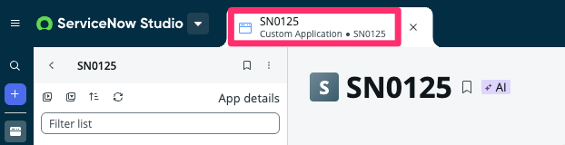
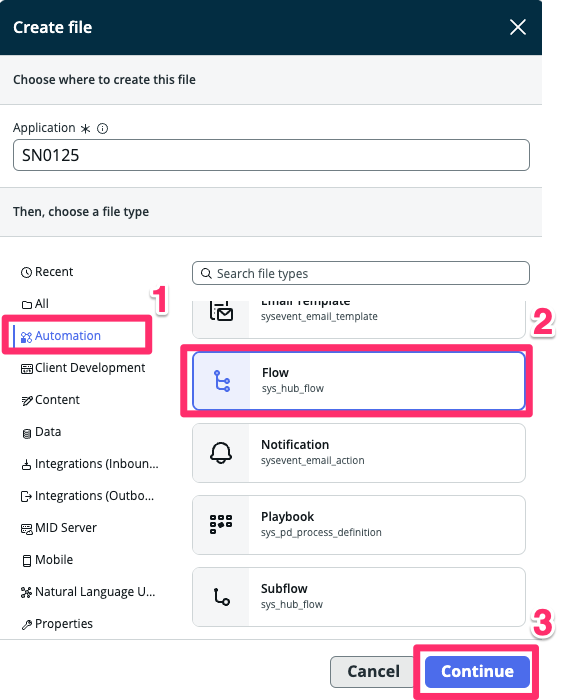
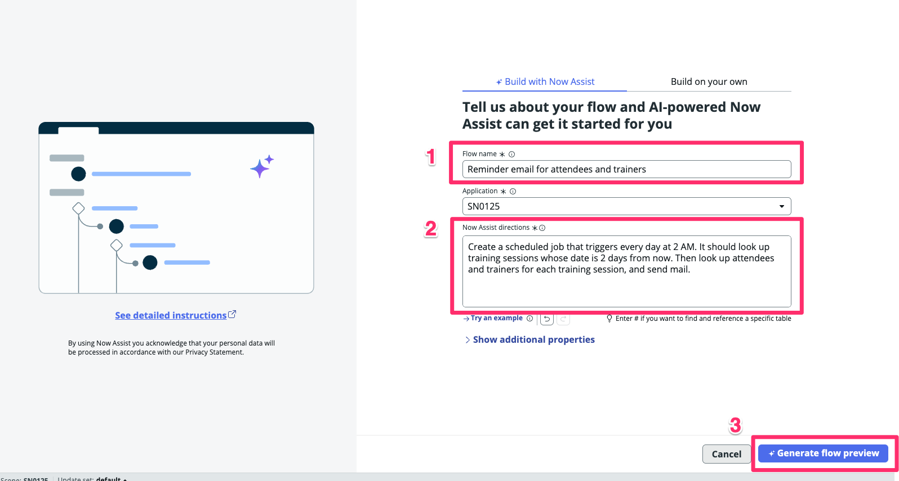
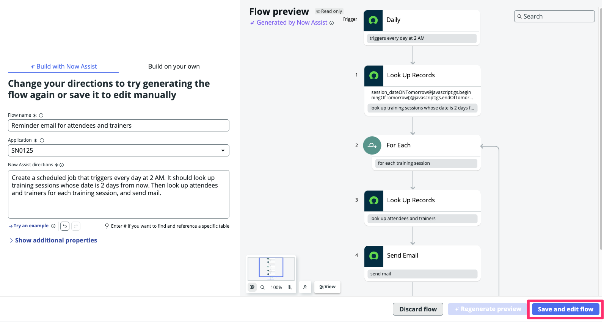
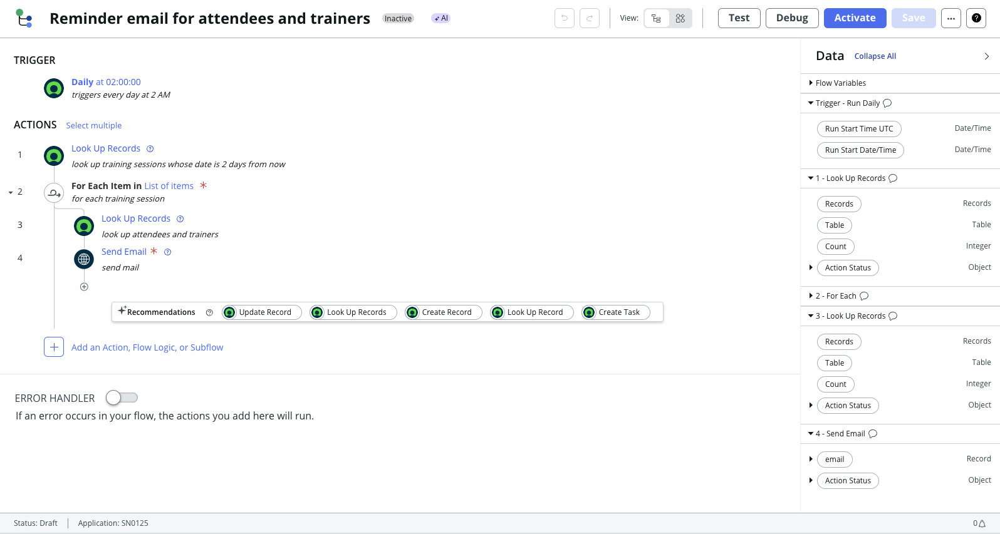

<div class="button-homepage-vancouver">
🕒 Duração Estimada: 10 min
</div>

## 🔍 Visão Geral  

Agora que exploramos a estrutura inicial do aplicativo, vamos ver como o **Now Assist for Creator** simplifica a **automação de fluxos de trabalho**.  

Você deseja automatizar **e-mails de lembrete** para participantes e treinadores **dois dias antes das sessões de treinamento**, além de enviar **e-mails de follow-up** para coletar feedback após cada sessão.  

Essas automações **eliminam tarefas manuais** e garantem que a comunicação ocorra no momento certo.  

Com a funcionalidade **Flow Generation**, você pode fornecer **descrições em linguagem natural**, e o **Now Assist for Creator** criará automaticamente um fluxo de trabalho correspondente.  

Ela deseja criar **dois fluxos de trabalho**:  
✅ **E-mail de lembrete para participantes e treinadores**.  
✅ **Coleta de feedback dos participantes após as sessões**.  

## Criando o Primeiro Fluxo – Lembrete de E-mail  

1. Agora, vamos retornar à aba da sua aplicação no ServiceNow Studio.
   

2. Selecione o botão <span className="button-purple-square">Create</span>.
   

3. Selecione a opção Automation > Flow e <span className="button-purple-square">Continue</span>.
   

4. Agora, utilizaremos o Now Assist para criar a estrutura do fluxo. 
5. No campo **Flow Name**, digite:  
   
   ```txt title="Flow Generation - Title 1"
   Reminder email for attendees and trainers
   ```  

6. No campo **Now Assist Directions**, digite:  

   ```txt title="Flow Generation - Prompt 1"
   Create a scheduled job that triggers every day at 2 AM. It should look up training sessions whose date is 2 days from now. Then look up attendees and trainers for each training session, and send mail.
   ```  
7.  Clique em <span className="button-purple-square">Generate flow preview</span>. 
   
8.  Aguarde a geração e em seguida clique em <span className="button-purple-square">Save and edit flow</span>  
    
9.  Altere a visualização de **Diagram View** para **Vertical View** clicando no botão de alternância.  
   
10. Verifique o flow criado.
    

:::info
Quando você conversa com o Now Assist para criar o aplicativo, ele fará a maior parte do trabalho de desenvolvimento, mas, às vezes, pode ser necessário corrigir ou ajustar algumas coisas. Além disso, devido à natureza da IA Generativa, o aplicativo de cada pessoa pode acabar ficando um pouco diferente. 

**Por favor, CONTINUE o laboratório** mesmo que o seu aplicativo gerado não corresponda exatamente às capturas de tela nos próximos passos.
:::

## Criando o Segundo Fluxo – Coleta de Feedback  

1. Volte à aba da sua aplicação.
   
2. Selecione o botão <span className="button-purple-square">Create</span>.
   

3. Selecione a opção Automation > Flow e <span className="button-purple-square">Continue</span>.
   

4. No campo **Flow Name**, digite:  
   
   ```txt title="Flow Generation - Title 2"
   Gather Feedback from Attendees
   ```  

5. No campo **Now Assist Directions**, digite:  

   ```txt title="Flow Generation - Prompt 2"
   Create a scheduled job that runs every day at 3 AM. It should look up training sessions that ended the day before, and look up attendees of each training session, and send mail.
   ``` 
6. Clique em <span className="button-purple-square">Generate flow preview</span>. 
   
7. Aguarde a geração e, em seguida, clique em <span className="button-purple-square">Save and edit flow</span>  
   
8. Altere a visualização do fluxo clicando no botão de alternância ao lado de **View** no topo da tela.  

## Explorando as Recomendações de Fluxo  

1. Clique em **"Add an Action, Flow Logic, or Subflow"**.
      
2. Isso abrirá o **pop-up de Recomendações**.  
   
   > 📌 O **Now Assist for Creator** pode sugerir **Ações** que você pode estar procurando, economizando tempo ao criar um novo fluxo.  

   > ⚠️ Dependendo dos dados na instância do laboratório, pode aparecer a mensagem **"No recommendations found yet"**, o que é esperado caso a IA ainda não tenha dados suficientes.  

---

## 🎯 Recapitulação  

**Parabéns!** 🎉  

Você criou **dois fluxos automatizados** usando a funcionalidade **Flow Generation** do **Now Assist for Creator**!  

> No futuro, em versões como **Xanadu**, a funcionalidade de **Flow Generation** poderá **mapear automaticamente os data pills** e até **realizar edições utilizando prompts em linguagem natural**.  
