<div class="button-homepage-vancouver">
🕒 Duração Estimada: 10 min
</div>

## 🔍 Visão Geral  

A **validação de formulários** é essencial para garantir que os dados inseridos sigam as regras do aplicativo.  

O aplicativo **Cross-Training** precisa implementar duas regras de validação:  

✅ **Validação do Limite de Participantes** – Um alerta impedirá novos registros quando o limite for atingido.  
✅ **Verificação da Inscrição de Treinadores** – Uma regra impedirá treinadores de se voluntariarem para sessões que já possuam um instrutor.  

**Você** implementará essa lógica utilizando **JavaScript**, mas para acelerar o desenvolvimento, usará a funcionalidade **Now Assist Code Generation**.  


## 🛠️ Passos  

### **Criando um Script Include**  

1. Volte a aba da sua aplicação.
   
2. Selecione o botão <span className="button-purple-square">Create</span>.
   
3. Selecione a opção [More] > Server Development > Script Include e <span className="button-purple-square">Continue</span>.
   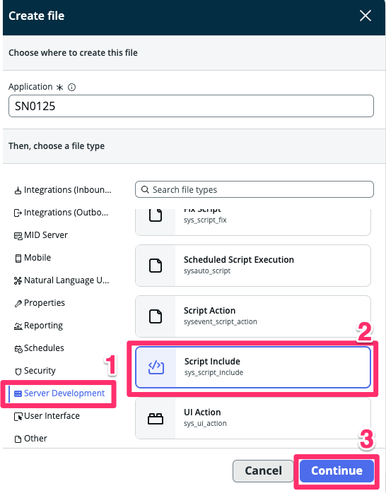
4. No campo **Name**, digite:  
   ```txt title="Code Generation - Name"
   CrossTrainingLabUtils
   ```  
   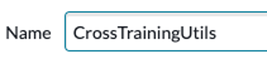

5. Marque a opção **Glide AJAX enabled**.  
   

6. No campo **Script**, clique na linha **3** e insira a função vazia abaixo:  
   ```js title="Code Generation - Function"
   checkAttendeesLimit: function() { 
   
   },
   ```
   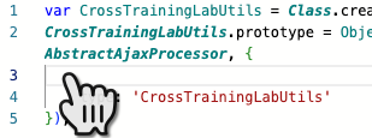
   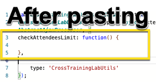

7. Na linha **4**, pressione **Cmd + Enter (Mac) ou Ctrl + Enter (Windows)** para ativar a funcionalidade **"Generate code with Now Assist"**, que converterá o prompt em código JavaScript.

   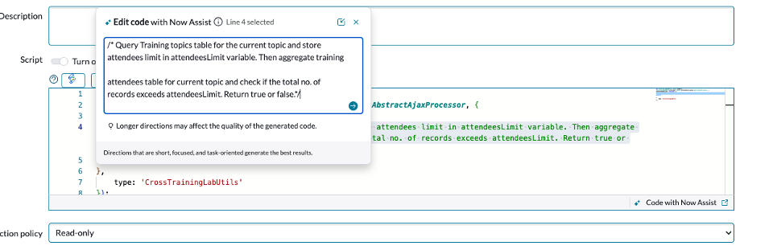  
   ```js title="Code Generation - Function"
   Query Training topics table for the current topic and store attendees limit in attendeesLimit variable. Then aggregate training attendees table for current topic and check if the total no. of records exceeds attendeesLimit. Return true or false.
   ```

8.   Aguarde até que o Now Assist Code Generation gere a resposta. O código gerado aparecerá em **Verde**. 
  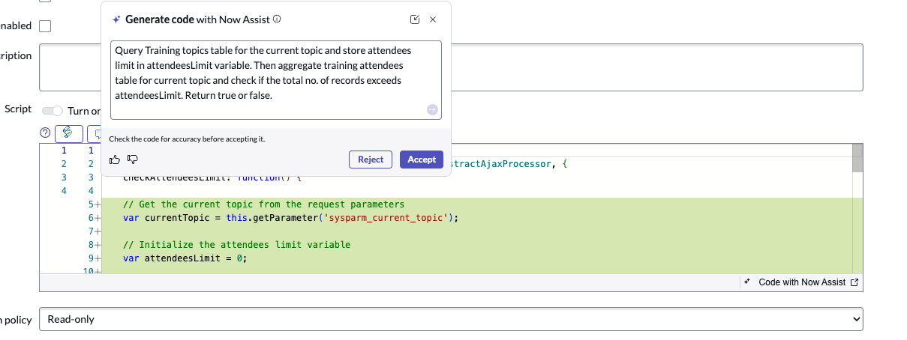  
1.   Clique em **Accept** para aceitar o código gerado.   
     - A **barra roxa ao lado** indicará que o código foi gerado pelo **Now Assist**.
   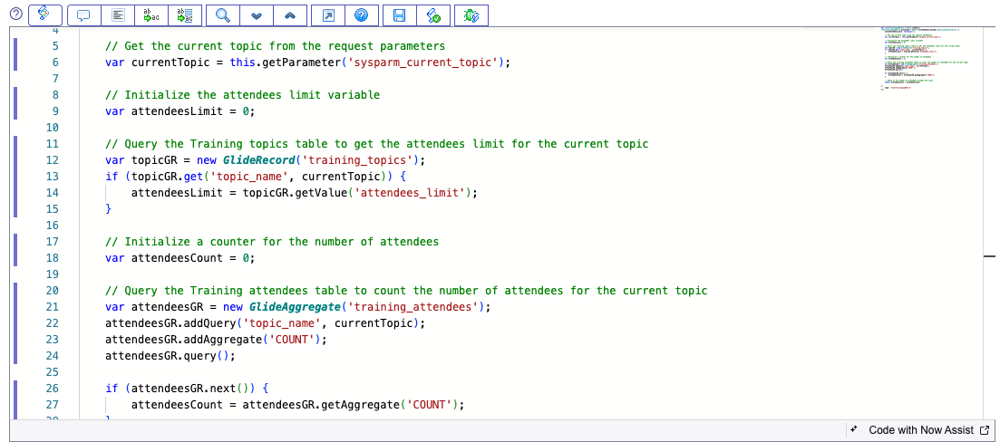
2.   Clique no botão **"Format Code"** no topo do editor para organizar e melhorar a legibilidade do código.
    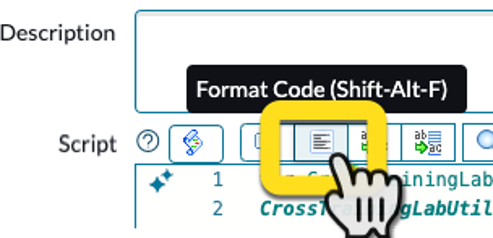  

3.  Agora, selecione parte do código gerado e perceba que o ícone do Now Assist aparece ao lado.
    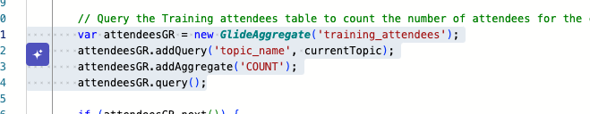

4.  Clique o ícone do Now Assist e selecione a opção "Explain code in detail"
    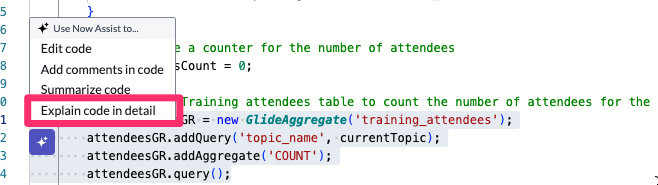

5.  Ele irá nos detalhar sobre o trecho do código específico
    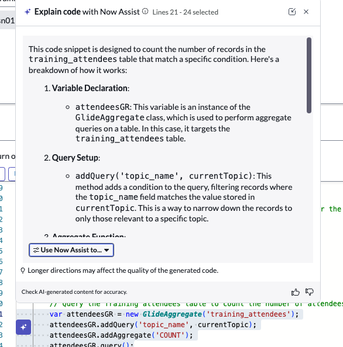

6.  Clique em Submit

   :::danger
   ⚠️ **Ignore qualquer mensagem sobre salvar o trabalho.** Não é necessário salvar.  
   :::

---
:::danger
**Caso Não Consiga Salvar**  

⚠️ **Se não conseguir salvar o Script Include, não há problema.**  

O objetivo deste exercício é apenas demonstrar **como e onde utilizar o Now Assist Code Generation**.  

Se precisar sair sem salvar:  

- Clique no **logo do ServiceNow** no canto superior esquerdo.
   
- **Confirme a saída sem salvar** quando solicitado.
   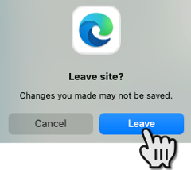
:::
---

## 🎯 Recapitulação  

**Parabéns!** 🎉  

**Você** utilizou a **Code Generation do Now Assist** para **criar rapidamente a lógica de validação** que Alexandra precisava no aplicativo **Cross-Training**.  

