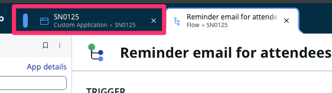
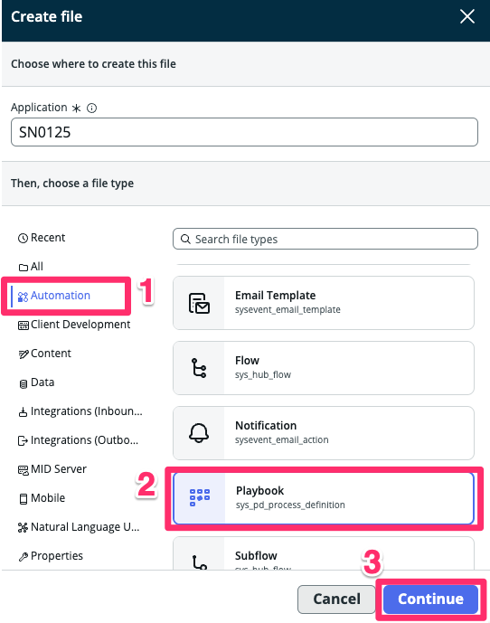
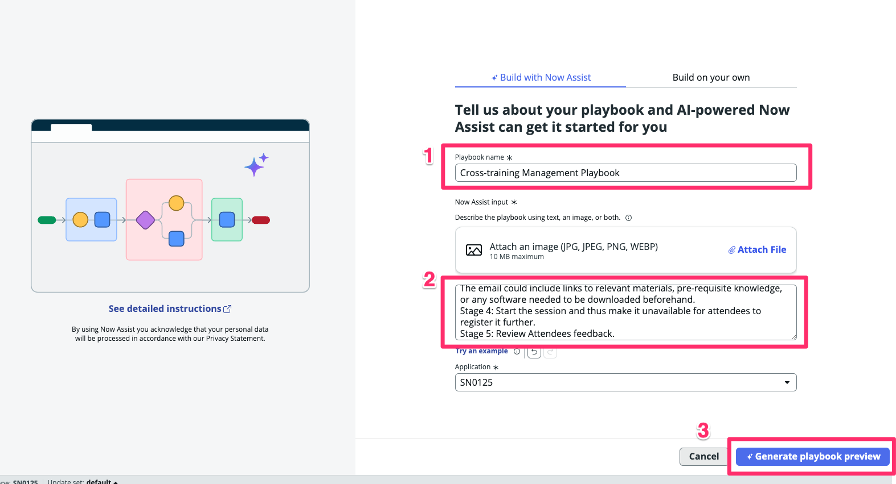
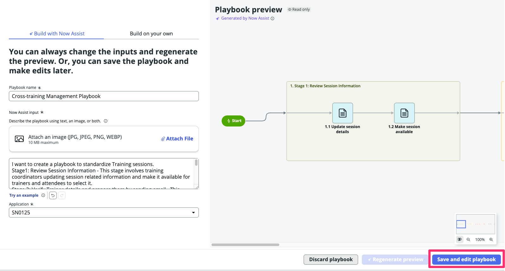
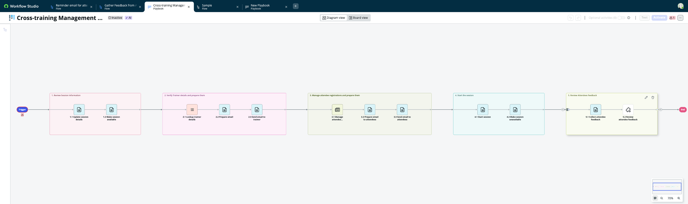
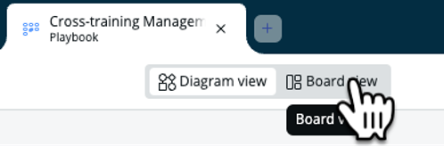
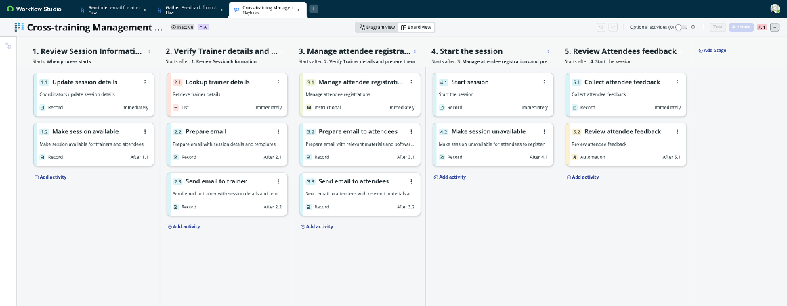

<div class="button-homepage-vancouver">
🕒 Duração Estimada: 10 min
</div>

## 🔍 Visão Geral  

Manter um processo consistente para gerenciar sessões de treinamento é essencial.  

O **Now Assist for Playbook Generation** ajuda a **padronizar a gestão de treinamentos**, permitindo que **Você** defina **etapas-chave**, como:  

✅ **Atualização das informações da sessão**  
✅ **Envio de materiais para treinadores**  
✅ **Registro de participantes**  
✅ **Coleta de feedback**  

Isso cria um **roteiro visual (playbook)** para os **coordenadores de treinamento**, garantindo **consistência e eficiência** no processo.  

Com o **Playbook Generation**, Você pode descrever o processo em **linguagem natural**, e o **Now Assist for Creator** gerará automaticamente um **Playbook estruturado**.  


## 🛠️ Passos  

:::info
📌 Você ainda deve estar no **ServiceNow Studio** para este exercício. Se não estiver, **retorne a ele**.  
:::

1. Volte a aba da sua aplicação.
   
2. Selecione o botão <span className="button-purple-square">Create</span>.
   

3. Selecione a opção Automation > Playbook e <span className="button-purple-square">Continue</span>.
   

4. No campo **Playbook Name**, digite:  
   ```txt title="Playbook Generation - Title"
   Cross-training Management Playbook  
   ```
5. No campo **Now Assist Directions**, copie e cole o seguinte texto:  
   ```txt title="Playbook Generation - Prompt"
   Quero criar um playbook para padronizar as sessões de treinamento.
   Etapa 1: Revisar Informações da Sessão – Esta etapa envolve os coordenadores de treinamento atualizando as informações relacionadas à sessão e tornando-as disponíveis para que instrutores e participantes possam selecioná-las.
   Etapa 2: Verificar detalhes do instrutor e prepará-lo enviando um e-mail – Esta etapa envolve consultar os detalhes do instrutor e enviar um e-mail com orientações sobre como conduzir as sessões ou com modelos de apresentação que devem ser utilizados.
   Etapa 3: Gerenciar as inscrições dos participantes e prepará-los enviando um e-mail – O e-mail pode incluir links para materiais relevantes, conhecimento prévio necessário ou qualquer software que precise ser baixado antecipadamente.
   Etapa 4: Iniciar a sessão e torná-la indisponível para novas inscrições.
   Etapa 5: Revisar o feedback dos participantes.
   ```
6.  Clique em <span className="button-purple-square">Generate playbook preview</span>. 
   
6.  Aguarde a geração e em seguida clique em <span className="button-purple-square">Save and edit playbook</span> 
   
7.  Explore o **Playbook gerado**.  
   
   > 📌 Você verá que **cada estágio foi capturado** e **espaços reservados foram inseridos** para os passos que precisarão ser desenvolvidos.  

### **Explorando Diferentes Modos de Visualização**  

7. Clique na opção **"Board View"** para visualizar o processo no **formato Kanban**.
   
8. **Compare as duas visualizações:**  
   

   > 📌 O **Board View** oferece uma visão estilo Kanban, enquanto o **Diagram View** exibe o processo de forma sequencial.  

   > 📌 As **etapas no topo das colunas** do **Board View** correspondem às **mesmas fases do Playbook**, visíveis para o **agente ou usuário final**.  

---

## 🎯 Recapitulação  

**Parabéns!** 🎉  

Você criou um **Playbook automatizado** utilizando a funcionalidade **Playbook Generation** do **Now Assist for Creator**!  

> No futuro, as versões mais recentes permitirão **menos placeholders** e a possibilidade de **editar playbooks usando prompts em linguagem natural**.  

