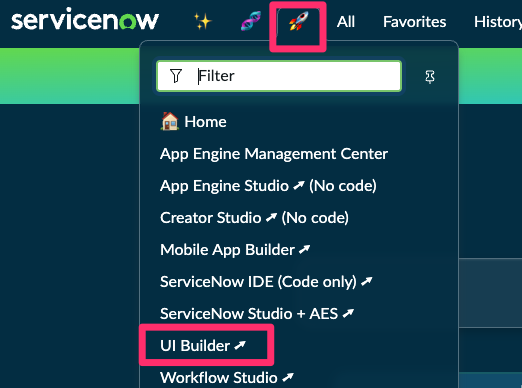
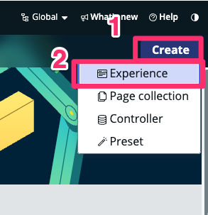
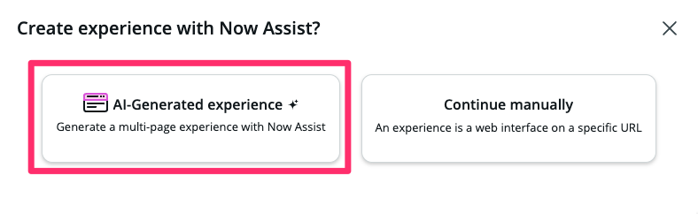
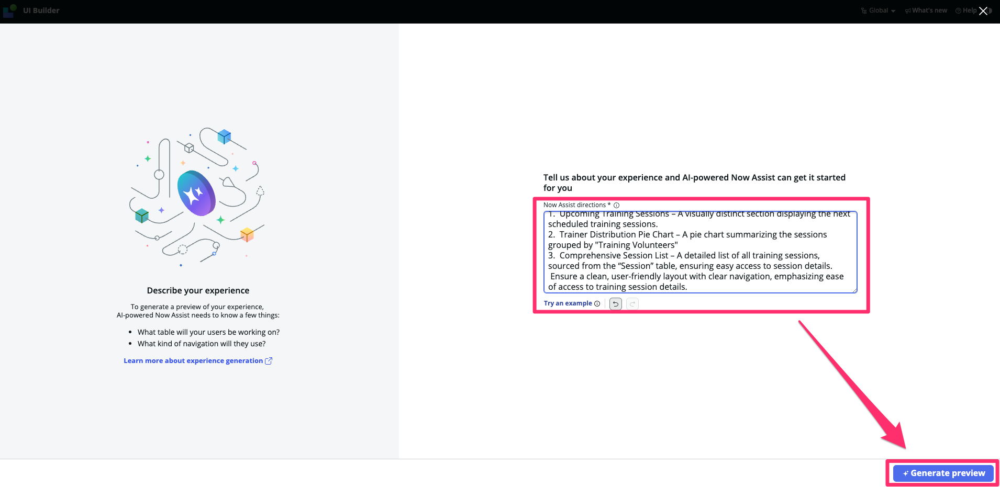
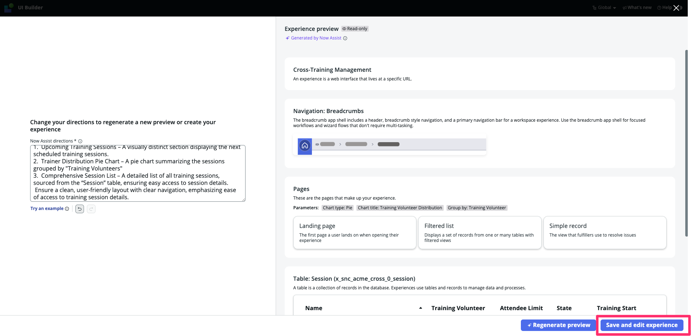
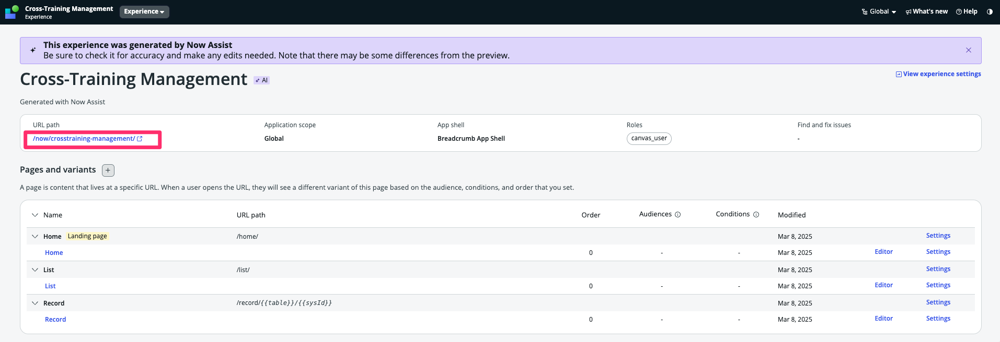
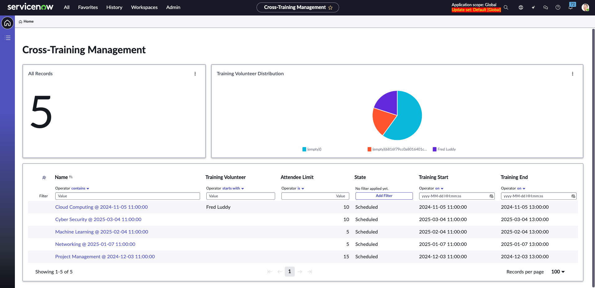

<div class="button-homepage-vancouver">
🕒 Duração Estimada: 10 min
</div>

## 🔍 Visão Geral  

O **Now Assist para UI Generation** permite a criação de experiências de usuário rapidamente, utilizando **inteligência artificial** para gerar interfaces personalizadas com base em descrições textuais.  

Com essa funcionalidade, você pode:  

✅ Criar interfaces sem necessidade de **codificação manual**  
✅ Gerar telas personalizadas **com base em prompts em linguagem natural**  
✅ Editar e ajustar componentes diretamente no **UI Builder**  

---

## 🛠️ Passos  

:::info
📌 Você deve retornar à plataforma ServiceNow para este exercício.  
:::

1. **Volte à página inicial da plataforma ServiceNow (URL raiz)**.  
2. No menu **🚀**, pesquise por **UI Builder** e clique para abrir.  
   

3. Clique no botão **Create** e Selecione a opção **Experience**.  

  

1. Escolha a opção **AI-Generated Experience**. 
    

2. Na caixa de texto, **Now Assist directions**, cole o exemplo a seguir:  

   ```txt title="UI Generation - Prompt"
   Create a Breadcrumb-style experience titled “Cross-Training Management” that provides a structured and intuitive navigation experience. The interface should include:
	1.	Upcoming Training Sessions – A visually distinct section displaying the next scheduled training sessions.
	2.	Trainer Distribution Pie Chart – A pie chart summarizing the sessions grouped by "Training Volunteers"
	3.	Comprehensive Session List – A detailed list of all training sessions, sourced from the “Session” table, ensuring easy access to session details.
    Ensure a clean, user-friendly layout with clear navigation, emphasizing ease of access to training session details.
   ```   

3. Clique em **Generate Preview** e visualize o resultado gerado.  

   

4. Valide a interface gerada e clique em **Save and Edit Experience**.  

   

5.  Acesse o link disponibilizado no campo **"URL Path"** para visualizar a UI gerada.  

    

6. Navegue pela interface criada

    

## 🎯 Recapitulação  

**Parabéns!** 🎉  

Você criou uma **interface personalizada** utilizando o **Now Assist no UI Builder**!  

✅ Criamos uma interface **baseada em um prompt**.  
✅ Geramos automaticamente os componentes da experiência.  
✅ Publicamos e acessamos a **nova UI diretamente via URL**.  

Agora você pode **explorar ajustes e personalizar a experiência conforme necessário**!  
