<div class="button-homepage-vancouver">
🕒 Duração Estimada: 15 min
</div>

## 🔍 Visão Geral  

Os **Spokes** no **ServiceNow Integration Hub** facilitam a integração com sistemas externos, permitindo a automação de processos de forma rápida e segura.  

Neste exercício, criaremos um **Spoke personalizado** para se conectar à **ACME Training API**, um sistema externo que gerencia treinamentos. Esse Spoke possibilitará recuperar informações sobre sessões de treinamento diretamente no ServiceNow e usá-las em workflows, chatbots e outras automações.  

📌 **Acesse a documentação da API para referência:**  
🔗 [ACME Training API Docs](https://acme-training-api.azurewebsites.net/api-docs/)  

---

## 🛠️ **Criando o Spoke**  

1. Retorne à **plataforma ServiceNow**.  
2. No menu **🚀**, busque por **Workflow Studio** e clique para abrir.  
   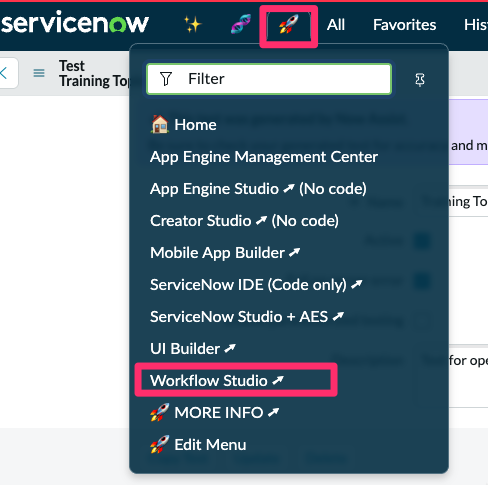 
3. Clique em **New > Spoke**.  
   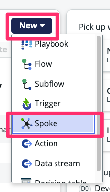  
4. Selecione a opção **"Create spoke in existing scope"**, digite o nome da sua aplicação e clique em **Continue**.  
   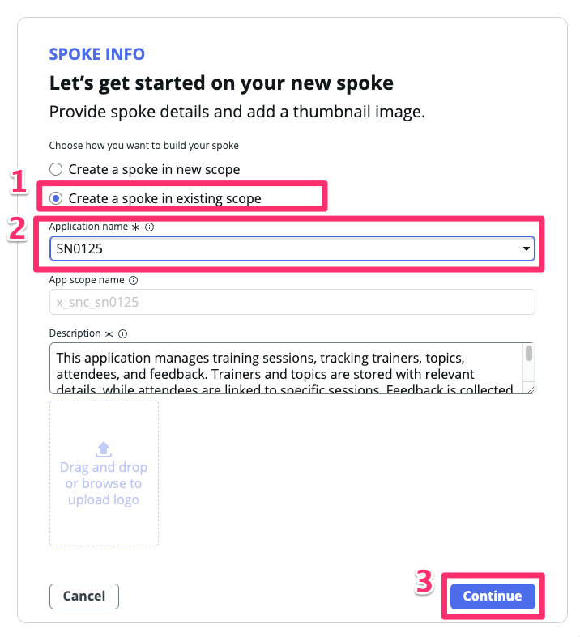  
5. Escolha a opção **Now Assist** e clique em **Continue**.  
   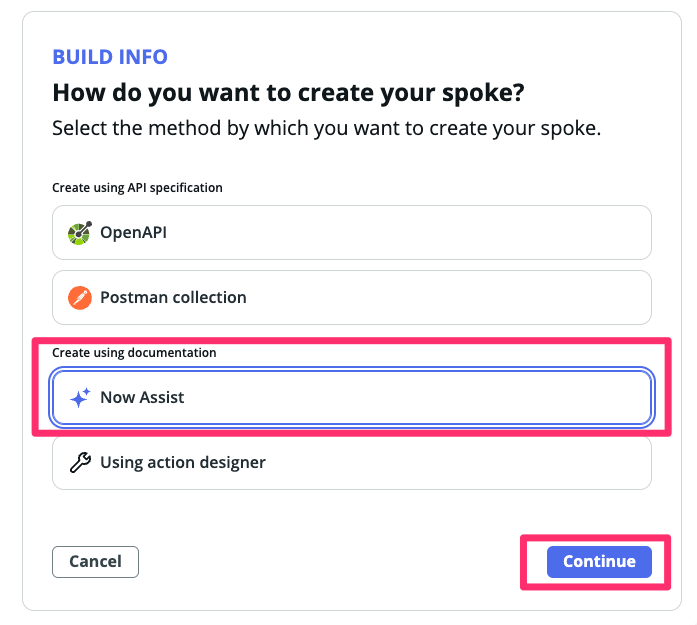  
6. Agora, cole o prompt abaixo na área de descrição do spoke:
    ```
    Name: List Available Training Sessions  
    Description: Retrieves a list of all scheduled training sessions using the ACME Training API.  
    API Endpoint: GET /trainings  

    ## Response  

    [
    {
        "id": "T-001",
        "name": "Cloud Computing @ 2024-11-05 11:00:00",
        "training_topic": "Cloud Computing",
        "training_start": "2024-11-05 14:00:00",
        "training_end": "2024-11-05 16:00:00",
        "session_format": "in_person",
        "state": "scheduled",
        "attendee_limit": 10,
        "training_volunteer": "Fred Luddy"
    },
    {
        "id": "T-002",
        "name": "Machine Learning Basics @ 2024-12-10 10:00:00",
        "training_topic": "Machine Learning",
        "training_start": "2024-12-10 10:00:00",
        "training_end": "2024-12-10 12:00:00",
        "session_format": "virtual",
        "state": "scheduled",
        "attendee_limit": 15,
        "training_volunteer": "Alan Turing"
    }
    ]

    ## Notes  
    - This action retrieves a list of all training sessions available for employees.  
    - No authentication required (test mode).  
    - Can be used to display available sessions in ServiceNow interfaces, chatbots, or workflows.  
    ````
7. Clique em **Generate preview**.  
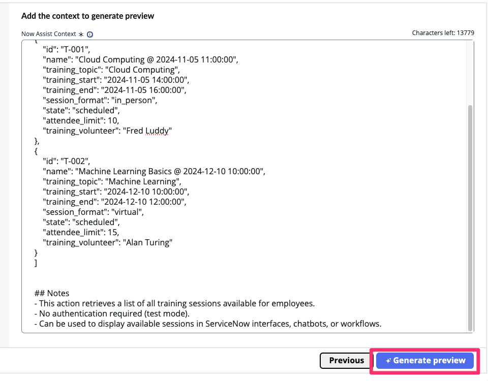  
1. Verifique a estrutura criada e clique em **Continue**.  
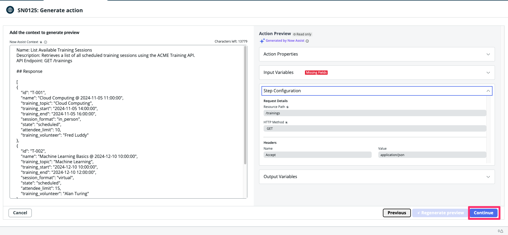  
:::info  
📌 **Nota:** Essa API não requer dados de entrada, então os campos de input podem estar vazios.  
:::  

1. Agora, vamos criar um **Connection Alias**. Clique em **Create New**.  
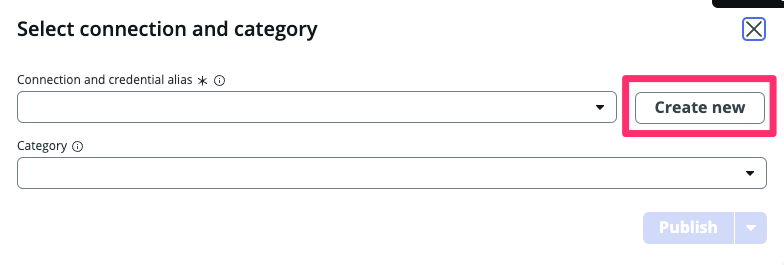  
1.  Escolha um nome para o alias e clique em **Create alias and continue**.  
 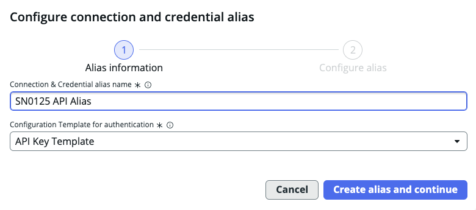  
1.  Insira as seguintes informações:  

    | **Parâmetro**       | **Valor**                                          |
    |---------------------|--------------------------------------------------|
    | **Connection URL**  | `https://acme-training-api.azurewebsites.net/`  |
    | **API Key**        | `demo`                                           |

    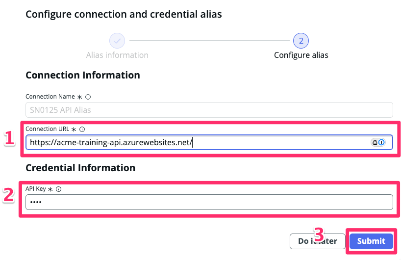

2.  Clique em **Publish**.  
 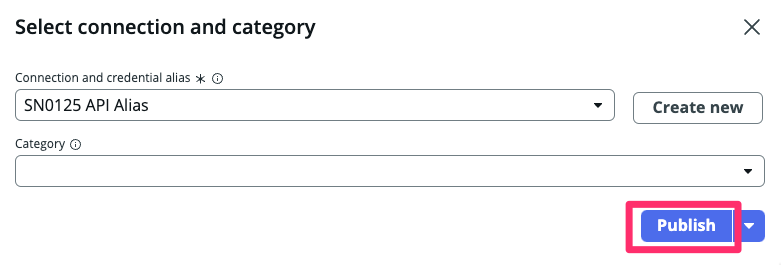  
1.  Clique em **Go to spoke page** para visualizar os detalhes do Spoke.  
 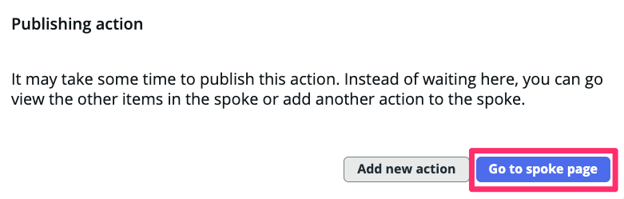  

## **Testando o Spoke**  

14. Aguarde até a **Action** ser criada e acesse o link da ação.  
 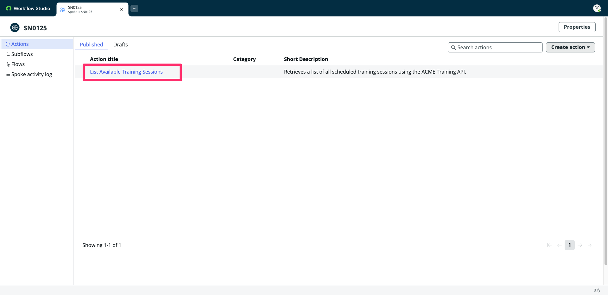  
15. Após o carregamento dos detalhes, clique na aba **OpenAPI/Postman**.  
 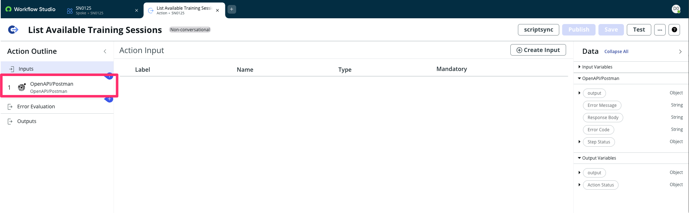  
16. Verifique que a **Action** foi criada corretamente. Agora, clique em **Test**.  
 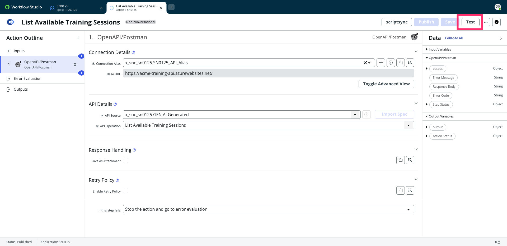  
17. Clique em **Run Test** para executar o teste.  
 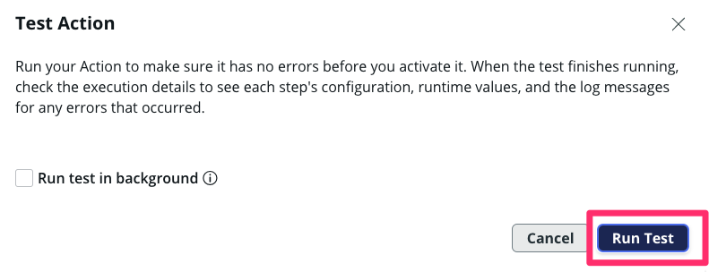  
18. Clique no link `"Your test has finished running. View the Action execution details."`  
 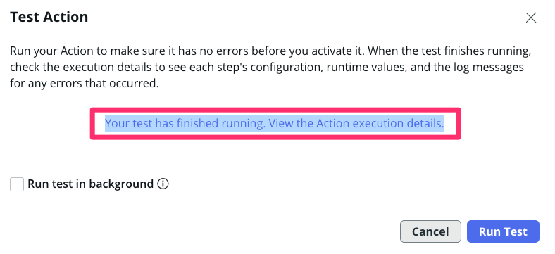  
19. Verifique se o teste foi **executado com sucesso** e clique no **output** para ver a resposta da API.  
 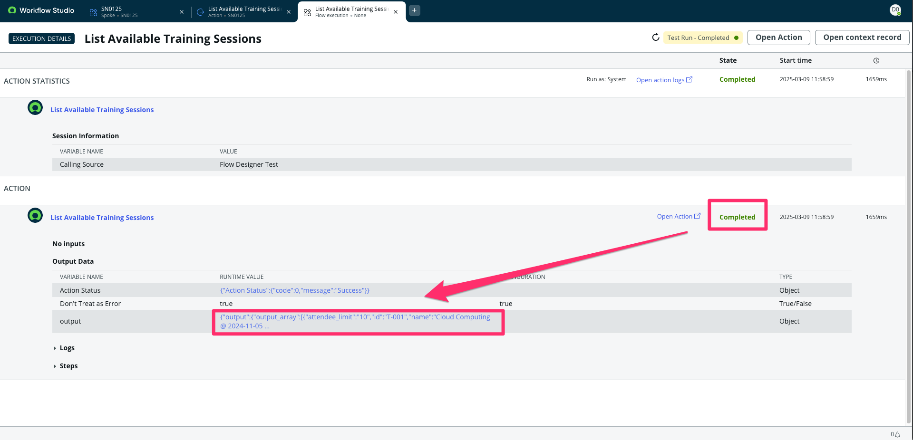  
20. Veja que a API **retornou dados reais** com a lista de treinamentos disponíveis.  
 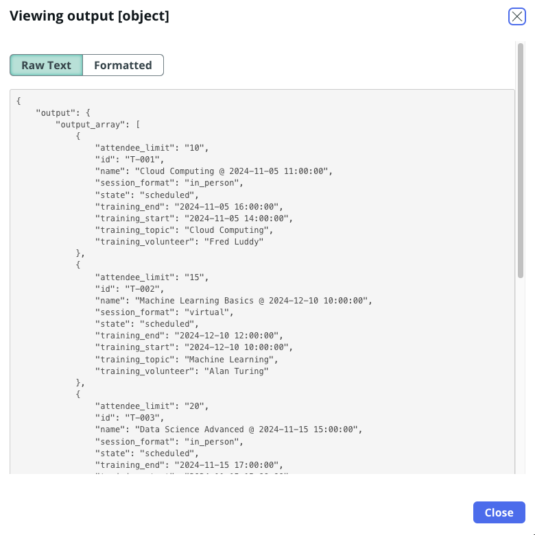 
21. Feche a aba do **Workflow Studio**.  

---

## 🎯 Recapitulação  

**Parabéns!** 🎉  

Você criou um **Spoke funcional** para integração com um sistema externo no **ServiceNow**. Agora, sua instância pode se comunicar diretamente com a **ACME Training API**, permitindo a automação de processos sem necessidade de desenvolvimento manual de integrações.  

✅ Criamos um **Spoke** para comunicação via API.  
✅ Configuramos um **Connection Alias**.  
✅ Publicamos e **testamos** a integração com sucesso.  

Agora você pode usar essa integração para enriquecer **workflows**, **chatbots** e **automação de processos** no ServiceNow! 🚀  