<div class="button-homepage-vancouver">
🕒 Duração Estimada: 20 min
</div>

Agora é hora de adicionar inteligência à nossa aplicação.

Após uma sessão de treinamento ser concluída, Alexandra deseja gerar um plano de melhorias com base nas sugestões dos participantes, transformando os comentários em ações concretas.

No entanto, fazer isso manualmente pode ser demorado e inconsistente.

Por isso, Alexandra decidiu criar um **AI Agent** para realizar essa tarefa automaticamente assim que a sessão for encerrada.

Vamos começar a construir o agente juntos!

---

### 📌 Passos

1. Faça o impersonate de **Alexandra Arias**.

2. Altere o escopo para **ACME Cross-Training - Pre-built Version 2024.09.27**

   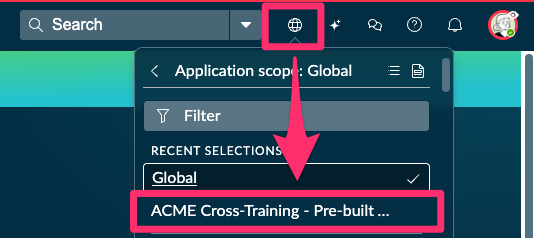

3. Clique no ícone de brilho (✨) e selecione **AI Agent Studio**  
   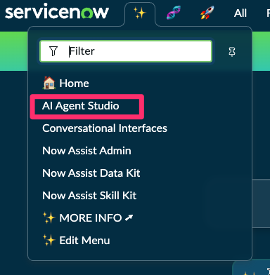

4. Ignore a janela de boas-vindas, marque **Do not show this again** e feche com (X)  
   _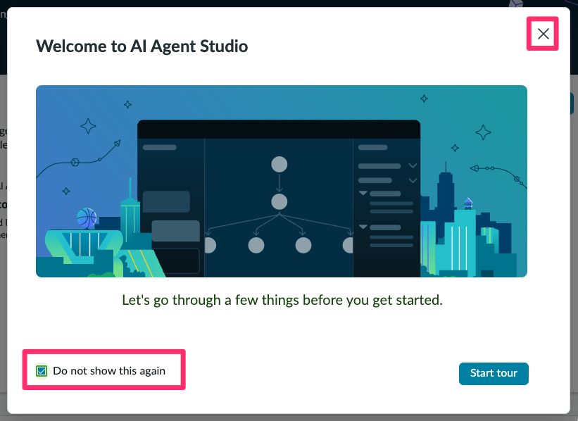_

5. Role a tela para baixo, clique em **AI Agents** e depois em **New**  
   _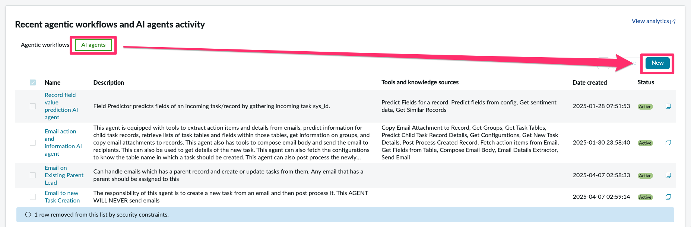_

---

### Descrevendo e instruindo o Agente

Nessa etapa, vamos definir o propósito do agente e dar instruções claras sobre como ele deve se comportar e qual resultado gerar.

Essa definição garante consistência e efetividade para resolver a necessidade do negócio — no nosso caso, transformar feedbacks em melhorias concretas.

   _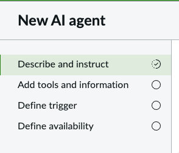_

1. Preencha os campos:  

   - Em **Name**, digite:
     ```text
     Session Feedback Analyst
     ```

   - Em **Description**, digite:
     ```text
     Analyzes attendee feedback from cross-training sessions and provides a clear summary of strengths, areas for improvement, and suggestions to enhance future training.
     ```

   - Em **AI agent role**, digite:
     ```text
     The AI agent serves as a session feedback analyst for training coordinators. It reviews all participant feedback from a given session and synthesizes it into actionable insights. The AI should highlight what went well, what could be improved, and propose suggestions based on the recurring patterns in feedback.
     ```

   - Em **Instructions**, digite:
     ```text
     1. Retrieve the training session and all related feedback records, including user information, using the Knowledge Graph Tool.
     2. Analyze the feedback content to identify recurring strengths and positive experiences mentioned by attendees.
     3. Detect and extract criticisms or suggestions for improvement from the feedback data.
     4. Synthesize the findings into a structured summary with the following sections:
        - Strengths
        - Areas for Improvement
        - Recommendations
     5. Update the Notes field of the session record with the synthesized summary using the Record Operation Tool. The text should:
        - Be in raw text format (no markdown)
        - Include the tag [__✨ AI Agent ✨__] at the beginning
        - Use a professional and easy-to-read tone, with bullet points and clear line breaks
     ```

7. Em **Specify categories for long-term memory**, clique em **Identify Categories**  
   _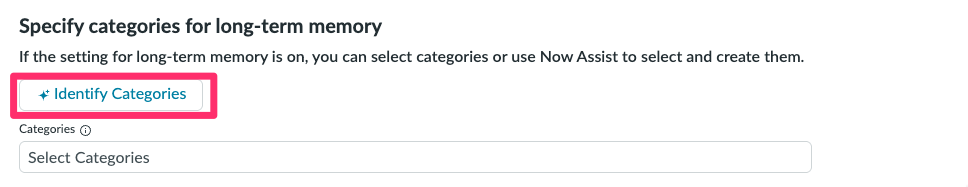_

8. Aceite a sugestão “Meeting and Events” e clique em **Save**  
   _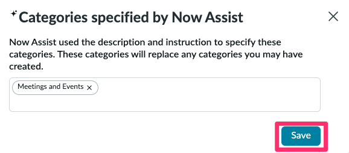_

9. Clique em **Save and Continue**  
   _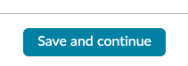_

---

### Adicionando ferramentas ao agente

Agora vamos conectar o agente às fontes de dados e ferramentas para que ele consiga interagir com a aplicação.

   _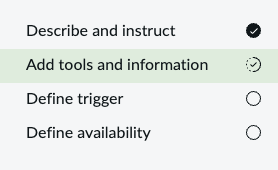_

1. Retorne ao **AI Agent Studio** e Clique em **Add tool** e selecione **Knowledge Graph**  

13. Retorne ao assistente e preencha os seguintes campos:  

    1. **Name**:
     ```text
     KG ACME Cross-Training
     ```
    2. **Description**:
     ```text
     Search feedback and user information using Knowledge Graph
     ```
    3. **Select knowledge graph**:  
     _ACME Cross-Training Graph_
    4. **Execution mode**: _Autonomous_  
    5. **Display output**: _Yes_  
    6. **Processing message**: 
     ```text
     Searching feedback
     ```
    7. **Output transformation strategy**: _Paraphrase_

14. Antes de adicionar a ferramenta, vamos explorar um pouco do Knowledge Graph. 
15. Clique no ícone ao lado de **ACME Cross-Training Graph**  
    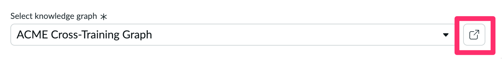
    Nós utilizaremos este Knowledge Graph para permitir que o nosso Agente de IA navegue nos dados de treinamento.
   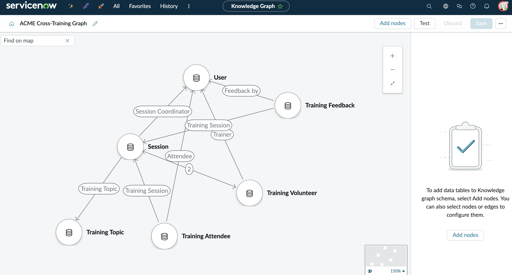

16. Feche a aba do **Knowledge Graph** e retone para a tool no **AI Agent Studio**
    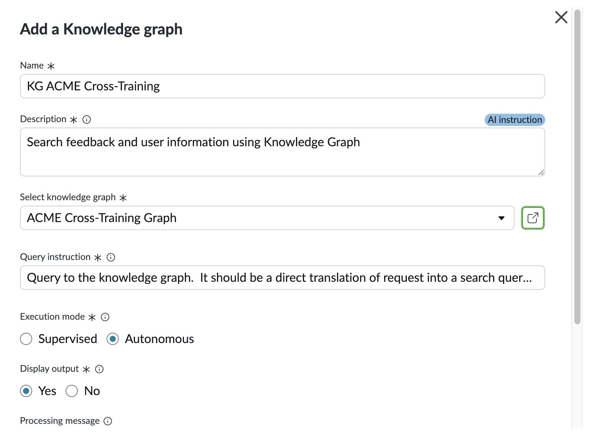

17. Clique em **Add**  
    _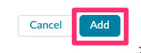_

18. Agora adicione a ferramenta **Record Operation** para atualizar o campo de notas da sessão  
    _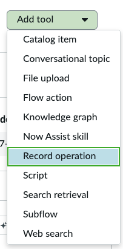_

19. Preencha os campos:  

    1. **Name**:
     ```text
     Update the Session Notes field
     ```
    2. **Description**:
     ```text
     This tool needs to be used to update the Session Notes field in the session record with the result of the AI Agent analysis.
     ```
    3. **Inputs**:
     - `number` = `Number of the Session record that triggered the AI Agent`  
     - `result` = `The final result of AI Agent analysis of the feedback`
    4. **Table**: _Session [x_snc_acme_cross_0_session]_  
    5. **Select operation**: _Update records_  
    6. **Conditions**:  
     - `Number` | `is` | `{{number}}`
    7. **Field value**:  
     - `Session Notes` | `{{result}}`
    8. **Execution mode**: _Autonomous_  
    9. **Display output**: _No_  
    10. **Processing message**:
     ```text
     Updating session notes
     ```
    - **Output transformation strategy**: _None_
  
  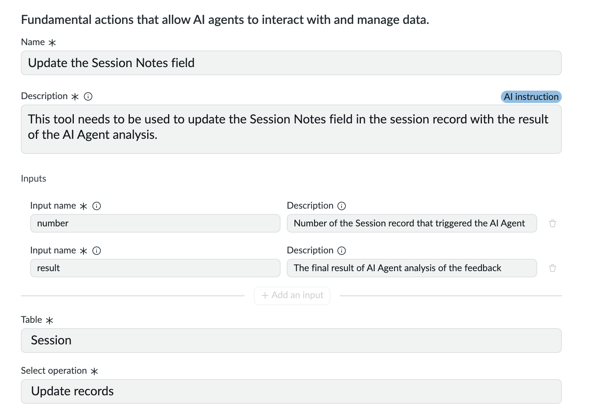

1.  Clique em **Add**  
    __

2.  Clique em **Save and continue**  
    _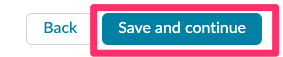_

---

### Definindo o gatilho (trigger)

Agora vamos configurar o evento que dispara o agente — no nosso caso, ao marcar a sessão como concluída.

   _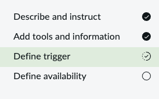_

1. Clique em **Add trigger** e selecione **Updated**  
    _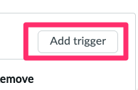_

18. Preencha os seguintes campos:  

    1. **Select trigger**: _Updated_  
    2. **Name**:
     ```text
     Session complete
     ```
    3. **Table**: _Session [x_snc_acme_cross_0_session]_  
    4. **Active**: _true_  
    5. **Conditions**:
     - `State` | `is` | `Complete` 
     - **`AND`** 
     - `Session Notes` | `is empty`
    6. **Method of defining sys_user**: _Use an existing table_  
     - _Session Coordinator [x_snc_acme_cross_0_session]_
    7. **Objective template**:
     ```text
     Help me analyze the session feedback for session Number: ${number}
     ```
    8. **Channel**: _Now Assist panel_  
    9. Marque ✅ **Show Notification**
    _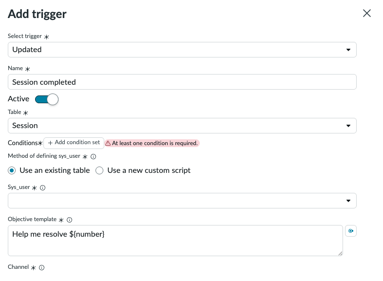_

1.  Clique em **Add**  
    __

2.  Clique em **Save and continue**  
    __

---

### 🚀 Finalizando

21. Na seção **Define availability**, certifique-se de que o **Status** está como **Active**  
    _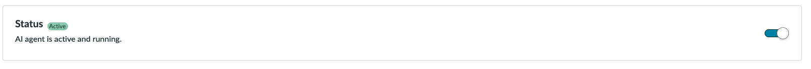_

22. Em **Processing message**, digite:
  ```text
  Analyzing session feedback
  ```

   _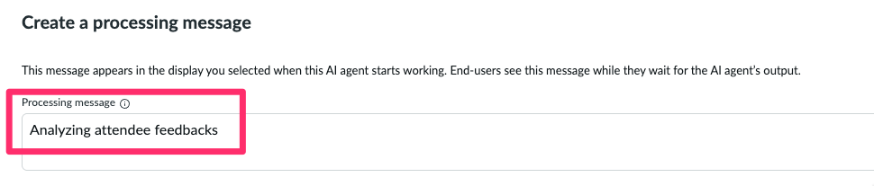_

23. Clique em **Save and test**  
   _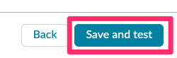_