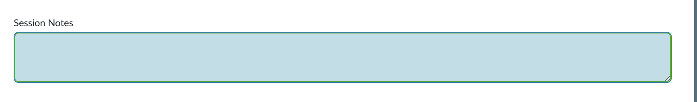
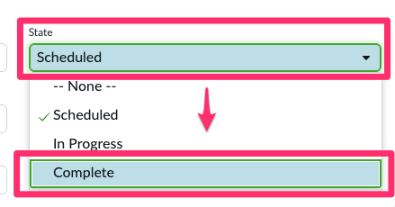
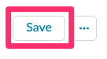
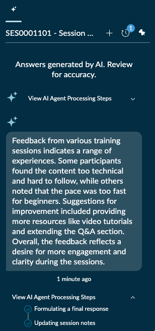
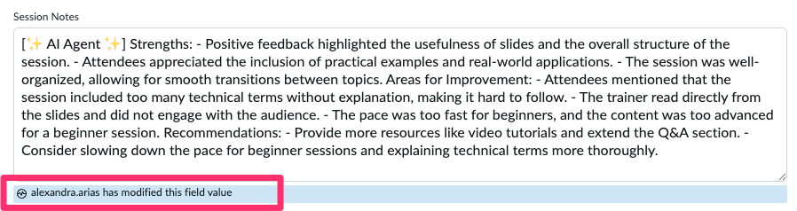

🕒 Duração Estimada: 5 min

---

### 📌 Passos

1. No registro de **Session**, precisamos antes limpar o campo **Session Notes** para que nossa trigger seja disparada.
   

2.  Em seguida, altere o campo **State** de **Scheduled** para **Complete**

   

3. Clique em **Save**

   

4. Repare que o **ícone do Now Assist** apresenta uma nova notificação. Clique nele.

   __

5. Observe a **execução** acontecendo.

   __

6. Verifique o campo **Session Notes**, que agora estará atualizado com uma nova análise gerada pelo AI Agent em nome de **Alexandra Arias**.

   __

---

### 🎉 Parabéns!

Agora, Alexandra possui uma aplicação de Cross-Training poderosa — construída em tempo recorde utilizando a ServiceNow Platform, o App Engine e o Now Assist for Creator.

Com essa solução, ela pode escalar seu programa de treinamentos globalmente e capacitar ainda mais colaboradores a compartilhar conhecimento e colaborar de forma eficaz.

Ainda melhor: um **AI Agent** agora ajuda automaticamente a analisar os feedbacks das sessões, transformando insights em melhorias contínuas.

Se ainda houver tempo no laboratório, sinta-se à vontade para explorar novas ideias e continuar experimentando as capacidades do **Now Assist for Creator**.

**Obrigado por participar!**  
Esperamos que tenha aproveitado a experiência.