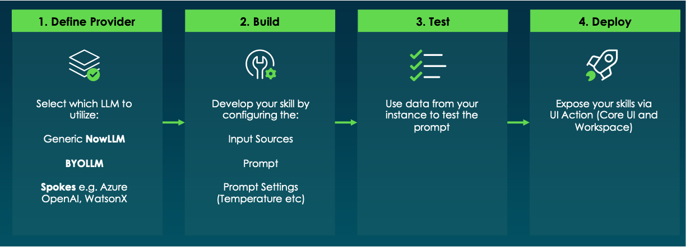

# Introdução ao Skill Kit do Now Assist  

## 🔍 Visão Geral  

O **Now Assist Skill Kit (NASK)** permite a criação de **habilidades personalizadas de IA** dentro do ecossistema ServiceNow. Com ele, desenvolvedores podem estender as funcionalidades do **Now Assist**, integrando inteligência artificial em fluxos de trabalho, automatizando tarefas e criando **interações avançadas**.  

Neste laboratório, você aprenderá a criar uma **Custom Skill** para validar o esquema de tabelas no ServiceNow, garantindo conformidade com padrões organizacionais.  

---

## 🚀 O que é o Now Assist Skill Kit?  

O **Skill Kit do Now Assist** é uma plataforma que permite:  

✅ Criar **interações personalizadas de IA** para o ServiceNow.  
✅ Utilizar **grandes modelos de linguagem (LLMs)** para análise de dados e automação.  
✅ **Ampliar as capacidades do Now Assist**, indo além dos recursos padrão.  
✅ Integrar IA em fluxos de trabalho, melhorando **produtividade e governança**.  

Com esse kit, desenvolvedores podem criar **habilidades sob medida**, como:  
- Validação automática de dados.  
- Análises personalizadas de processos.  
- Assistentes que auxiliam na tomada de decisão.  

---

## 🔧 Fases do Desenvolvimento de uma Custom Skill  

A criação de uma **Custom Skill no Skill Kit** segue as seguintes etapas:  

1. **Definir um provedor de IA**  
   - Escolha entre **Now LLM**, **Azure OpenAI**, **OpenAI GPT**, **Google Gemini** ou **WatsonX**.  
   
2. **Configurar a Skill**  
   - Criar **inputs** (ex.: registros do ServiceNow que serão analisados).  
   - Escrever um **prompt estruturado** para guiar a IA.  
   - Integrar com **scripts e APIs** para enriquecer a consulta.  

3. **Testar e Ajustar**  
   - Validar os resultados no **Skill Kit Testing Module**.  
   - Refinar os prompts para melhorar a precisão das respostas.  

4. **Implantar e Publicar**  
   - Definir as configurações de **deployment** (ex.: **Now Assist Panel**, **Flow Action**).  
   - Ativar a skill no **Now Assist Admin Console**.  

---

## 🎯 Objetivo deste Lab

Neste laboratório, você criará uma nova Skill chamada **Sugestão de Tópicos de Treinamento**, voltada ao programa de cross-training da organização.

A Skill tem como objetivo ajudar colaboradores a identificar temas relevantes que eles poderiam propor como instrutores voluntários, com base em:
- Sua área de atuação;
- As ferramentas que utilizam no dia a dia;
- As habilidades que costumam ser solicitadas por colegas;
- E os tópicos de treinamento já existentes no sistema.

Ao final do exercício, você terá:
✅ Criado e configurado uma **Custom Skill com múltiplos inputs contextuais**;  
✅ Conectado uma **Tool para buscar os tópicos de treinamento existentes** via Script;  
✅ Criado um **prompt com verificação inteligente para evitar sugestões duplicadas**;  
✅ Testado e publicado a skill no **Now Assist Panel** para uso prático pelos usuários finais.
