<div class="button-homepage-vancouver">
🕒 Duração Estimada: 20 min
</div>

## 🔍 Visão Geral  

Neste workshop, você aprenderá a criar uma **Custom Skill** utilizando o **Skill Kit do ServiceNow**.  

O objetivo desta skill é **sugerir tópicos de treinamento relevantes** que o colaborador pode oferecer como instrutor voluntário, considerando sua área, ferramentas e habilidades, sem repetir tópicos já existentes.  

---

## 🛠️ Criando a Skill  

1. Clique no ícone de brilho (✨) e selecione **Now Assist Skill Kit**  
   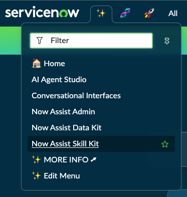
2. Clique em **"Create Skill"**.  
   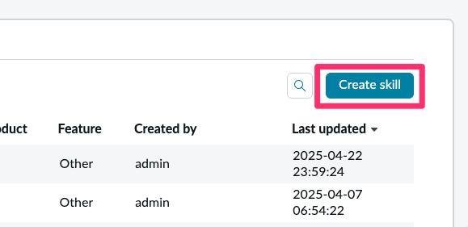
3. No formulário, preencha os seguintes campos:  

   - **Skill name:** Training Topic Suggestions  
   - **Description:** Suggests personalized training topics based on the collaborator's area, tools, and skills, avoiding duplicates of existing topics in the system.  
   - **Default provider:** Now LLM Generic
   - **Provider API:** Now LLM Generic

4. Em **"How would you like to create a prompt for this skill?"**, selecione **"Write from scratch"**.  
5. Clique em **"Next"**.  

   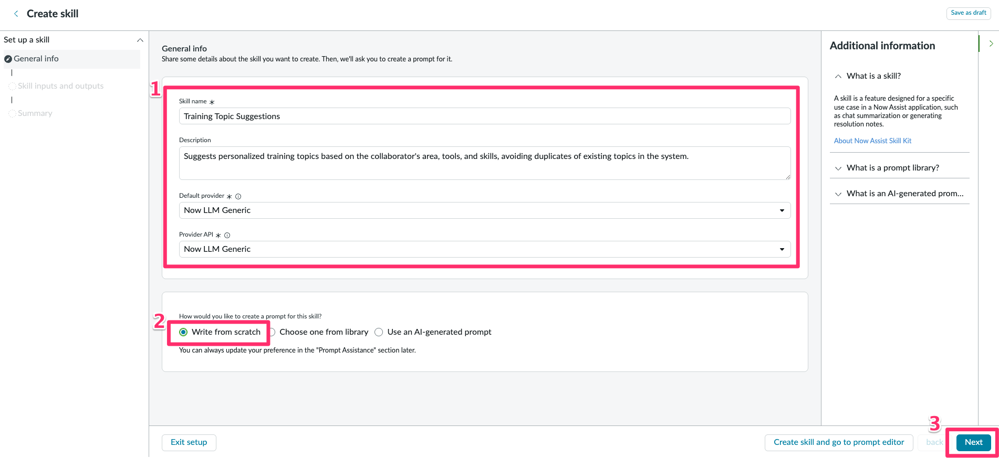

6. Vamos pular as próximas etapas e finalizar no **Prompt Editor**.
7. Clique em **Skip To Prompt editor**.
   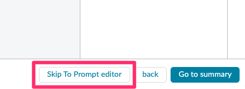
8. Nosso skill foi salvo como **Draft** e poderemos seguir daqui.
   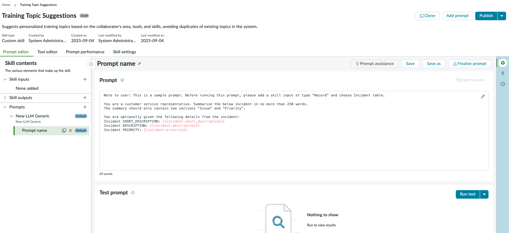

## 🛠️ Definindo Inputs  

1. Localize o menu lateral **Skill contents**.  
2. Clique em **+** ao lado de **Skill inputs** para adicionar os inputs abaixo.  
   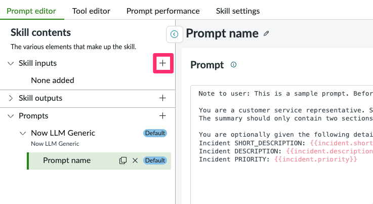
3. Configure os seguintes parâmetros:  

   1. **Área de Atuação / Cargo do Usuário:**
      - **Datatype:** String  
      - **Name:** area  
      - **Description:** What area do you work in  
      - **Mandatory:** ✅ `true`  

   2. **Habilidades que as Pessoas Costumam Pedir Ajuda:**
      - **Datatype:** String  
      - **Name:** skills  
      - **Description:** What skills do your colleagues often ask you help with  
      - **Mandatory:** ❌ `false`  

   3. **Ferramentas e Tecnologias Utilizadas:**
      - **Datatype:** String  
      - **Name:** tools  
      - **Description:** What tools or technologies do you often use  
      - **Mandatory:** ❌ `false`  
  
  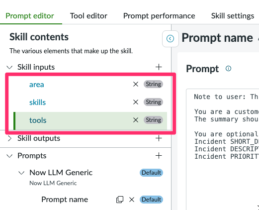

## 🛠️ Criando o Prompt  

1. Agora iremos adicionar um prompt base (template) no **Prompt Editor**. O skill já vem com um prompt de exemplo, nós iremos substituí-lo por um prompt mais aderente a nossa necessidade
   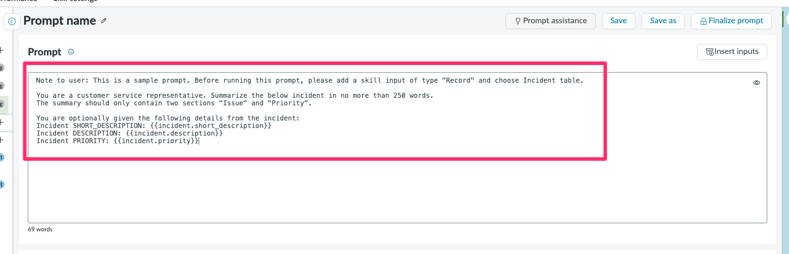
2. Limpe o prompt de exemplo:
   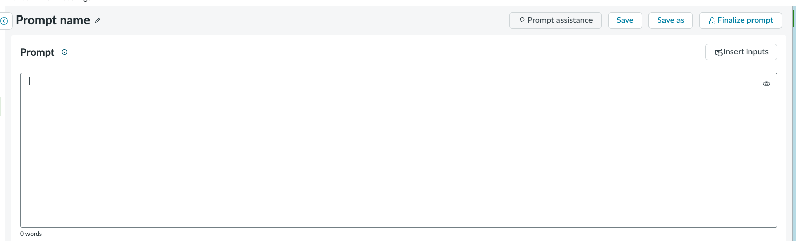
3. Insira o seguinte prompt:  

   :::info
   O uso de formatação Markdown é muito utilizado com LLMs e facilita a leitura humana e pela IA.
   :::

    ```
    ## Role
    You are a cross‑training assistant that suggests relevant, personalized training topics for employees.

    ## Context
    - Area of expertise: 
    - Tools used (comma‑separated text): 
    - Skills colleagues ask help for (comma‑separated text): 

    ## Rules
    1) Do not repeat existing topics (exact and fuzzy match; ignore case and accents).
    2) Prioritize suggestions that combine the provided area, tools, and skills.
    3) Each suggestion must be specific, practical, and useful to colleagues.
    4) Generate 4–6 suggestions.

    ## Output Format (Raw Text)
    For each suggestion, output one line in the format:
    - Title — brief explanation (1 sentence) — why it’s relevant (1 sentence)

    Example:
    - Automating Routine Tasks in ServiceNow — How to create simple flows for repetitive tasks — Relevant because many colleagues ask for basic automation help.
    ```

   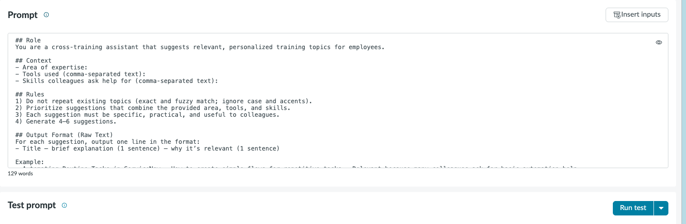

4. Agora, precisamos adicionar os inputs dinâmicos ao prompt. Isso possibilita passar variáveis ao prompt antes de enviar à LLM.
5. Vamos adicionar os inputs que criamos dentro dos locais correspondentes no prompt.
6. Posicione o cursor após o texto `Area of expertise: `
   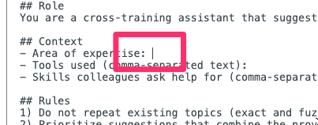
7. Clique em **Insert inputs** no canto superior direito.
   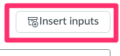
8. Clique em `area`.
   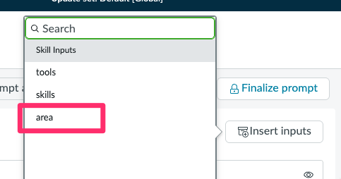
9. Veja que ele adicionou a tag `{{area}}` ao prompt.
    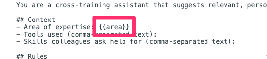
10. Faça o mesmo para os demais `tools` e `skills` respectivamente.
    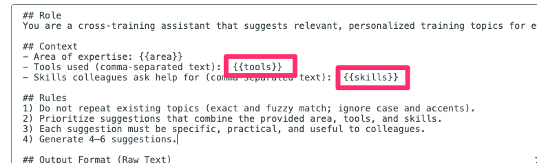
    

## 🛠️ Testando o Prompt  

1. Clique em **"Run Test"**.  
   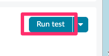
2. Preencha os inputs de teste:  
   - `area`: ex: Customer Service  
   - `tools`: ex: Excel, Power BI, ServiceNow  
   - `skills`: ex: Reporting, Automation, Documentation 
3. Clique em `Run test` 
   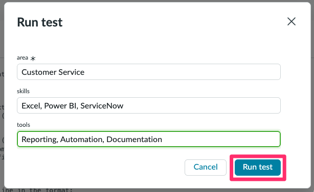
4. Execute o teste e valide se:  
   - As sugestões são relevantes para a área, ferramentas e habilidades.  
   - Nenhum tópico existente foi repetido.  
5. Vamos dar um nome ao prompt. Edite o campo clicando no lápis ao lado de **Prompt name**.
6. Renomeie para **Training Topic Prompt** e **Salve**.
   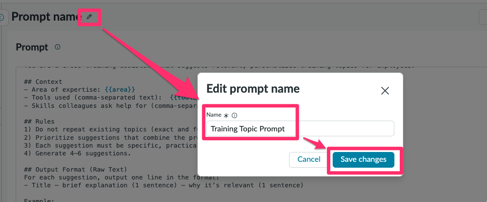
7. Ajuste o prompt se necessário e **Finalize Prompt** quando estiver satisfeito.  
   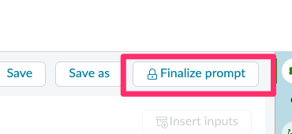


## 🛠️ Configurando a Skill  

1. Abra a guia **Skill Settings**.  
2. Acesse **Deployment Settings**. 
   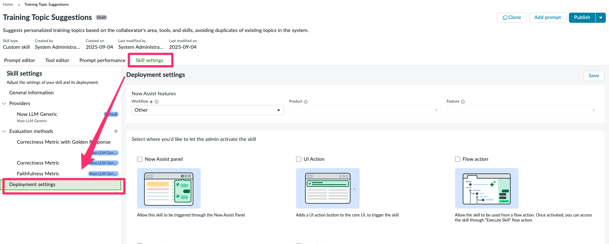
3. Configure os seguintes campos:  

   - **Workflow:** Creator  
   - **Feature:** Create new feature  
   - **Name:** Training Topic Suggestions  
   - **Description:** Suggests personalized training topics.
  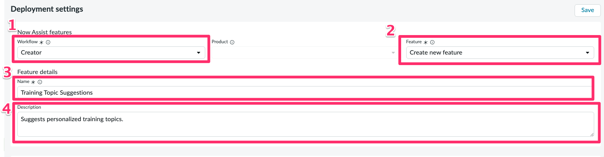

5. Selecione a opção:  ✅ Now Assist Panel 
   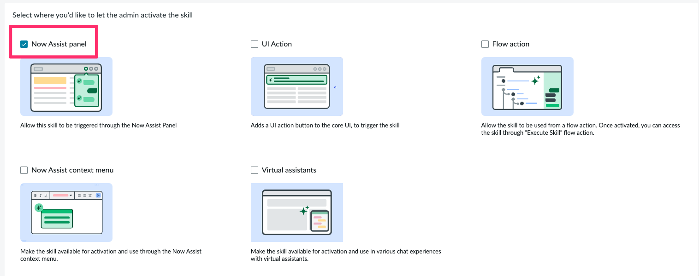

4. Clique em **"Save"**.  
   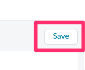

5. Clique em **"Publish"**, marque a opção **Default Prompt** e confirme.  
   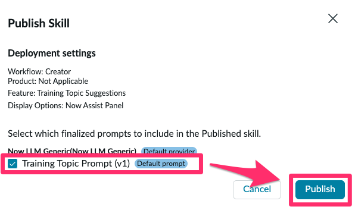
   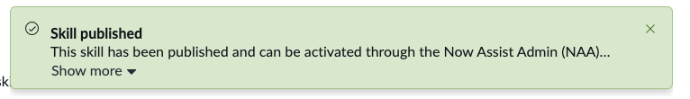


## 🎯 Conclusão  

Parabéns! 🎉  

Você criou e ativou uma **Custom Skill no ServiceNow Skill Kit** para **sugerir tópicos de treinamento personalizados** no **Now Assist**.  

🚀 Agora, você pode testar outras customizações (novos inputs, filtros na Tool, ajustes no prompt) e explorar novas possibilidades!  
