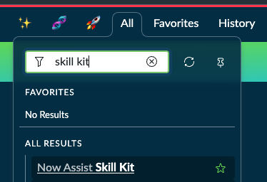
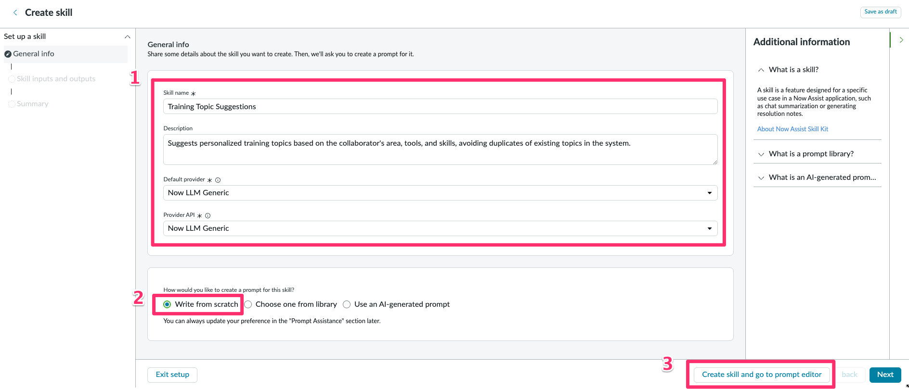

<div class="button-homepage-vancouver">
🕒 Duração Estimada: 20 min
</div>

## 🔍 Visão Geral  

Neste workshop, você aprenderá a criar uma **Custom Skill** utilizando o **Skill Kit do ServiceNow**.  

O objetivo desta skill é **sugerir tópicos de treinamento relevantes** que o colaborador pode oferecer como instrutor voluntário, considerando sua área, ferramentas e habilidades, sem repetir tópicos já existentes.  

---

## 🛠️ Criando a Skill 

1. Verifique se ainda está impersonando **Alexandra Arias**. Se não estiver, impersone-a novamente.

2. Altere o escopo para **ACME Cross-Training - Pre-built Version 2024.09.27**

   

3. Clique em **All** e pesquise **Now Assist Skill Kit**. 
   
4. Clique em **"Create Skill"**.  
   
5. Vamos criar a nossa skill.
   1. No formulário, preencha os seguintes campos:  
   
      **Skill name:** Ideias de Treinamento  
      **Description:** Sugere tópicos de treinamento personalizados com base na área, ferramentas e habilidades do colaborador, evitando duplicações de tópicos já existentes no sistema.  
      **Default provider:** Now LLM Generic
      
      **Provider API:** Now LLM Generic

      :::note Sobre provedores
      Caso sua instância tenha múltiplos provedores configurados (Now LLM, Azure OpenAI, etc.), selecione o provider/API padrão recomendado pelo admin. Para este lab, usamos **Now LLM Generic** por simplicidade.
      :::

   2. Em **"How would you like to create a prompt for this skill?"**, selecione **"Write from scratch"**.  
   3. Clique em **"Create skill and go to prompt editor"**.  

      

6. Nossa skill foi salva como **Draft** e poderemos seguir daqui.
   

## 🛠️ Definindo Inputs  

1. Localize o menu lateral **Skill contents**.  
2. Clique em **+** ao lado de **Skill inputs** para adicionar os inputs abaixo.  
   
3. Configure os seguintes parâmetros:  

   1. **Área de Atuação / Cargo do Usuário:**
      - **Datatype:** String  
      - **Name:** area  
      - **Description:** Qual seu setor de trabalho  
      - **Mandatory:** ✅ `true`  

   2. **Habilidades que as Pessoas Costumam Pedir Ajuda:**
      - **Datatype:** String  
      - **Name:** skills  
      - **Description:** Com quais habilidades seus colegas costumam pedir sua ajuda  
      - **Mandatory:** ❌ `false`  

   3. **Ferramentas e Tecnologias Utilizadas:**
      - **Datatype:** String  
      - **Name:** tools  
      - **Description:** Quais ferramentas ou tecnologias fazem parte do seu dia a dia  
      - **Mandatory:** ❌ `false`  
  
  

:::tip Boas práticas de inputs
- Prefira textos curtos e objetivos.
- Para `tools` e `skills`, use vírgulas para separar itens (ex.: “Excel, Power BI, ServiceNow”).
- Evite duplicar termos; o prompt fará normalização, mas entradas limpas ajudam na qualidade.
:::

## 🛠️ Criando o Prompt  

1. Agora iremos adicionar um prompt base (template) no **Prompt Editor**. A skill já vem com um prompt de exemplo; vamos substituí-lo por um prompt mais aderente à nossa necessidade.
   
2. Limpe o prompt de exemplo:
   
3. Insira o seguinte prompt:  

   :::info Por que usar Markdown no prompt?
   A estrutura em seções (Role, Context, Rules, Output) melhora a interpretação pelo LLM e facilita a manutenção do prompt.
   :::

    ```
   ## Papel
   Você é um assistente de cross-training que sugere tópicos de treinamento relevantes e personalizados para os colaboradores.

   ## Contexto
   - Área de atuação:
   - Ferramentas utilizadas (texto separado por vírgulas):
   - Habilidades pelas quais os colegas pedem ajuda (texto separado por vírgulas):

   ## Regras
   1) Não repetir tópicos existentes (correspondência exata ou aproximada; ignorar maiúsculas, minúsculas e acentos).
   2) Priorizar sugestões que combinem área, ferramentas e habilidades informadas.
   3) Cada sugestão deve ser específica, prática e útil para os colegas.
   4) Gerar entre 4 e 6 sugestões.

   ## Formato de Saída (Texto Puro)
   Para cada sugestão, apresentar uma linha no formato:
   - Título — breve explicação (1 frase) — por que é relevante (1 frase)

   Exemplo:
   - Automatizando Tarefas Rotineiras no ServiceNow — Como criar fluxos simples para tarefas repetitivas — Relevante porque muitos colegas pedem ajuda com automação básica.
    ```

   

4. Agora, precisamos adicionar os inputs dinâmicos ao prompt. Isso possibilita passar variáveis ao prompt antes de enviar à LLM.
5. Vamos adicionar os inputs que criamos dentro dos locais correspondentes no prompt.
6. Posicione o cursor após o texto `Área de atuação: `
   
7. Clique em **Insert inputs** no canto superior direito.
   
8. Clique em `area`.
   
9. Veja que ele adicionou a tag `{{area}}` ao prompt.
    
10. Faça o mesmo para os demais `tools` e `skills` respectivamente.
    
    
    :::note Sobre tags `{{...}}`
    As tags `{{area}}`, `{{tools}}` e `{{skills}}` serão substituídas pelos valores fornecidos na execução do skill. Elas não são variáveis JavaScript, e sim placeholders do Skill Kit.
    :::
    

## 🛠️ Testando o Prompt  

1. Clique em **"Run Test"**.  
   
2. Preencha os inputs de teste: 
    
   | Field  | Value                                      |
   |--------|--------------------------------------------|
   | **area**   | Atendimento a Clientes                           |
   | **tools** | Excel, Power BI, ServiceNow                |
   | **skills** | Relatórios, Automação, Documentação       |
   
   Clique em `Run test` 

   :::danger Observe com atenção!
      Cuidado! A **ordem dos inputs** pode ter mudado. 
   :::

   
   
3. Execute o teste e valide se:  
   - As sugestões são **relevantes** para a área, ferramentas e habilidades.  
   - Nenhum tópico existente foi **repetido**.  
4. Vamos dar um nome ao prompt. Edite o campo clicando no lápis ao lado de **Prompt name**.
5. **Renomeie** para `Prompt de Tópicos de Treinamento` e **Salve**.
   
6. Ajuste o prompt se necessário e **Finalize Prompt** quando estiver satisfeito.  
   

:::caution Resultados variam
Como toda geração com LLMs, pequenas variações de saída são normais entre execuções. Concentre-se em validar relevância e ausência de duplicatas; refine o texto do prompt se necessário.
:::


## 🛠️ Configurando a Skill  

1. Abra a guia **Skill Settings**.  
2. Acesse **Deployment Settings**. 
   

3. Selecione a opção:  ✅ Now Assist Panel 
   

4. Clique em **"Save"**.  
   

5. Clique em **"Publish"**, marque a opção **Default Prompt** e confirme.  
   
   


## 🎯 Conclusão  

Parabéns! 🎉  

Você criou e ativou uma **Custom Skill no ServiceNow Skill Kit** para **sugerir tópicos de treinamento personalizados** no **Now Assist**.  

🚀 Agora, você pode testar outras customizações (novos inputs, filtros na Tool, ajustes no prompt) e explorar novas possibilidades!  
