<div class="button-homepage-vancouver">
🕒 Duração Estimada: 10 min
</div>

## 🛠️ Ativando a Skill  

1. Clique no ícone de brilho (✨) e selecione **Now Assist Admin**  
   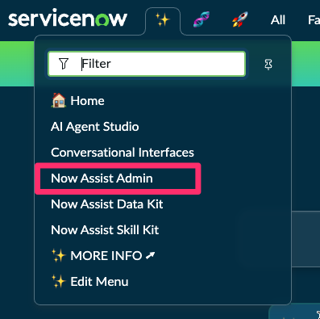 
2. Feche a janela de Welcome.
   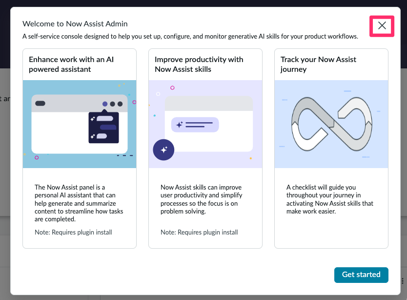
3. Selecione a aba **Now Assist Skills** e em seguida selecione **Creator**.
   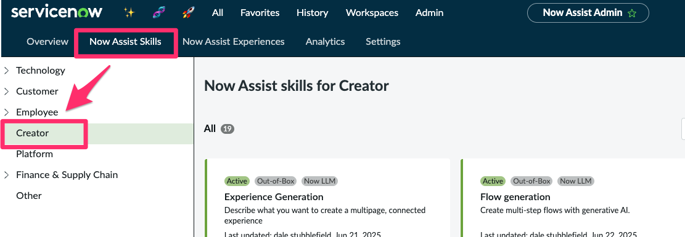  
4. Encontre a **skill recém-publicada** e clique em **Activate skill**.  
   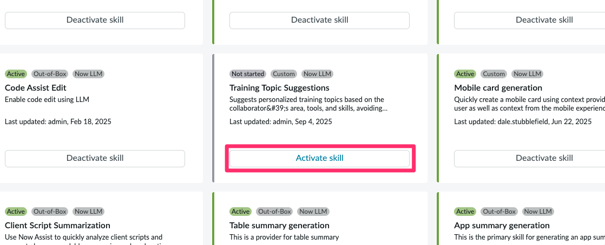
5. Clique em **Activate Skill**.  
   
6. Expanda a caixa **Conversational experiences**
   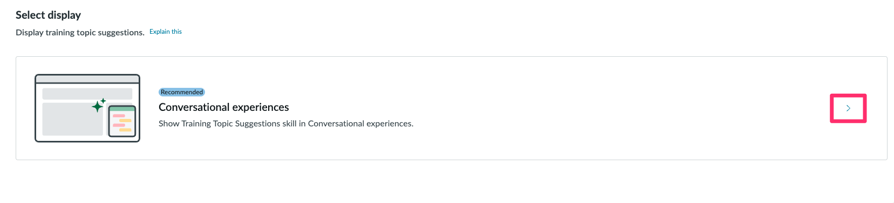
7. Marque a opção **"Now Assist Panel"** e clique em **Save and Continue**.  
   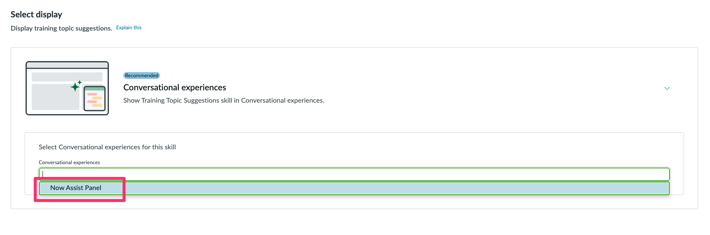
   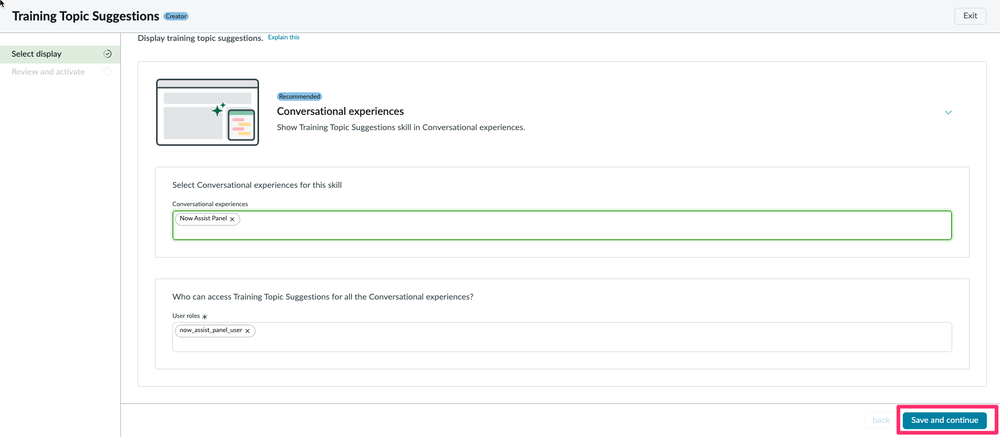
8.  Clique em **Activate**.
   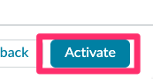
9.  Clique em **Return to Creator**


## Testando via Now Assist Panel

Agora vamos testar a chamada dessa custom skill pelo Now Assist Panel na plataforma.

1. Clique no ícone de faíscas na barra superior.
   
2. Fixe o painel.
   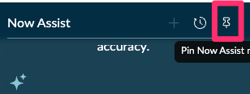
3. Cole o nome da sua skill no chat e envie.
   ```
   Training Topic Suggestions
   ```
   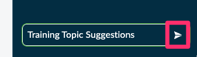
4. Ele irá sugerir algumas opções, selecione a opção `(Topic) Training Topic Suggestions`. Selecione-o.
   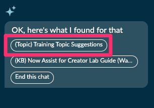
5. Responda a pergunta **What area do you work in?**.
   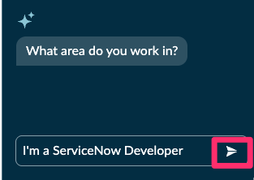
   ```
   I'm a ServiceNow Developer
   ```
6. Responda a pergunta **What skills do your colleagues often ask you help with?**.
   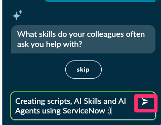
   ```
   Creating scripts, AI Skills and AI Agents using ServiceNow :)
   ```
7. Responda a pergunta **What tools or technologies do you often use?**.

   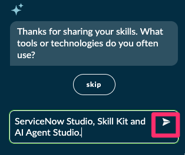
   ```
   ServiceNow Studio, Skill Kit and AI Agent Studio.
   ```
8. Selecione a opção `Looks good`.
   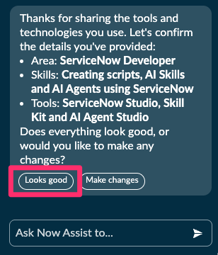

9. Veja o retorno.
    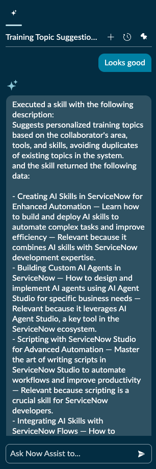

## 🎯 Conclusão  

Parabéns! 🎉  

Você criou e ativou uma **Custom Skill no ServiceNow Skill Kit** para **sugerir tópicos de treinamento personalizados** no **Now Assist**.

🚀 Agora, você pode testar outras customizações (novos inputs, filtros na Tool, ajustes no prompt) e explorar novas possibilidades!  
