

🕒 Duração Estimada: 10 min

## 🛠️ Ativando a Skill  

:::info Exercício Opcional
Este exercício é opcional; caso esteja atrasado no laboratório, fique à vontade para pulá-lo.
:::

1. Clique em **All** e pesquise **Conversational Interfaces > Assistants**.  
   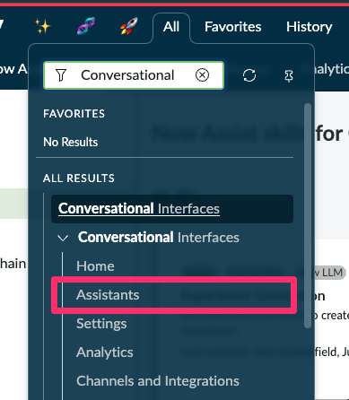

2. Selecione **Now Assist Panel - Platform (default)**
   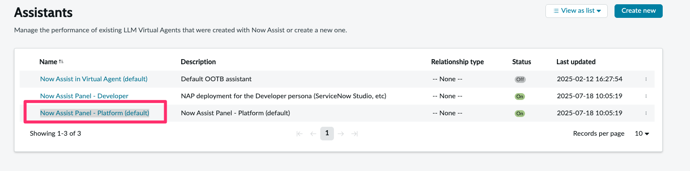

3. Na guia **Overview**, selecione **Save and continue**.
   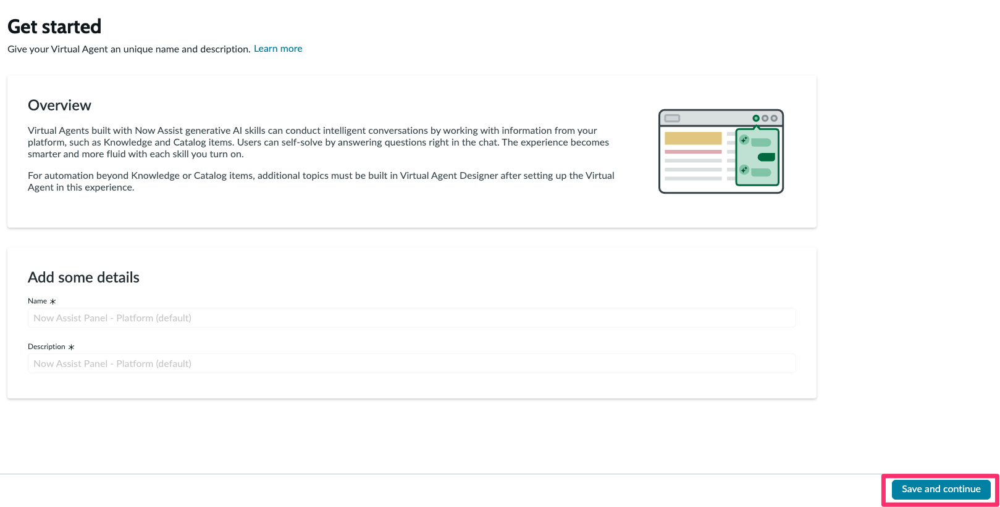

4. Na guia **Assign Now Assist skills**, selecione **Save and continue**.
   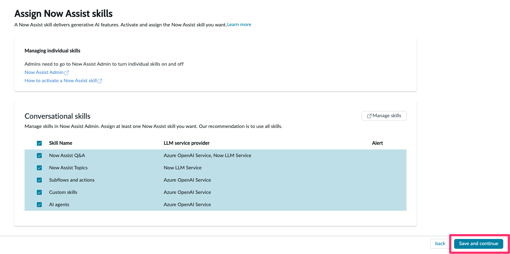

5. Na guia **Choose how to display**, selecione **Save and continue**.
   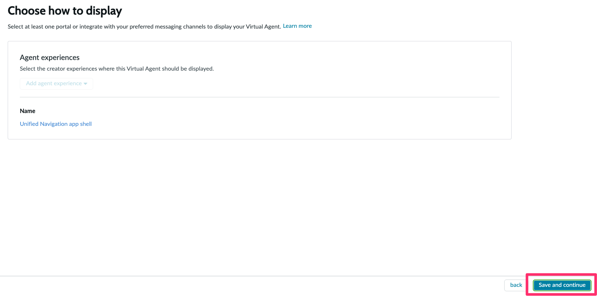

6. Na guia **Choose information sources**, selecione **Save and continue**.
   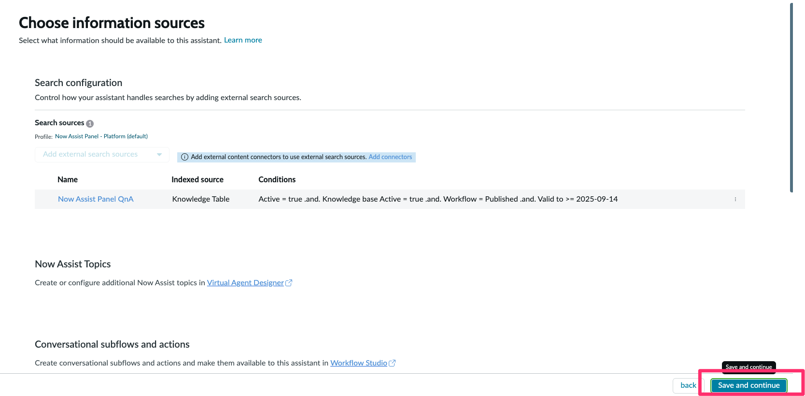

7. Na guia **Define your chat experience**, clique em **Promoted assets** e, em seguida, **Virtual Agent Designer**.
   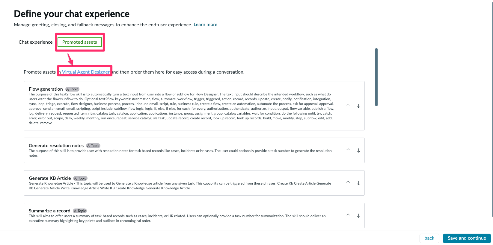

8. Selecione as opções do Tópico **Sugestões de Tópicos de Treinamento** e selecione **Promoted**.
   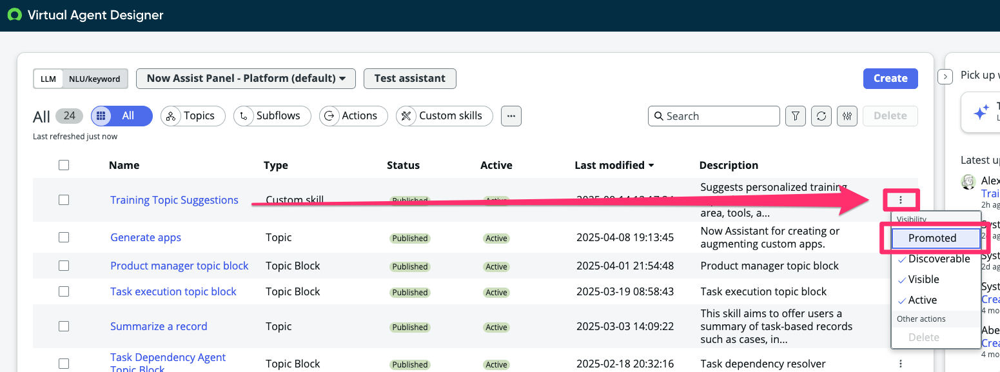

9. Feche a janela do **Virtual Agent Designer**, retorne à tela do **Painel** e clique em **Refresh**.
   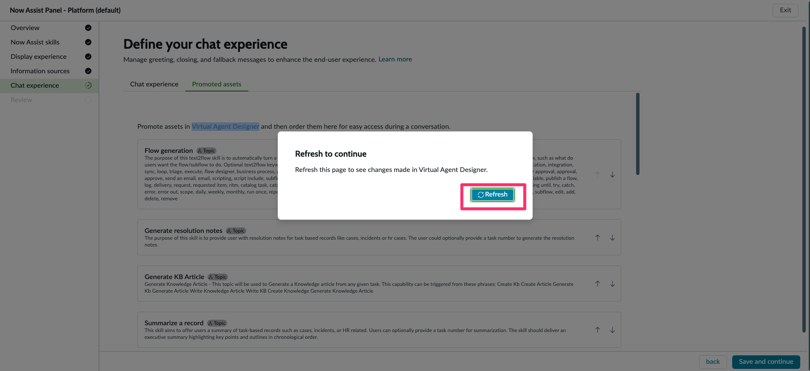
   

## Testando a Skill no Painel do Now Assist

1. Abra o painel do **Now Assist** e clique no **ícone** de **(+)** para abrir um novo chat.
   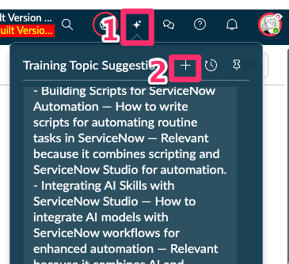

2. Verifique que a skill agora está sendo promovida/sugerida automaticamente.
   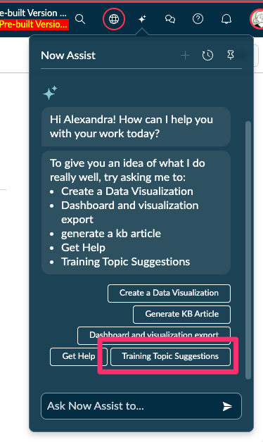

## 🎯 Conclusão  

Parabéns! 🎉  

Você promoveu a sua **Custom Skill no painel do Now Assist** para **sugerir tópicos de treinamento personalizados** no **Now Assist**.
