## 🛠️ Criando uma tools

:::info
Já carregamos na plataforma um Script Include que retorna os **tópicos de treinamento existentes** via GlideRecord. Nesta etapa, vamos apenas referenciá‑lo para uso dentro da skill.
:::

1. Acesse a guia **Tool Editor**. 
   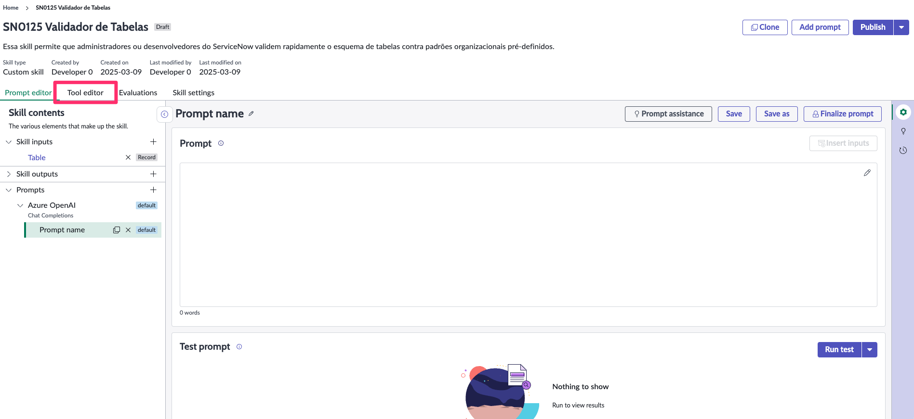 
2. Clique no **símbolo de (+)** antes do **Skill Prompt**. 
   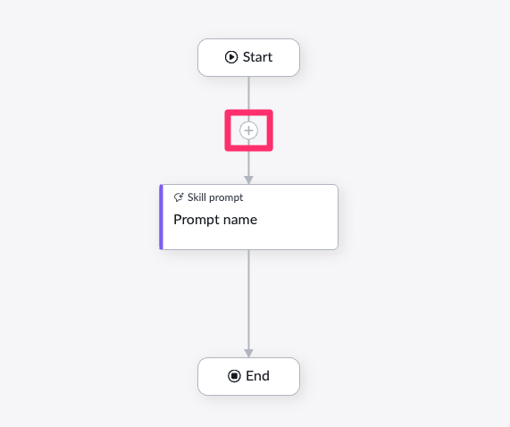 
3. Selecione **Tool Node**.  
   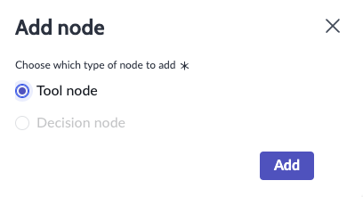
4. Configure os seguintes parâmetros:  

   1. **Type:** Script  
   2. **Name:** ExistingTrainingTopics 
   3. **Choose existing script**  
   4. **Resource:** TrainingTopicsUtil  
   5. **Script function:** getExistingTopics  
   6. (Opcional) **area → Value:** `{{area}}`  
   7. Clique em **"Add"**.  

   Observação: o node se chamará `ExistingTrainingTopics`. Usaremos sua saída como `{{ExistingTrainingTopics.output}}` no prompt.


## 🛠️ Adding more context (Glossary of Terms)

Se desejar enriquecer o contexto para a IA, adicione um glossário de termos para orientar consistência de nomenclatura e padronização.

Foi carregada uma tabela chamada **Glossary of Terms [u_glossario_de_termos]**. Vamos carregá‑la no prompt por meio de um script.

1. Acesse novamente a aba **Tool Editor** e adicione uma ferramenta antes do Prompt.
   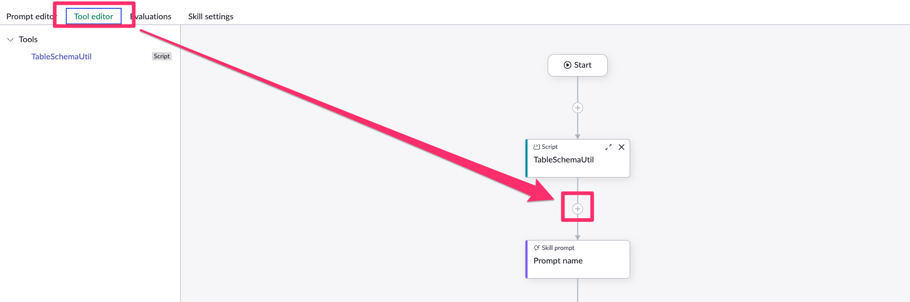
2. Adicione um Tool node
   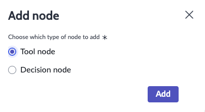
3. Configure os parâmetros:
   1. **Type:** Script  
   2. **Name:** getGlossary 
   3. Script:

   ```js
   (function runScript(context) {
      // Initialize the output object
      var outputs = {};

      try {
         // Create a GlideRecord instance for the table
         var glossaryGR = new GlideRecord('u_glossario_de_termos');
         glossaryGR.query();

         // Initialize an empty mapping object
         var termMapping = {};

         // Iterate through the records and populate the mapping
         while (glossaryGR.next()) {
               var abbreviation = glossaryGR.getValue('u_abraviacao');
               var term = glossaryGR.getValue('u_termo');

               if (abbreviation && term) {
                  termMapping[abbreviation] = term;
               }
         }

         // Return the JSON mapping
         outputs.status = "success";
         outputs.mapping = termMapping;
      } catch (err) {
         // Handle any errors
         outputs.status = "error";
         outputs.error = "An error occurred while retrieving the glossary: " + err.message;
      }

      return outputs;
   })(context);
   ```
   4. Clique em **"Add"**.  
   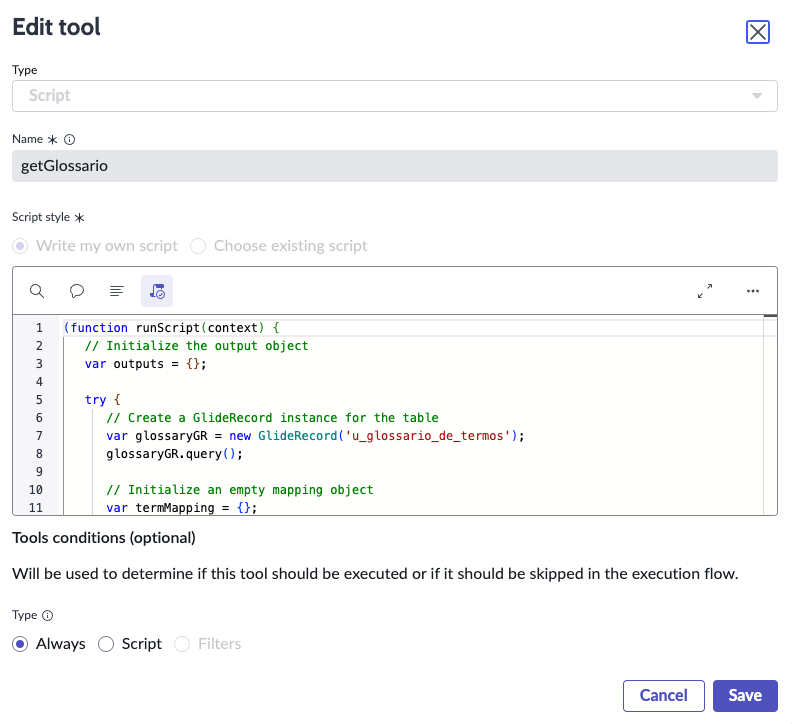

4. Retorne à aba **Prompt Editor** e clone o prompt atual.
   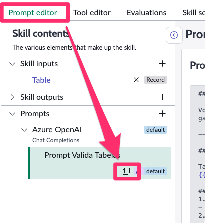
5. Dê um novo nome para o prompt.
   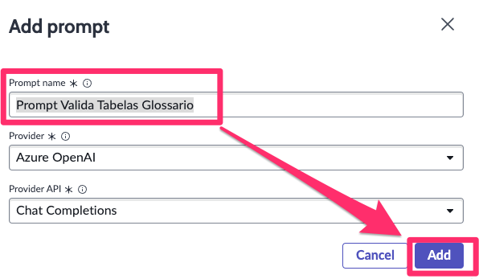
6. Agora vamos adicionar a saída do nosso script (payload com glossário de termos). Dentro da sessão "Context" inclua o "Glossary of Terms".
   1. Escreva "Glossary of Terms:" e pule uma linha
   2. Selecione o botão "Insert inputs"
   3. Selecione `>` ao lado de `getGlossary`
   4. Selecione `output`
   5. Verifique se a tag foi adicionada.

   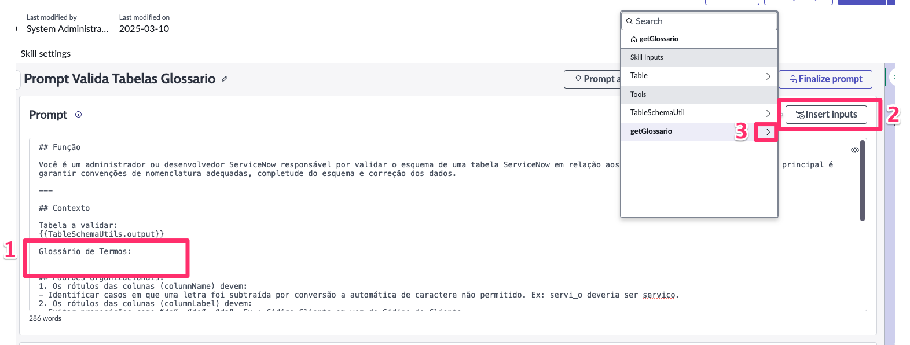
   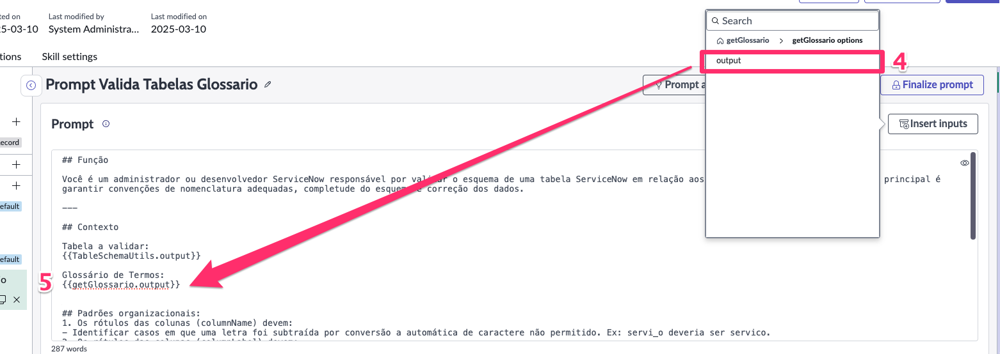

7. (Opcional) Adicione uma observação às regras:
   ```
   - Identified terms should strictly follow the abbreviations defined in the Glossary of Terms.
   ```
   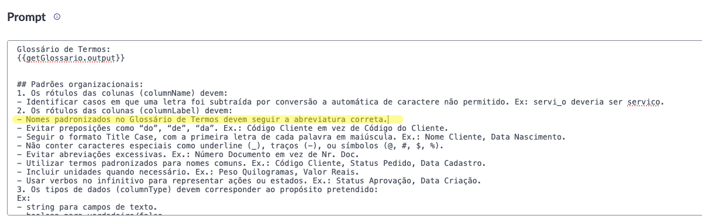

8. Execute mais um teste (Run test). Verifique que agora o resultado considera o glossário de termos utilizado.
   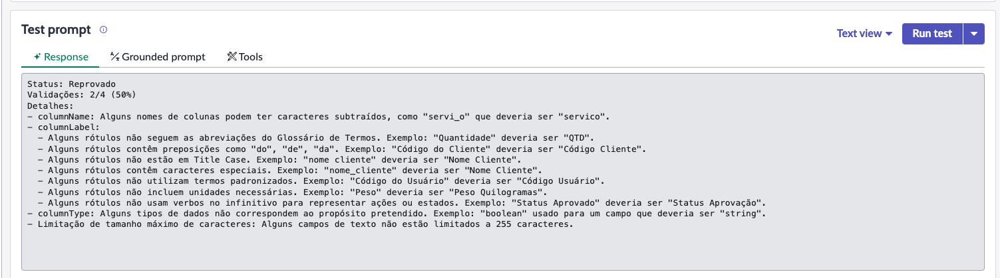
   


## Opcional – Fixar Skill ao Chat
É possível fixar a skill para ser sugerida sempre que o chat do Now Assist for iniciado. Para fazer isso você deve adicionar a skill a tabela Promoted Skills

1. Acesse All e Busque por Promoted Skills.
   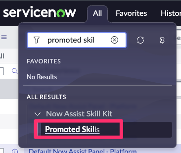
2. Crie uma nova entrada clicando em New
   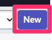
3. Preencha as informações:
   - **Generative AI Skill:** ***[YOUR NAME]*** Training Topic Suggestions  
   - **Chat Experience:** Default Now Assist Panel - Platform
   - Submit
   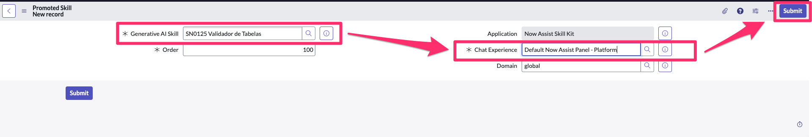

## 🛠️ Testando a Skill  

1. Abra o painel **Now Assist** e fixe-o na tela.  
   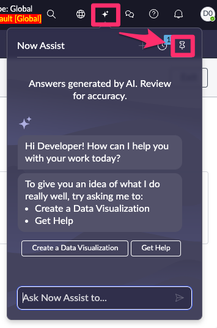
2. Selecione a sua skill **[YOUR NAME] Training Topic Suggestions** (Ex.: SN0125 Training Topic Suggestions). 
   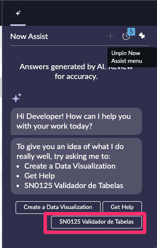
3. Preencha os inputs `area`, `tools` e `skills` e confirme a execução.  
   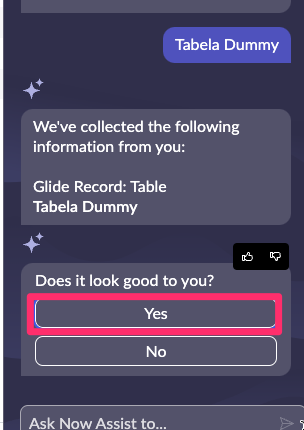
5. Verifique o resultado.  
   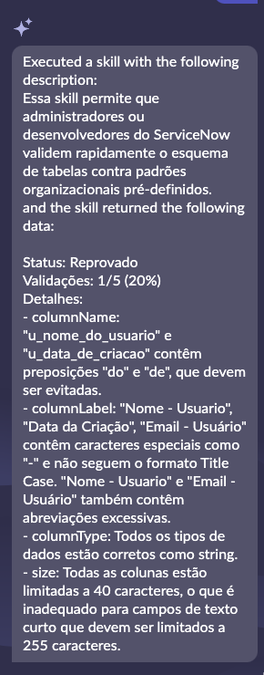

:::info
### Recurso Adicional - Skill Flow Action
Além do do **Now Assist Panel (Chat)** é possível também consumir as skills por meio de flows/subflows, após publicar uma skill e ativa-lá como **Flow Action** é possível chamá-la utilizando a action **Execute Skill**.

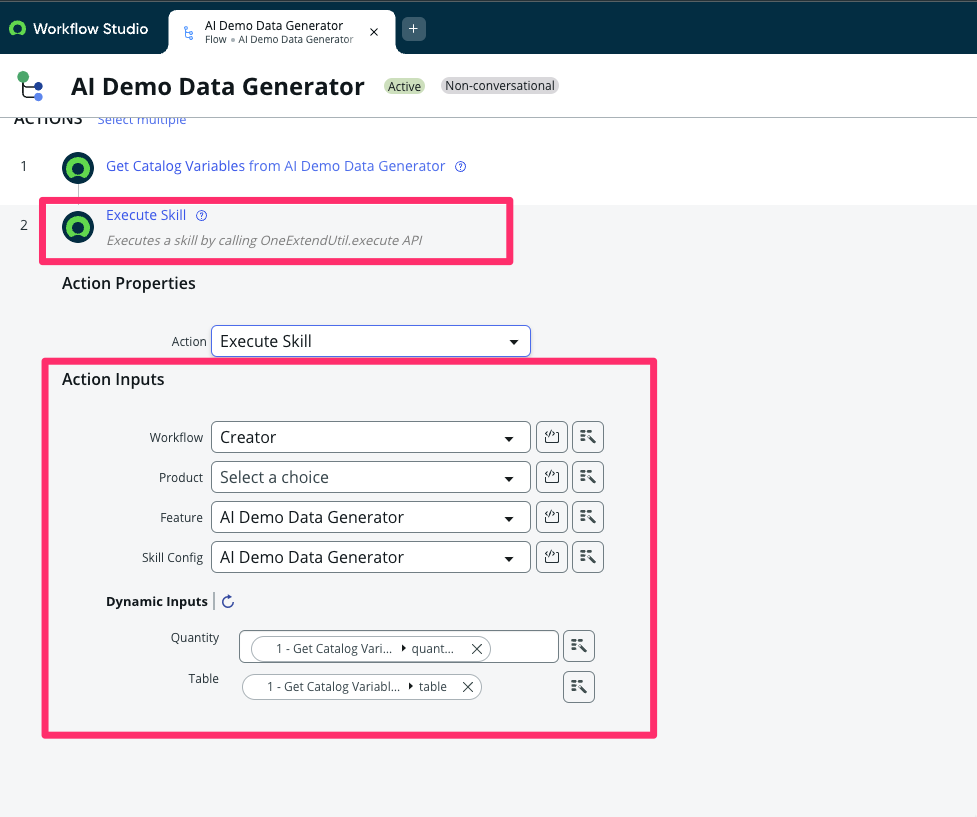
:::
