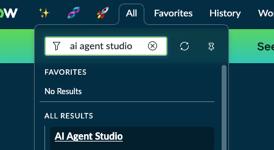

<div class="button-homepage-vancouver">
🕒 Duração Estimada: 20 min
</div>

Agora é hora de adicionar inteligência à nossa aplicação.

Após uma sessão de treinamento ser concluída, Alexandra deseja gerar um plano de melhorias com base nas sugestões dos participantes, transformando os comentários em ações concretas.

No entanto, fazer isso manualmente pode ser demorado e inconsistente.

Por isso, você decidiu criar um **AI Agent** para realizar essa tarefa automaticamente assim que a sessão for encerrada.

Vamos começar a construir o agente juntos!

---

:::info Ferramentas do AI Agent
Este lab usa duas ferramentas nativas:
- **Knowledge Graph**: consulta dados relacionados em grafos configurados (ex.: sessões e feedbacks).
- **Record Operation**: atualiza registros com o resultado da análise do agente.
:::

### 📌 Passos

1. Verifique se ainda está impersonando **Alexandra Arias**. Se não estiver, impersone-a novamente.

2. Verifique se ainda está no escopo **ACME Cross-Training - Pre-built Version 2024.09.27**. Caso não esteja altere-o.

   

3. Clique em **All** e pesquise **AI Agent Studio**  
   

4. Ignore a janela de boas-vindas, marque **Do not show this again** e feche com (X)  
   __

5. Role a tela para baixo, clique em **AI Agents** e depois em **New**  
   __

---

### Descrevendo e instruindo o agente

Nessa etapa, vamos definir o propósito do agente e dar instruções claras sobre como ele deve se comportar e qual resultado gerar.

Essa definição garante consistência e efetividade para resolver a necessidade do negócio — no nosso caso, transformar feedbacks em melhorias concretas.

   __

1. Preencha os campos:  

   - Em **Name**, digite:
     ```text
     Analista de Feedback de Sessões
     ```

   - Em **Description**, digite:
     ```text
     Analisa o feedback dos participantes das sessões de cross-training e fornece um resumo claro dos pontos fortes, áreas de melhoria e sugestões para aprimorar os treinamentos futuros.
     ```

   - Em **AI agent role**, digite:
     ```text
   O agente de IA atua como analista de feedback de sessões para os coordenadores de treinamento.  
   Ele revisa todos os feedbacks dos participantes de uma determinada sessão e os sintetiza em insights acionáveis.  
   A IA deve destacar o que funcionou bem, o que pode ser melhorado e propor sugestões com base em padrões recorrentes identificados nos feedbacks.
     ```

   - Em **Instructions**, digite:
   ```text
   1. Recupere a sessão de treinamento e todos os registros de feedback relacionados, incluindo informações dos usuários, utilizando a Ferramenta de Knowledge Graph.  
   2. Analise o conteúdo dos feedbacks para identificar pontos fortes recorrentes e experiências positivas mencionadas pelos participantes.  
   3. Detecte e extraia críticas ou sugestões de melhoria a partir dos dados de feedback.  
   4. Sintetize as conclusões em um resumo estruturado com as seguintes seções:  
      - Pontos Fortes  
      - Áreas de Melhoria  
      - Recomendações  
   5. Atualize o campo Notas do registro da sessão com o resumo sintetizado utilizando a Ferramenta de Operação de Registros. O texto deve:  
      - Estar em formato de texto simples (sem markdown)  
      - Incluir a tag [✨ AI Agent ✨] no início  
      - Utilizar um tom profissional e de fácil leitura, com marcadores e quebras de linha claras
   ```

2. Em **Specify categories for long-term memory**, clique em **Identify Categories**.  
   __

3. Aceite a sugestão “Meeting and Events” e clique em **Save**.  
   __

4. Clique em **Save and Continue**.  
   __

---

### Adicionando ferramentas ao agente

Agora vamos conectar o agente às fontes de dados e ferramentas para que ele consiga interagir com a aplicação.

   __

1. Retorne ao **AI Agent Studio**, clique em **Add tool** e selecione **Knowledge Graph**.  

2. No assistente, preencha os seguintes campos:  

    1. **Name**:
     ```text
     KG ACME Cross-Training
     ```
    2. **Description**:
     ```text
     Pesquise feedbacks e informações de usuários utilizando o Knowledge Graph.
     ```
    3. **Select knowledge graph**:  
     _ACME Cross-Training Graph_
    4. **Execution mode**: _Autonomous_  
    5. **Display output**: _Yes_  
    6. **Processing message**: 
     ```text
     Buscando feedbacks
     ```
    7. **Output transformation strategy**: _Paraphrase_

3. Antes de adicionar a ferramenta, vamos explorar um pouco do Knowledge Graph. 
4. Clique no ícone ao lado de **ACME Cross-Training Graph**.  
    
    Nós utilizaremos este Knowledge Graph para permitir que o nosso Agente de IA navegue nos dados de treinamento.
   

5. Feche a aba do **Knowledge Graph** e retorne para a tool no **AI Agent Studio**.
    

6. Clique em **Add**.  
   __

7. Agora, adicione a ferramenta **Record Operation** para atualizar o campo de notas da sessão.  
   __
:::tip Boas práticas de saída
Defina mensagens de processamento claras (Processing message) e, quando possível, ative **Display output** para facilitar a depuração durante testes.
:::

8. Preencha os campos:  

    1. **Name**:
     ```text
     Atualizar o campo Session Notes
     ```
    2. **Description**:
     ```text
     Esta ferramenta deve ser utilizada para atualizar o campo Notas da Sessão no registro da sessão com o resultado da análise do Agente de IA.
     ```
    3. **Inputs:** 
    
    *(Input Name = Description)*
     - `number` = `Número do registro da Sessão que acionou o Agente de IA`  
     - `result` = `O resultado final da análise dos feedbacks realizada pelo Agente de IA`
    4. **Table**: _Session [x_snc_acme_cross_0_session]_  
    5. **Select operation**: _Update records_  
    6. **Conditions**:  
     - `Number` | `is` | `{{number}}`
    7. **Field value**:  
     - `Session Notes` | `{{result}}`
    8. **Execution mode**: _Autonomous_  
    9.  **Display output**: _No_  
    10. **Processing message**:
     ```text
     Atualizando notas da sessão
     ```
    - **Output transformation strategy**: _None_
  
  

9.  Clique em **Add**.  
    __

10. Clique em **Save and continue**.  
    __

---

### Definindo o gatilho (trigger)

Agora vamos configurar o evento que dispara o agente — no nosso caso, ao marcar a sessão como concluída.

   __

1. Clique em **Add trigger** e selecione **Updated**.  
    __

2. Preencha os seguintes campos:  

    1. **Select trigger**: _Updated_  
    2. **Name**:
     ```text
     Sessão completa
     ```
    3. **Table**: _Session [x_snc_acme_cross_0_session]_  
    4. **Active**: _true_  
    5. **Conditions**:
     - `State` | `is` | `Complete` 
     - **`AND`** 
     - `Session Notes` | `is empty`
    6. **Method of defining sys_user**: _Use an existing table_  
     - _Session Coordinator [x_snc_acme_cross_0_session]_
    7. **Objective template**:
     ```text
     Me ajude a analisar o feedback da sessão de número: ${number}
     ```
    8. **Channel**: _Now Assist panel_  
    9. Marque ✅ **Show Notification**
    __

3.  Clique em **Add**.  
    __

4.  Clique em **Save and continue**.  
    __

---

### 🚀 Finalizando

1. Na seção **Define availability**, certifique-se de que o **Status** está como **Active**.  
    __

2. Em **Processing message**, digite:
  ```text
  Analisando feedback da sessão
  ```

   __

3. Clique em **Save and test**.  
   __
