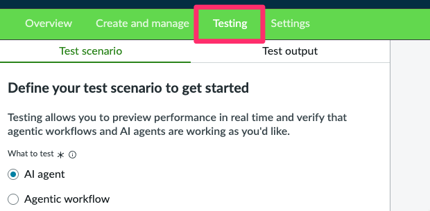
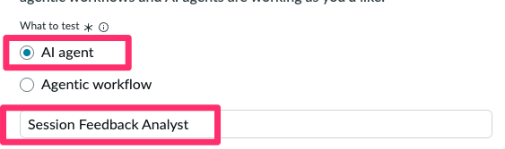
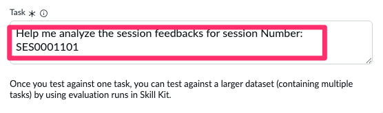
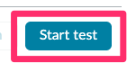
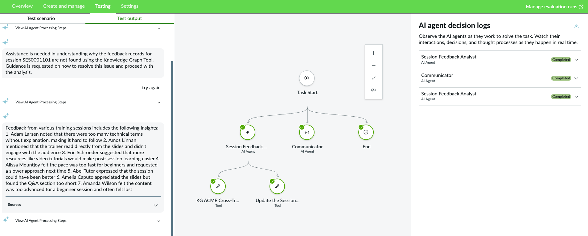
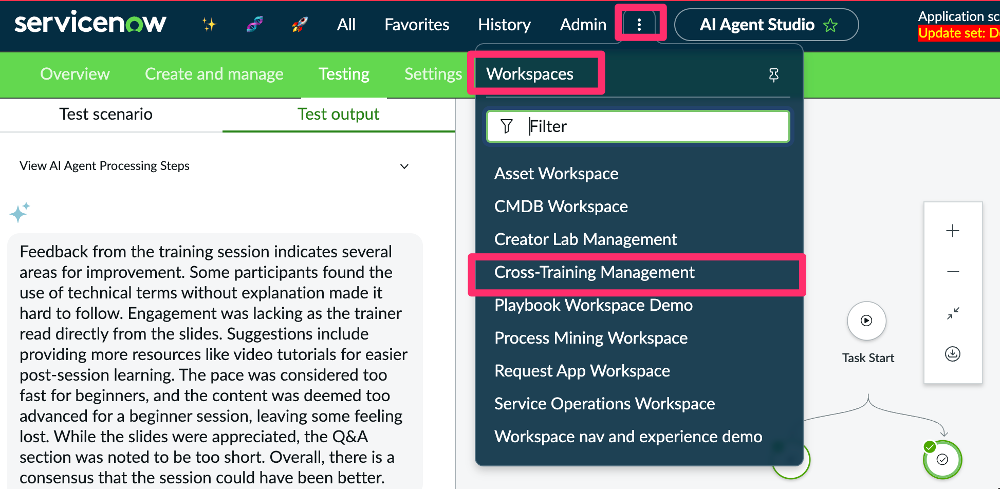
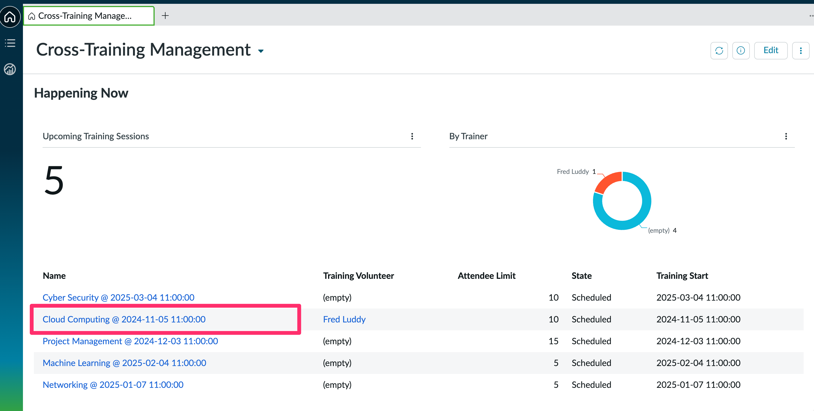
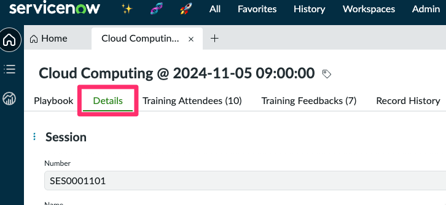
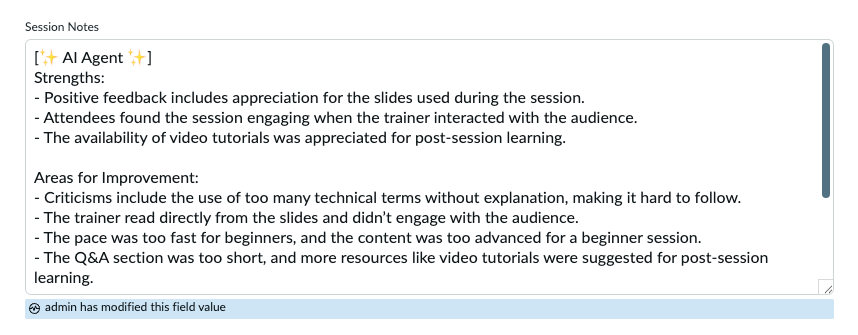

<div class="button-homepage-vancouver">
🕒 Duração Estimada: 5 min
</div>

Agora é hora de testar nosso agente de IA para garantir que tudo esteja funcionando como esperado.

---

### 📌 Passos

1. Abra a aba **Testing** dentro do **AI Agent Studio**  
   

2. Selecione **AI Agent** e digite:  
   ```text
   Analista de Feedback de Sessões
   ```  
   

3. No campo **Task**, digite:  
   ```text
   Me ajude a analisar o feedback da sessão de número: SES0001101
   ```  
   __

4. Clique em **Start Test**  
   __

5. Verifique os resultados. Se algo der errado, clique em **Try again** para repetir o teste.  
   __

6. Acesse o workspace pré-construído em **Workspaces > Cross-Training Management**.
   

7. Acesse o registro **SES0001101** referente à sessão **Cloud Computing @ 2024-11-05 09:00:00** utilizando o **Workspace**.  
   

8. Clique em **Details** para abrir o registro da sessão.  
   

9. Observe que o campo **Session Notes** foi preenchido automaticamente com o feedback da sessão, gerado pelo AI Agent.  
   __
