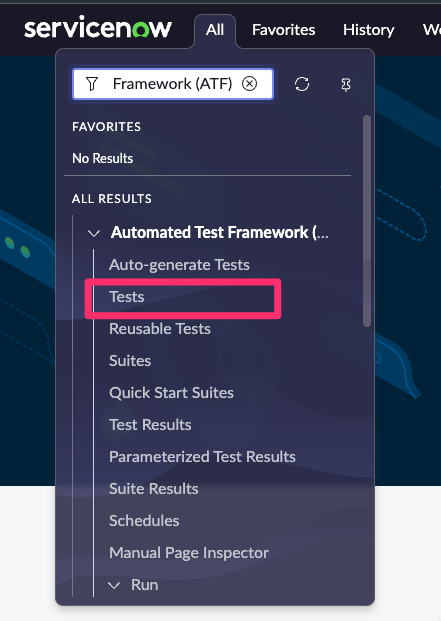
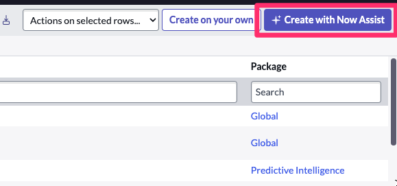
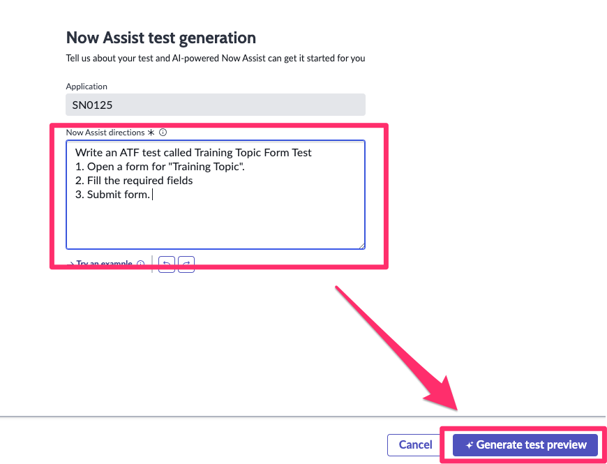
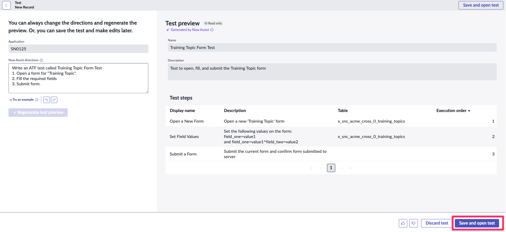
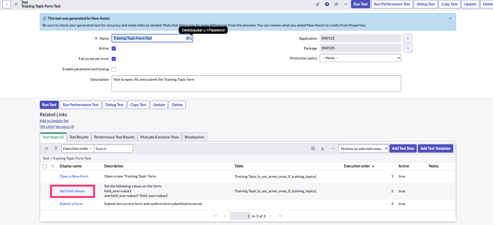
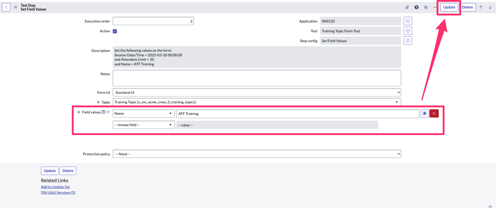
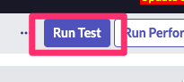
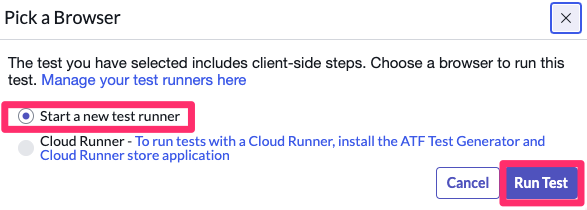
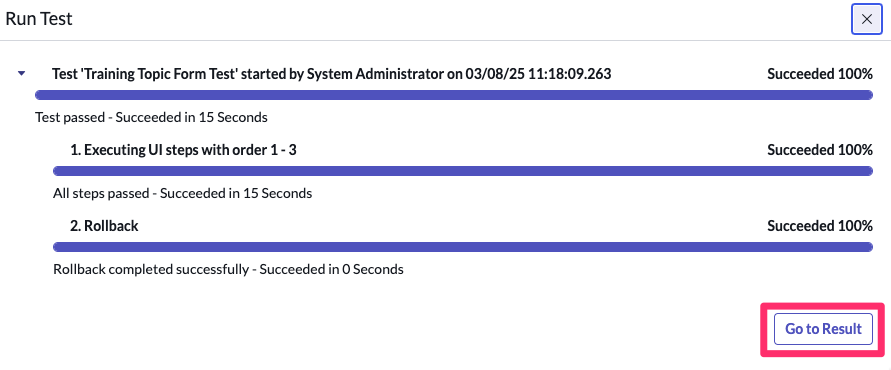
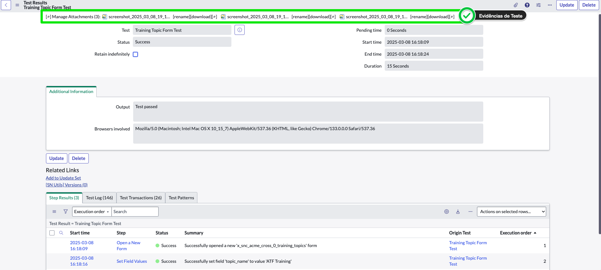

<div class="button-homepage-vancouver">
🕒 Duração Estimada: 10 min
</div>

## 🔍 Visão Geral  

O **Automated Test Framework (ATF)** no ServiceNow permite a **criação e execução de testes automatizados** para validar funcionalidades sem necessidade de testes manuais.  

Com o **Now Assist for Test Generation**, você pode:  

✅ Criar **testes automatizados** com **inteligência artificial**  
✅ Validar aplicações sem necessidade de **intervenção manual**  
✅ **Reduzir erros e otimizar o tempo de testes**  

---

## 🛠️ Passos  

:::info
📌 Você deve retornar à plataforma ServiceNow para este exercício.  
:::

1. **Volte à página inicial da plataforma ServiceNow**.  
2. No menu **All**, pesquise por **Automated Test Framework (ATF)** e clique em **Tests**.  

   

3. Clique no botão **Create with Now Assist**.  

   

4. No campo de entrada, **digite seu prompt**, descrevendo o que deseja testar.  

   ```txt title="Code Generation - Name"
    Write an ATF test called Training Topic Form Test
    1. Open a form for "Training Topic".
    2. Fill the required fields 
    3. Submit form. 
   ```  

5. Clique em **Generate Test Preview**.  

     

6. Veja ao lado a **estrutura gerada** do teste.  
7. **Revise a estrutura**, verificando os passos criados.  

   

   - Clique em **Save and open test**.  

8. No fluxo de teste, clique no step **"Set Field Values"** para definir os dados de input.
   
     
9.  No campo **Field Values**, preencha os campos necessários conforme a seguir:  

     

    :::info
    Se necessário abra o Form no ServiceNow Studio para **verificar quais campos precisam ser preenchidos.**
    :::

    - Clique em **Update**.  

10. Clique no botão **Run Test**.  

    

11. Selecione **Start a New Test Runner** para iniciar o teste.  

    

12. **Acompanhe a execução**, até ser finalizada.
     
13. Feche a aba do Test Runner.
      
14. Volte para a janela principal e clique em **Go to Result** para visualizar os resultados.  

     

15. Repare que os testes apresentam **detalhes completos**, incluindo **prints das telas como anexo**.  

---

## 🎯 Recapitulação  

**Parabéns!** 🎉  

Você criou um **teste automatizado** utilizando o **Now Assist for Test Generation** no **ATF (Automated Test Framework)**!  

✅ Criamos um **teste gerado por IA** para validar funcionalidades automaticamente.  
✅ Executamos e analisamos os **resultados do teste**.  
✅ Identificamos possíveis melhorias no **processo de validação**.  

Agora você pode **ajustar e criar novos testes para validar diferentes cenários!** 🚀  

