# Introdução ao Skill Kit do Now Assist  

## 🔍 Visão Geral  

O **Now Assist Skill Kit (NASK)** permite a criação de **habilidades personalizadas de IA** dentro do ecossistema ServiceNow. Com ele, desenvolvedores podem estender as funcionalidades do **Now Assist**, integrando inteligência artificial em fluxos de trabalho, automatizando tarefas e criando **interações avançadas**.  

Neste laboratório, você aprenderá a criar uma **Custom Skill** para validar o esquema de tabelas no ServiceNow, garantindo conformidade com padrões organizacionais.  

---

## 🚀 O que é o Now Assist Skill Kit?  

O **Skill Kit do Now Assist** é uma plataforma que permite:  

✅ Criar **interações personalizadas de IA** para o ServiceNow.  
✅ Utilizar **grandes modelos de linguagem (LLMs)** para análise de dados e automação.  
✅ **Ampliar as capacidades do Now Assist**, indo além dos recursos padrão.  
✅ Integrar IA em fluxos de trabalho, melhorando **produtividade e governança**.  

Com esse kit, desenvolvedores podem criar **habilidades sob medida**, como:  
- Validação automática de dados.  
- Análises personalizadas de processos.  
- Assistentes que auxiliam na tomada de decisão.  

---

## 🔧 Fases do Desenvolvimento de uma Custom Skill  

A criação de uma **Custom Skill no Skill Kit** segue as seguintes etapas:  


1. **Definir um provedor de IA**  
   - Escolha entre **Now LLM**, **Azure OpenAI**, **OpenAI GPT**, **Google Gemini** ou **WatsonX**.  
   
2. **Configurar a Skill**  
   - Criar **inputs** (ex.: registros do ServiceNow que serão analisados).  
   - Escrever um **prompt estruturado** para guiar a IA.  
   - Integrar com **scripts e APIs** para enriquecer a consulta.  

3. **Testar e Ajustar**  
   - Validar os resultados no **Skill Kit Testing Module**.  
   - Refinar os prompts para melhorar a precisão das respostas.  

4. **Implantar e Publicar**  
   - Definir as configurações de **deployment** (ex.: **Now Assist Panel**, **Flow Action**).  
   - Ativar a skill no **Now Assist Admin Console**.  

---

## 🎯 Objetivo deste Lab  

Neste laboratório, você criará a skill **Validador de Tabelas**, que permitirá validar **o esquema de tabelas no ServiceNow** com base em padrões organizacionais.  

Ao final do exercício, você terá:  
✅ Criado e configurado uma **Custom Skill no Skill Kit**.  
✅ Definido um **prompt estruturado para validação de tabelas**.  
✅ Integrado a skill com **Now Assist e ServiceNow**.  
✅ Publicado e testado a skill em um **fluxo de trabalho real**.  

---

## 👥 Pré-requisitos  

- Acesso ao **ServiceNow Skill Kit** com a função **sn_skill_builder.admin**.  
- Conhecimento básico sobre **Now Assist e App Engine**.  
- Noções básicas de **prompts e inteligência artificial generativa**.  

Agora, vamos começar a **construção da Skill!** 🚀  

# Workshop: Criando uma Custom Skill com Skill Kit

## 🔍 Visão Geral  

Neste workshop, você aprenderá a criar uma **Custom Skill** utilizando o **Skill Kit do ServiceNow**.  

O objetivo desta skill será permitir que **administradores e desenvolvedores validem esquemas de tabelas** no ServiceNow, garantindo conformidade com padrões organizacionais.  

---

## 🛠️ Passo 1 – Criando a Skill  

1. Navegue até **All > Skill Kit > Home**.  
   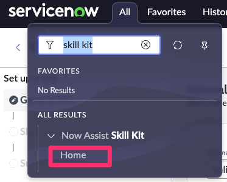
2. Acesse o link do **Skill Kit**
3. Clique em **"Create Skill"**.  
   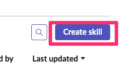
4. No formulário, preencha os seguintes campos:  

   - **Skill name:** ***[YOUR NAME]*** Validador de Tabelas  
   :::danger
   Substitua a tag **[YOUR NAME]** acima pela suas iniciais e 4 dígitos do seu aniversário DDMM, exemplo: RY2503
   :::
   - **Description:** Essa skill permite que administradores ou desenvolvedores do ServiceNow validem rapidamente o esquema de tabelas contra padrões organizacionais pré-definidos.  
   - **Default provider:** Azure OpenAI  
   - **Provider API:** Chat Completions  

5. Em **"How would you like to create a prompt for this skill?"**, selecione **"Write from scratch"**.  
6. Clique em **"Next"**.  

   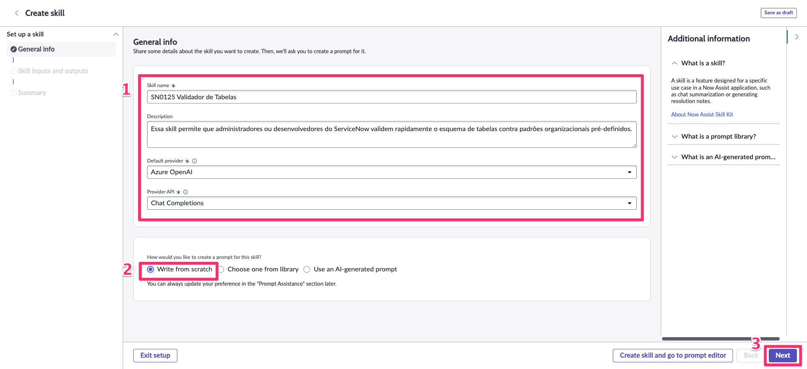

---

## 🛠️ Passo 2 – Definindo Inputs  

1. Vá para a guia **Skill Inputs**.  
2. Clique em **+ Add** para adicionar um novo input.  
3. Configure os seguintes parâmetros:  

   - **Datatype:** Record  
   - **Table name:** `sys_db_object`  
   - **Name:** Table  
   - **Mandatory:** ✅ (Habilitado)  

4. Clique em **"Go to Summary"**.  
   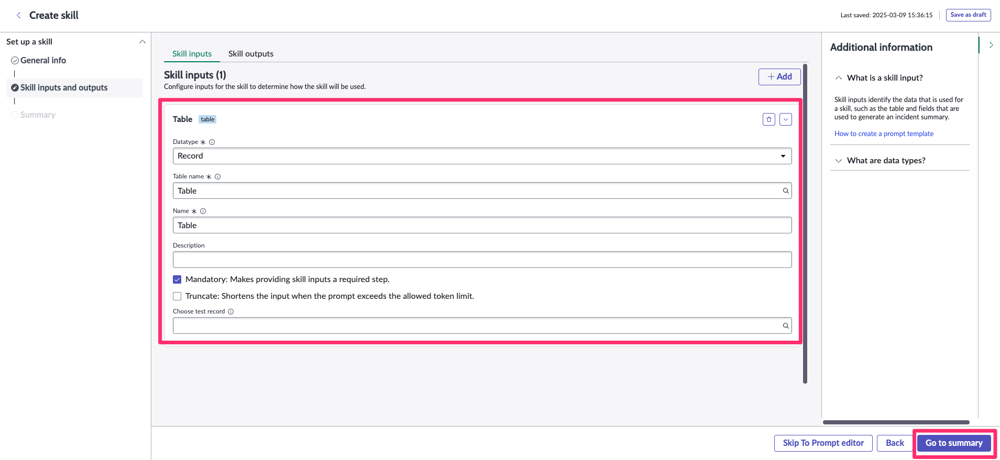
5. Clique em **"Finish"**.  
   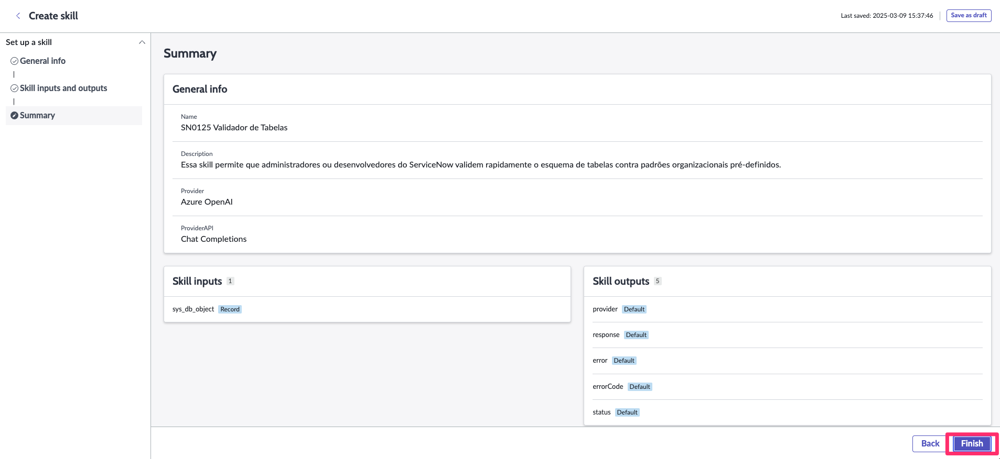

## 🛠️ Passo 3 – Criando um Script Tool  

:::info
Já carregamos na plataforma um script includes para retornar o schema da tabela selecionada, nesta etapa nós apenas iremos buscá-lo para executar dentro do nosso skill.
:::

1. Acesse a guia **Tool Editor**. 
    
2. Clique no **símbolo de (+)** antes do **Skill Prompt**. 
    
3. Selecione **Tool Node**.  
   
4. Configure os seguintes parâmetros:  

   1. **Type:** Script  
   2. **Name:** TableSchemaUtils  
   3. **Choose existing script**  
   4. **Resource:** TableSchemaUtils  
   5. **Script function:** getTableSchema  
   6. **tableName → Value:** `{{table.name}}`  
   7. Clique em **"Add"**.  

   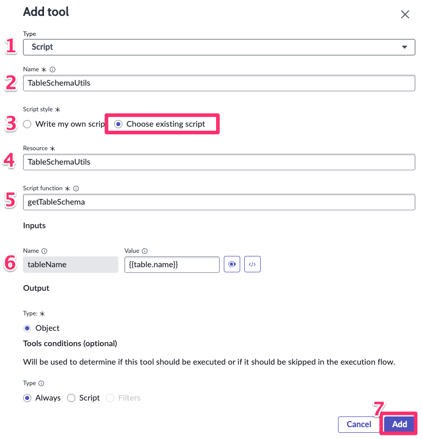

## 🛠️ Passo 4 – Criando o Prompt  

1. Volte para a guia **Prompt Editor**.  
2. Insira o seguinte prompt:  

    ```
    ## Função

    Você é um administrador ou desenvolvedor ServiceNow responsável por validar o esquema de uma tabela ServiceNow em relação aos padrões organizacionais. Seu foco principal é garantir convenções de nomenclatura adequadas, completude do esquema e correção dos dados.

    ---

    ## Contexto

    Tabela a validar:
    {{TableSchemaUtils.output}} 

    ## Padrões organizacionais:
    1. Os rótulos das colunas (columnName) devem:
    - Identificar casos em que uma letra foi subtraída por conversão a automática de caractere não permitido. Ex: servi_o deveria ser servico.
    2. Os rótulos das colunas (columnLabel) devem:
    - Evitar preposições como “do”, “de”, “da”. Ex.: Código Cliente em vez de Código do Cliente.
    - Seguir o formato Title Case, com a primeira letra de cada palavra em maiúscula. Ex.: Nome Cliente, Data Nascimento.
    - Não conter caracteres especiais como underline (_), traços (-), ou símbolos (@, #, $, %).
    - Evitar abreviações excessivas. Ex.: Número Documento em vez de Nr. Doc.
    - Utilizar termos padronizados para nomes comuns. Ex.: Código Cliente, Status Pedido, Data Cadastro.
    - Incluir unidades quando necessário. Ex.: Peso Quilogramas, Valor Reais.
    - Usar verbos no infinitivo para representar ações ou estados. Ex.: Status Aprovação, Data Criação.
    3. Os tipos de dados (columnType) devem corresponder ao propósito pretendido:
    Ex:
    - string para campos de texto.
    - boolean para verdadeiro/falso.
    - integer para valores numéricos inteiros.
    4. Limitação de tamanho máximo de caracteres:
    - Garantir que colunas de texto, como **string**, estejam limitadas a um tamanho apropriado (ex.: 255 caracteres para campos de texto curto).

    ---

    ## Resultado
    1. Indique o status da validação (Aprovado ou Reprovado) como "Status", Quantidade de Validações Aprovadas (Aprovadas/Total) como "Validações", Percentual e os detalhes dos findings como "Detalhes"
    2. O output deve ser em formato Raw Text
    ```

   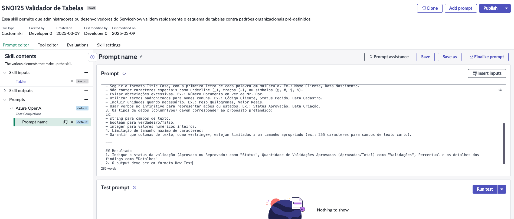

## 🛠️ Passo 5 – Testando o Prompt  

1. Clique em **"Run Test"**.  
   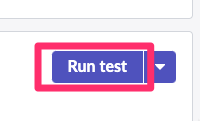
2. Selecione uma **tabela de teste**, como **Tabela Dummy** e clique em **Run Test**.
   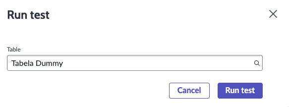
3. Aguarde a conclusão do teste e valide os resultados.  
   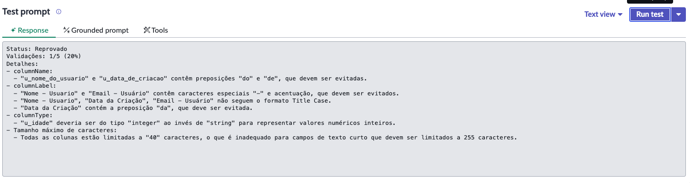
4. Realize ajustes no prompt, se necessário.  
   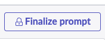
5. Edite o nome do prompt clicando no ícone de lapis.
   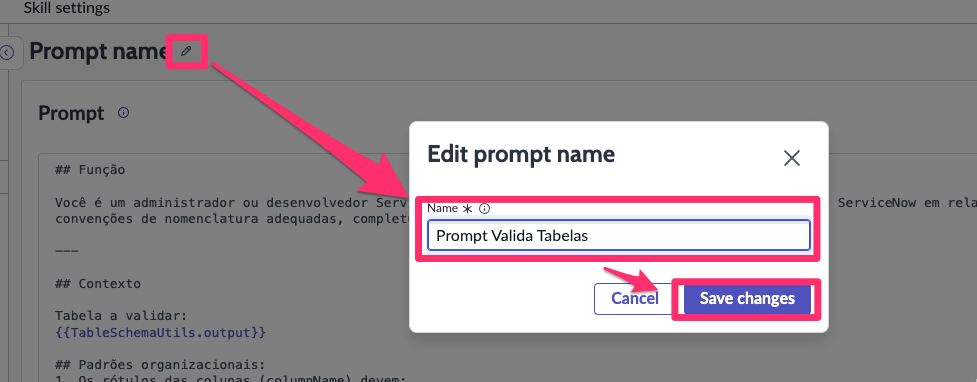
6. Quando estiver satisfeito, clique em **"Finalize Prompt"** e **confirme**.  
   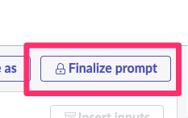
---

## 🛠️ Passo 6 – Configurando a Skill  

1. Abra a guia **Skill Settings**.  
2. Acesse **Deployment Settings**. 
   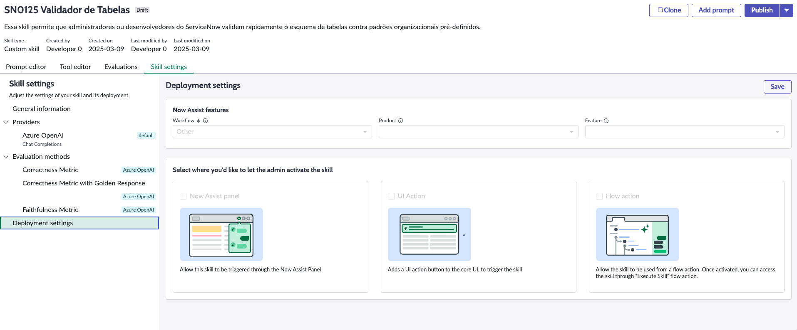 
3. Configure os seguintes campos:  

   - **Workflow:** Creator  
   - **Feature:** Create new feature  
   - **Name:** ***[YOUR NAME]*** Validador de Tabelas  

4. Clique em **"Save"**.  
   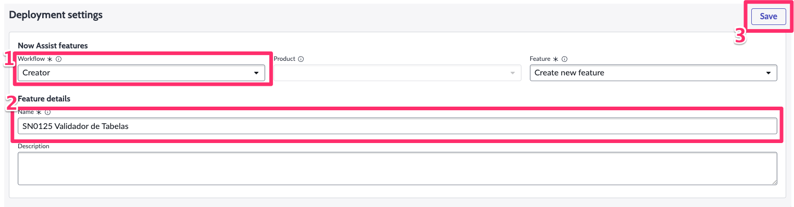
5. Selecione as opções:  

   ✅ Now Assist Panel  
   ✅ Flow Action  

6. Clique em **"Save"** novamente.  
   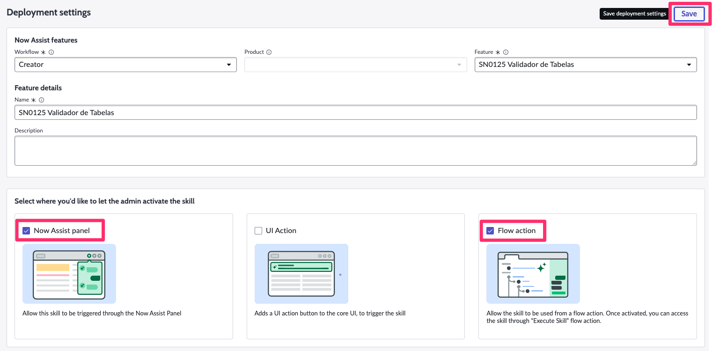
7. Clique em **"Publish"**, marque a opção **Default Prompt** e confirme.  
   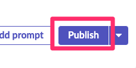
   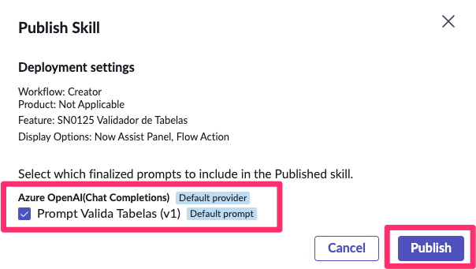

## 🛠️ Passo 7 – Ativando a Skill  

1. Navegue até **All > Now Assist Admin > Features**. 
   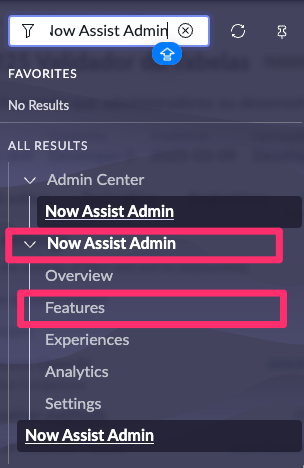  
2. Selecione **Creator**.  
3. Encontre a **skill recém-publicada** e clique em **View Details**.  
   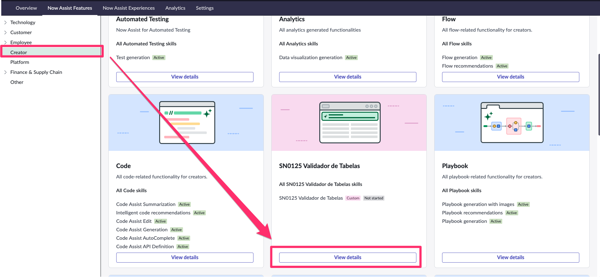
4. Clique em **Activate Skill**.  
   
5. Marque a opção **"Display in Flow Action"** e clique em **Save and Continue**.  
   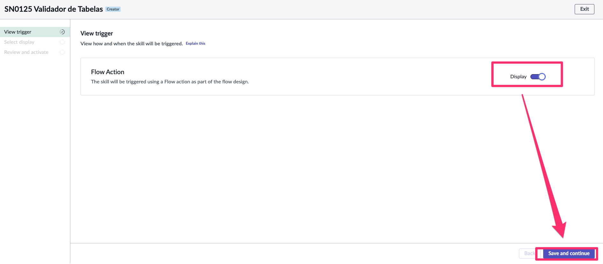
6. Marque a opção **"Display in Now Assist Panel"** e clique em **Save and Continue**.  
   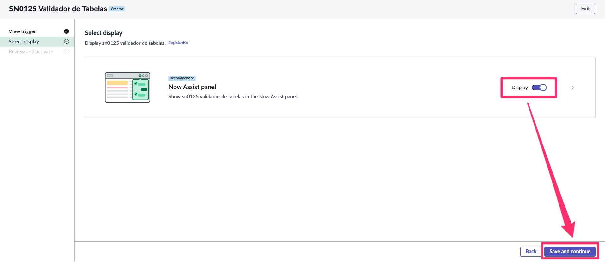
7. Clique em **Activate**.
   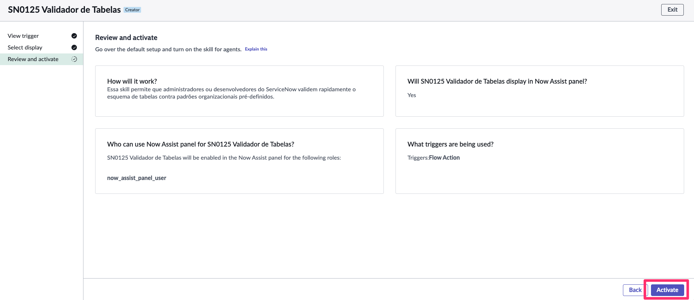  
8.  Feche a janela de ativação.  
   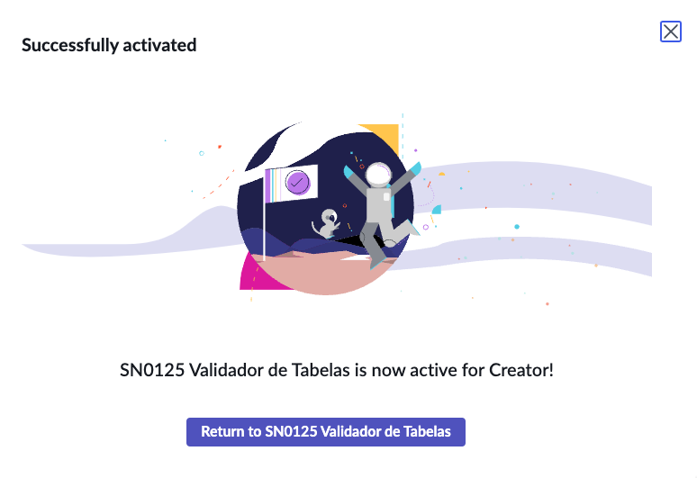

## Opcional – Fixar Skill ao Chat
É possível fixar a skill para ser sugerida sempre que o chat do Now Assist for iniciado. Para fazer isso você deve adicionar a skill a tabela Promoted Skills

1. Acesse All e Busque por Promoted Skills.
   
2. Crie uma nova entrada clicando em New
   
3. Preencha as informações:
   - **Generative AI Skill:** ***[YOUR NAME]*** Validador de Tabelas  
   - **Chat Experience:** Default Now Assist Panel - Platform
   - Submit
   

## 🛠️ Passo 8 – Testando a Skill  

1. Abra o painel **Now Assist** e fixe-o na tela.  
   
2. Selecione a sua skill **[YOUR NAME] Validador de Tabelas** (Ex: SN0125 Validador de Tabelas). 
   
3. Selecione a tabela que deseja validar.
   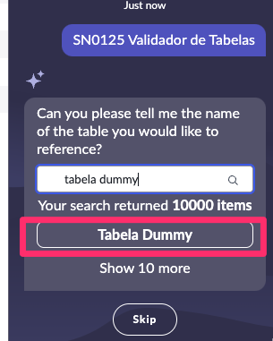
4. Confirme a execução.  
   
5. Verifique o resultado.  
   

:::info
### Recurso Adicional - Skill Flow Action
Além do do **Now Assist Panel (Chat)** é possível também consumir as skills por meio de flows/subflows, após publicar uma skill e ativa-lá como **Flow Action** é possível chamá-la utilizando a action **Execute Skill**.


:::


## 🎯 Conclusão  

Parabéns! 🎉  

Você criou e ativou uma **Custom Skill no Skill Kit da ServiceNow** para **validar tabelas automaticamente** com **Now Assist**.  

🚀 Agora, você pode testar outras customizações e explorar novas possibilidades!  