<div class="button-homepage-vancouver">
🕒 Duração Estimada: 20 min
</div>

## 🔍 Visão Geral  

O **Now Assist for Creator** permite que **Alexandra** descreva sua ideia em **linguagem natural**, e a IA converte essa descrição em **componentes fundamentais do aplicativo**.  

Isso permite que **citizen developers** criem aplicativos sem precisar de **conhecimentos avançados em código**, enquanto os **desenvolvedores experientes** podem usar essa base como ponto de partida.  

Alexandra pode simplesmente descrever o que deseja, e o **App Generation** transformará essa conversa em um aplicativo funcional com **tabelas, formulários e segurança configurados automaticamente**.  


🚀 Isso acelera o desenvolvimento, reduz erros e permite que mais pessoas contribuam para a criação de aplicações na plataforma.  

---

:::info
As perguntas do Now Assist podem não corresponder exatamente às capturas de tela do guia do laboratório.  **Isso é esperado!** Sempre copie e cole os prompts fornecidos no guia, **seguindo a ordem correta**.  
:::

:::danger
<div class="dev-badge">⚠️ Problema de Comunicação com o Now Assist?</div>

Se você **vir um erro indicando que a instância não pode se comunicar com o Now Assist**, **pule para o passo 17** e continue o laboratório normalmente.  


:::
---

## 🛠️ Passos  

1. Impersonar Alexandra Arias.  
2. Navegue até **ServiceNow Studio**.
   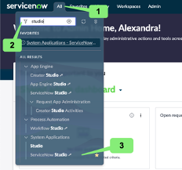
3. Abra o painel **Now Assist** clicando no ícone no canto superior direito.
   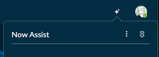
4. Fixe o menu clicando no ícone de **Pin** no lado direito da tela.
   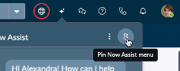
5. Clique em **"Create an App"** no painel **Now Assist**.
   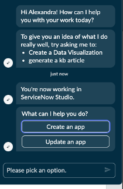

   > 📌 Importante: Para geração de aplicativos, é necessário **clicar na opção**. Digitar "Create an app" manualmente **não funciona** neste estágio.  

6. Copie e cole o prompt abaixo no campo de entrada:
   
   ```txt title="App Generation - Prompt 1"
   I want to create an App for Cross-training in my organization. The app name should be 
   // highlight-next-line
   [YOUR APP NAME]
   ```  
   :::danger
   Substitua a tag **[YOUR APP NAME]** acima pela suas iniciais e 4 dígitos do seu aniversário MMDD, exemplo: RY0824
   :::

   

7. Copie e cole o prompt abaixo no campo de entrada:  
   ```txt title="App Generation - Prompt 2"
   The app will have a general table listing various training topics, managed by Training Coordinators. The data in this table can be modified only by training coordinators.  
   ```
   

8. Copie e cole o prompt abaixo no campo de entrada:  
   ```txt title="App Generation - Prompt 3"
   This table would have Topic Name and Date/time on which training session for the associated topic can be held. Training coordinators manage the data in this table. There should be another integer field named Attendees limit.  
   ```
   

9.  Copie e cole o prompt abaixo no campo de entrada:  
   ```txt title="App Generation - Prompt 4"
   The app will have two forms - one is for trainers to volunteer for a topic and this submitted data should be stored in one table. Another form is for attendees to register for a training session, and this submitted data should be stored in another table. Once the forms are submitted, all the data should be read-only and no one can modify the data.  
   ```
   

10. Copie e cole o prompt abaixo no campo de entrada:  
   ```txt title="App Generation - Prompt 5"
   Trainers should select a topic from the list of available topics. On selection of topic, date/time should be auto-populated. Along with that, trainers should choose whether the session would be Virtual or In-person. I hope you got it, so that I will then proceed with attendees form."** 
   ```
    

11. Copie e cole o prompt abaixo no campo de entrada:  
   ```txt title="App Generation - Prompt 6"
   Attendees would just see the list of topics available, and a date/time field which should be auto-populated based on the selected topic. I would want another form where attendees can provide feedback after the conclusion of each training session. The submitted feedback should be stored in another table.  
   ```
   

12. Copie e cole o prompt abaixo no campo de entrada:  
   ```txt title="App Generation - Prompt 7"
   Attendees should select a concluded training topic from the data list and provide their feedback using below fields: Training session rating (on a scale of 1-5) and Suggestions for improvement.  
   ```
   

13. Clique em **"View more"** para expandir os detalhes do aplicativo.
    

14. Clique no botão **"Preview app"**.  
    
15. Aguarde alguns momentos enquanto o Now Assist gera o aplicativo.  
    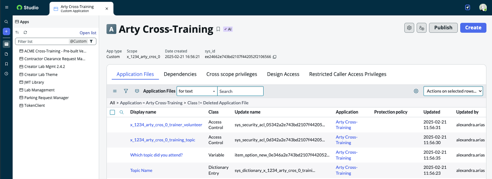
16. Clique em **"Save and open app"**.
    

<div class="dev-badge">⚠️ Caso tenha tido erro de comunicação com o Now Assist, continue a partir daqui:</div>

17. Abra o **App Engine Studio** clicando em **All**, digite **App Engine Studio**, e clique em **App Engine Studio**. 
    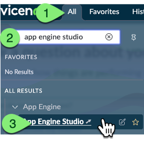
18. Feche o modal **"Getting Started"** caso apareça.
    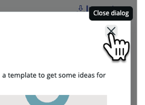
19. Clique no nome do seu aplicativo, conforme definido no **Passo 6**.
   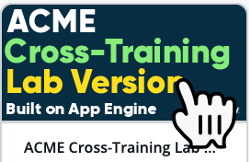
21. Marque **"Don’t show me this again"** e clique no **"X"** para fechar o tutorial guiado.
    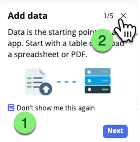
    

:::info
Quando você conversa com o Now Assist para criar o aplicativo, ele fará a maior parte do trabalho de desenvolvimento, mas, às vezes, pode ser necessário corrigir ou ajustar algumas coisas. Além disso, devido à natureza da IA Generativa, o aplicativo de cada pessoa pode acabar ficando um pouco diferente. 

**Por favor, CONTINUE o laboratório** mesmo que o seu aplicativo gerado não corresponda exatamente às capturas de tela nos próximos passos.
:::

---

## 🔍 Explorando o Aplicativo  

Agora que o aplicativo foi gerado, vamos explorar os componentes criados:  

21. Clique na aba **"Data"**.  
   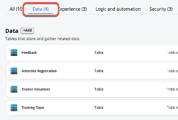
   > 📌 O Now Assist criou automaticamente tabelas para o aplicativo!  

22. Clique na aba **"Experience"**.  
   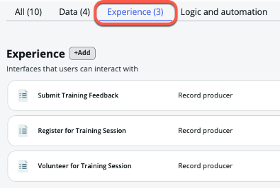
   > 📌 O Now Assist gerou Record Producers para a aplicação!  

23. Clique na aba **"Security (3)"**.
    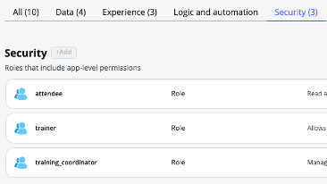  

   > 📌 O Now Assist criou roles dentro do aplicativo para diferentes tipos de usuários!  

---

## 🎯 Recapitulação  

**Parabéns!** 🎉  

Você criou o aplicativo **Cross-Training Management** utilizando **App Generation**!  

> Pense neste aplicativo como um **container para todas as configurações**, incluindo **tabelas, formulários, fluxos e mais**.  

🚀 Agora, vamos para o próximo exercício: **Criação de um Item de Catálogo!**  
