<div class="button-homepage-vancouver">
🕒 Duração Estimada: 10 min
</div>

## 🔍 Visão Geral  

Agora que exploramos a estrutura inicial do aplicativo, vamos ver como o **Now Assist for Creator** simplifica a **criação e manutenção de itens de catálogo e record producers**.  

Alexandra quer criar um **novo formulário de treinamento**, incluindo **10 perguntas** que irão **disparar uma nova solicitação de feedback**.  

A funcionalidade de **Catalog Generation** permite que Alexandra forneça **descrições em linguagem natural**, e o **Now Assist for Creator** transformará essas informações em um **formulário de autoatendimento** baseado nos seus inputs.  


---

## 🛠️ Passos  

1. Você ainda deve estar impersonando **Alexandra Arias**. Se não estiver, **impersone-a novamente**.  
2. Caso não esteja na aba original do **ServiceNow**, **retorne a ela**.
   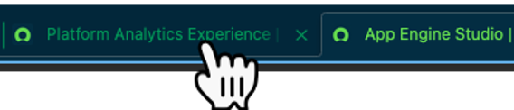  
3. Navegue até a **homepage**, **pesquise por "Catalog Builder"**, e clique no módulo de navegação correspondente. 
   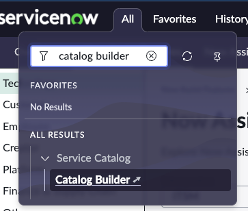 
4. Se o **painel lateral do Now Assist** estiver fixado no lado direito, **clique no ícone de "Pin" no canto superior direito** para desafixá-lo.  
   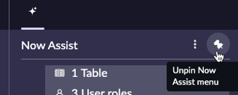
5. Clique no botão **"Create a new catalog item"**.  
   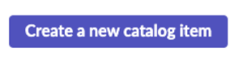
6. Clique no botão **"Continue"**.  
   
7. Selecione o template **"Training Template"**.
   
8. Clique no botão **"Use this item template"**.
    
9.  A página do **Catalog Builder** será aberta com as informações do template pré-preenchidas. Você será recebido na primeira aba, **Now Assist**.  
    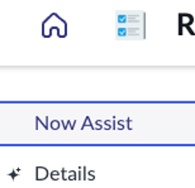
  
10. No campo **Now Assist directions**, copie e cole o seguinte texto:  
    ```txt title="Catalog Generation - Prompt 1"
    Create a new Self Service form to allow employees to request the addition of a new training program to the company’s training portfolio.
    ```
    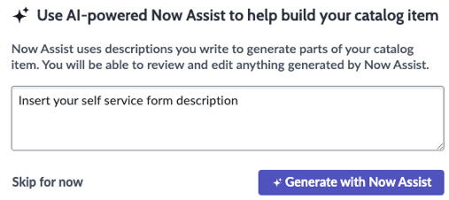

11. Clique em **"Generate with Now Assist"**. 
    
12. Clique no botão **"Preview"** no canto superior direito da tela.  
    
13. O Now Assist mostrará o **conteúdo gerado pela IA** com as perguntas recomendadas para o formulário.
    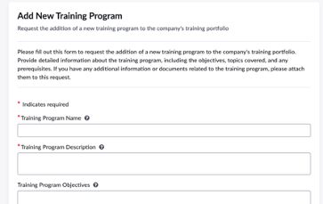  
14. Clique em **"Close"** no canto superior direito.
    
15. Volte para a aba **Now Assist**.  
    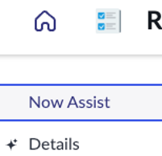
16. Como agora queremos fornecer entradas mais detalhadas, **substitua** o conteúdo de **Now Assist directions** pelo seguinte:  
    ```txt title="Catalog Generation - Prompt 2"
    Form Name: "New Training Request Form"
    Short Description: "This form allows employees to request the addition of a new training program to the company’s training portfolio. Please provide the necessary details to help us evaluate and implement your suggestion."
    Instructions: "Fill out the form below with all relevant details about the proposed training. Ensure that the training aligns with company goals and addresses specific skill gaps or development areas. Once submitted, the request will be reviewed by the training and development team."
    Questions:
    Training Title
    Training Category: Technical, Leadership, Compliance, Soft Skills
    Training Description
    Target Audience
    Skills or Knowledge Gaps Addressed
    Training Format: Online, In-Person, Hybrid
    Estimated Duration
    Proposed Trainer or Training Provider
    Expected Benefits
    Estimated Costs (Optional)
    Additional Comments
    ```

    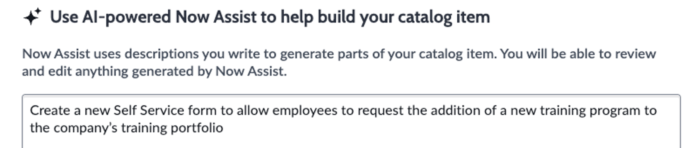

17. Clique em **"Generate with Now Assist"**. 
     
18. Como queremos regenerar o conteúdo, clique em **"Confirm"**.  
    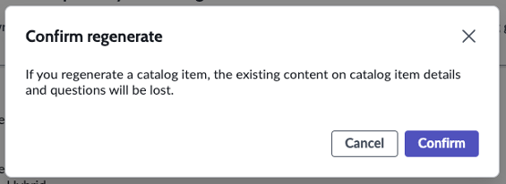
19. Clique em **"Preview"**.  
    
20. **Mude para a visualização Now Mobile**.  
    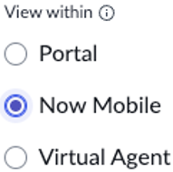
21. O Now Assist mostrará o formulário gerado com **todos os detalhes fornecidos**.  
22. Clique em **"Close"** no canto superior direito.  
    

23.  Navegue até a seção **"Questions"**.  
    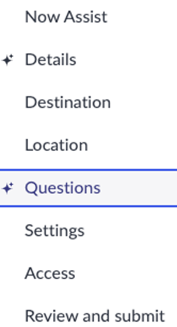

    > 📌 Cada pergunta gerada pela IA será sinalizada com um ícone. Você pode **editar, remover ou adicionar novas perguntas manualmente**.  

24.  Navegue até a seção **"Review and submit"** e clique em **"Submit"**.  
    
    

## 🎯 Recapitulação  

**Parabéns!** 🎉  

Você criou um **formulário de solicitação de novos treinamentos** para permitir que funcionários enviem sugestões para o **portfólio de treinamentos da empresa**.  

> No futuro, com versões como **Xanadu**, a funcionalidade de **Catalog Generation** poderá incluir **edição direta dos formulários gerados**.  

🚀 Agora, vamos para o próximo exercício: **Automação de Fluxos com IA!**  
