<div class="button-homepage-vancouver">
🕒 Duração Estimada: 10 min
</div>

## 🔍 Visão Geral  

Agora que exploramos a estrutura inicial do aplicativo, vamos ver como o **Now Assist for Creator** simplifica a **automação de fluxos de trabalho**.  

Alexandra deseja automatizar **e-mails de lembrete** para participantes e treinadores **dois dias antes das sessões de treinamento**, além de enviar **e-mails de follow-up** para coletar feedback após cada sessão.  

Essas automações **eliminam tarefas manuais** e garantem que a comunicação ocorra no momento certo.  

Com a funcionalidade **Flow Generation**, Alexandra pode fornecer **descrições em linguagem natural**, e o **Now Assist for Creator** criará automaticamente um fluxo de trabalho correspondente.  

Ela deseja criar **dois fluxos de trabalho**:  
✅ **E-mail de lembrete para participantes e treinadores**.  
✅ **Coleta de feedback dos participantes após as sessões**.  


## 🛠️ Passos  

1. Você ainda deve estar impersonando **Alexandra Arias**. Se não estiver, **impersone-a novamente**.  
2. Caso não esteja na aba original do **ServiceNow**, **retorne a ela**.  
   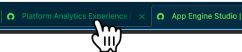
3. Clique no **ícone de "Pin" no canto superior direito** para desafixar o painel do Now Assist. 
   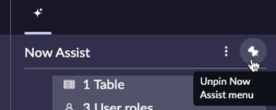 
4. Navegue até **All**, digite **Workflow Studio**, e clique no link correspondente.  
   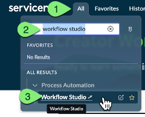
5. No topo da página, clique no **ícone "+"** ao lado de **Workflow Studio**, e selecione **Flow**.
   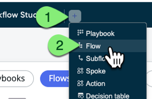  

## Criando o Primeiro Fluxo – Lembrete de E-mail  

1. No campo **Flow Name**, digite:  
   
   ```txt title="Flow Generation - Title 1"
   Reminder email for attendees and trainers
   ```  

2. No campo **Now Assist Directions**, digite:  

   ```txt title="Flow Generation - Prompt 1"
   Create a scheduled job that triggers every day at 2 AM. It should look up training sessions whose date is 2 days from now. Then look up attendees and trainers for each training session, and send mail.
   ```  

3. No menu suspenso **Application**, selecione **ACME Cross-Training** ou **ACME Cross-Training Lab Version** (ambos são aceitos).  
   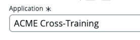
4. Clique em **"Generate flow preview"**. 
    
5.  Clique em **"Save and edit flow"**.  
   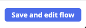
6.  Altere a visualização de **Diagram View** para **Vertical View** clicando no botão de alternância.  
   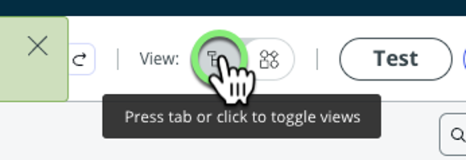
---

## Criando o Segundo Fluxo – Coleta de Feedback  

1. Clique no **ícone "+"** ao lado da aba superior e selecione **Flow**.
   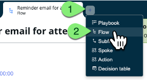  

1. No campo **Flow Name**, digite:  
   
   ```txt title="Flow Generation - Title 2"
   Gather Feedback from Attendees
   ```  

2. No campo **Now Assist Directions**, digite:  

   ```txt title="Flow Generation - Prompt 2"
   Create a scheduled job that runs every day at 3 AM. It should look up training sessions that ended the day before, and look up attendees of each training session, and send mail.
   ``` 
3.  Clique em **"Generate flow preview"**.
   
4.  Clique em **"Save and edit flow"**.  
   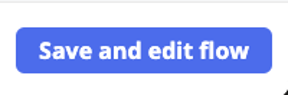
5.  Altere a visualização do fluxo clicando no botão de alternância ao lado de **View** no topo da tela.  

## Explorando as Recomendações de Fluxo  

18. Clique em **"Add an Action, Flow Logic, or Subflow"**.
    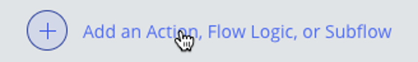  
19. Isso acionará a exibição do **pop-up de Recomendações**.  
   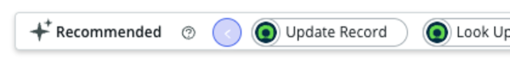
   > 📌 O **Now Assist for Creator** pode sugerir **Ações** que você pode estar procurando, economizando tempo ao criar um novo fluxo.  

   > ⚠️ Dependendo dos dados na instância do laboratório, pode aparecer a mensagem **"No recommendations found yet"**, o que é esperado caso a IA ainda não tenha dados suficientes.  

---

## 🎯 Recapitulação  

**Parabéns!** 🎉  

Você criou **dois fluxos automatizados** usando a funcionalidade **Flow Generation** do **Now Assist for Creator**!  

> No futuro, em versões como **Xanadu**, a funcionalidade de **Flow Generation** poderá **mapear automaticamente os data pills** e até **realizar edições utilizando prompts em linguagem natural**.  

🚀 Agora, vamos para o próximo exercício: **Geração de Playbooks com IA!**  
