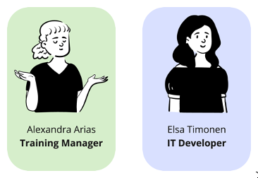
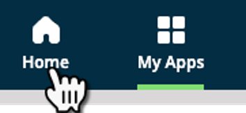
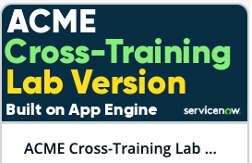
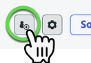
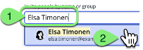
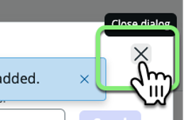
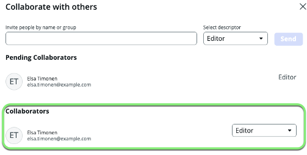
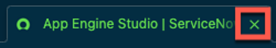
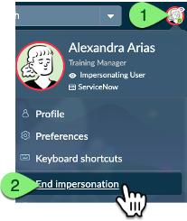

🕒 Duração Estimada: 10 min

## 🔍 Visão Geral  

Até agora, **Alexandra** utilizou o **Now Assist** para otimizar diversas funcionalidades do seu aplicativo.  

No entanto, algumas **lógicas mais complexas** exigem a **colaboração de um desenvolvedor de TI**.  

Com o **App Engine Studio**, Alexandra pode facilmente **solicitar colaboração** para que **Elsa** a ajude no desenvolvimento do aplicativo **Cross-Training**.  

## 🛠️ Passos  

### **Solicitando Colaboração**  

1. Retorne para a aba do navegador onde o **App Engine Studio** está aberto.  

   > 📌 Caso tenha fechado a aba, abra o **App Engine Studio** novamente.  

2. Clique em **Home** no topo da página.
   
3. Clique em **ACME Cross-Training Lab Version** para abrir o aplicativo.
     
4. Clique no botão **"Manage Collaborators"**, localizado **à esquerda do botão "Source Control"**.
     
5. No campo de busca, digite **Elsa Timonen** e clique no nome dela na lista suspensa.  
   
6. Clique no botão **"Send"**.
   
7. Clique no botão **"X"** para fechar o modal **"Collaborate with others"**.
     

8. Clique novamente no botão **"Manage Collaborators"**.  
9. Observe que a **solicitação de colaboração de Elsa foi aprovada automaticamente**.  
   
   > 📌 Elsa recebeu acesso imediato porque é uma **desenvolvedora experiente** e foi **pré-aprovada** para colaboração em aplicativos no **App Engine Management Center**.  

   > ⚠️ Essa **aprovação automática pode ser configurada** no **App Engine Management Center** para outros usuários conforme necessário.  

10. Clique no botão **"X"** para fechar o modal **"Collaborate with others"**.  
    

11. **Feche a aba** do navegador com o **App Engine Studio**.

12. **Feche a aba** do navegador com o **Workflow Studio**.  

   > ⚠️ Caso veja uma mensagem sobre salvar seu trabalho, **ignore-a**. Você **não precisa salvar nada** neste momento do laboratório.  

13. Retorne para a aba original do **ServiceNow**.  
14. Clique no **avatar de Alexandra** no canto superior direito e selecione **"End Impersonation"**. 
     

## 🎯 Recapitulação  

**Parabéns!** 🎉  

Alexandra adicionou Elsa como **colaboradora** no aplicativo **Cross-Training**.  

> O **App Engine Management Center** processa **automaticamente** as solicitações de colaboração, verificando se um usuário já está **pré-aprovado** ou se precisa de **aprovação manual** antes de poder colaborar no desenvolvimento de um aplicativo.  

> Para fins deste laboratório, assumimos que a solicitação foi **auto-aprovada** no **App Engine Management Center**.  

🚀 Agora, vamos para o próximo exercício: **Implantação do Aplicativo!**  
