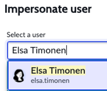
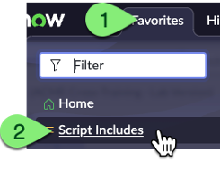
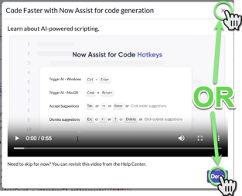
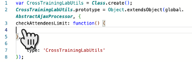
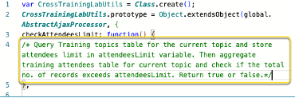
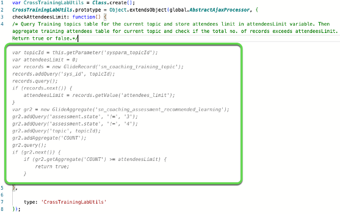
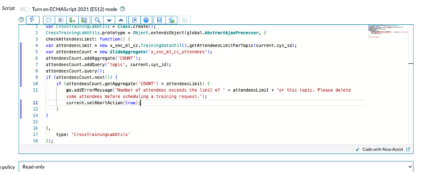
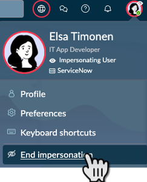

<div class="button-homepage-vancouver">
🕒 Duração Estimada: 10 min
</div>

## 🔍 Visão Geral  

A **validação de formulários** é essencial para garantir que os dados inseridos sigam as regras do aplicativo.  

O aplicativo **Cross-Training** precisa implementar duas regras de validação:  

✅ **Validação do Limite de Participantes** – Um alerta impedirá novos registros quando o limite for atingido.  
✅ **Verificação da Inscrição de Treinadores** – Uma regra impedirá treinadores de se voluntariarem para sessões que já possuam um instrutor.  

A **Elsa** implementará essa lógica utilizando **JavaScript**, mas para acelerar o desenvolvimento, usará a funcionalidade **Now Assist Code Generation**.  


## 🛠️ Passos  

### **Criando um Script Include**  

1. **Impersonar Elsa Timonen**.  
   
2. Navegue até **Favorites** > **Script Includes**.
     
3. Clique no botão **"New"** no canto superior direito.
     
4. Feche o pop-up clicando em **"X"** ou **"Done"**.
    
5. No campo **Name**, digite:  
   ```txt title="Code Generation - Name"
   CrossTrainingLabUtils
   ```  
   

6. Marque a opção **Glide AJAX enabled**.  
   

7. No campo **Script**, clique na linha **3** e insira a função vazia abaixo:  
   ```js title="Code Generation - Function"
   checkAttendeesLimit: function() { 
   
   },
   ```
   
   

8. Na linha **4**, adicione um comentário descrevendo a funcionalidade desejada:  
   ```js title="Code Generation - Function"
   /* Query Training topics table for the current topic and store attendees limit in attendeesLimit variable. Then aggregate training attendees table for current topic and check if the total no. of records exceeds attendeesLimit. Return true or false.*/
   ```

   
   

9. Pressione **Cmd + Enter (Mac) ou Ctrl + Enter (Windows)** para ativar a funcionalidade **"Edit code with Now Assist"**, que converterá o prompt em código JavaScript.
:::info 
Você também pode colar na caixa de prompt
:::
   

10.  Aguarde até que o Now Assist Code Generation gere a resposta. O código gerado aparecerá em **cinza itálico**. 
     
11.  Pressione **ENTER** para aceitar o código gerado.  
     - O código mudará de **cinza para colorido**.  
     - A **barra roxa ao lado** indicará que o código foi gerado pelo **Now Assist**.
   
12. Clique no botão **"Format Code"** no topo do editor para organizar e melhorar a legibilidade do código.
      
13. Clique no **avatar de Elsa** no canto superior direito e selecione **"End Impersonation"**.  
   
   ⚠️ **Ignore qualquer mensagem sobre salvar o trabalho.** Não é necessário salvar.  

---
:::danger
**Caso Não Consiga Salvar**  

⚠️ **Se não conseguir salvar o Script Include, não há problema.**  

O objetivo deste exercício é apenas demonstrar **como e onde utilizar o Now Assist Code Generation**.  

Se precisar sair sem salvar:  

- Clique no **logo do ServiceNow** no canto superior esquerdo.
   
- **Confirme a saída sem salvar** quando solicitado.
   
:::
---

## 🎯 Recapitulação  

**Parabéns!** 🎉  

A **Elsa** utilizou a **Code Generation do Now Assist** para **criar rapidamente a lógica de validação** que Alexandra precisava no aplicativo **Cross-Training**.  

🚀 Agora, vamos para o próximo exercício: **Implantação do Aplicativo!**  
